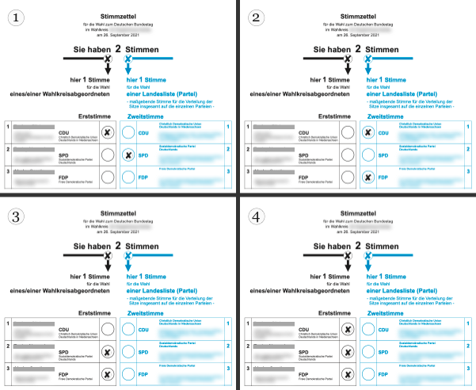
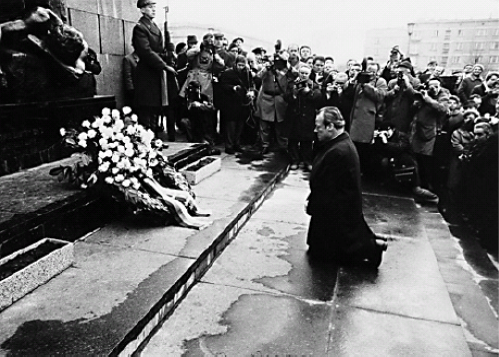
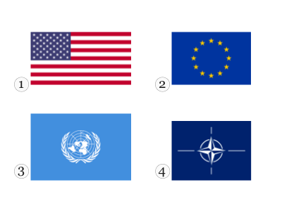
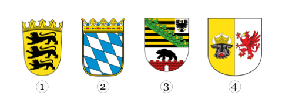
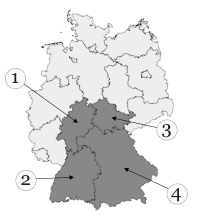

 
  
 # Leben in Deutschland ([reference](https://oet.bamf.de/ords/oetut/f?p=534:1::::::))
 
  
 |#|#|#|#|#|#|#|#|#|#|
 |-|-|-|-|-|-|-|-|-|-|
 |[001](#frage-001)|[002](#frage-002)|[003](#frage-003)|[004](#frage-004)|[005](#frage-005)|[006](#frage-006)|[007](#frage-007)|[008](#frage-008)|[009](#frage-009)|[010](#frage-010)|
 |[011](#frage-011)|[012](#frage-012)|[013](#frage-013)|[014](#frage-014)|[015](#frage-015)|[016](#frage-016)|[017](#frage-017)|[018](#frage-018)|[019](#frage-019)|[020](#frage-020)|
 |[021](#frage-021)|[022](#frage-022)|[023](#frage-023)|[024](#frage-024)|[025](#frage-025)|[026](#frage-026)|[027](#frage-027)|[028](#frage-028)|[029](#frage-029)|[030](#frage-030)|
 |[031](#frage-031)|[032](#frage-032)|[033](#frage-033)|[034](#frage-034)|[035](#frage-035)|[036](#frage-036)|[037](#frage-037)|[038](#frage-038)|[039](#frage-039)|[040](#frage-040)|
 |[041](#frage-041)|[042](#frage-042)|[043](#frage-043)|[044](#frage-044)|[045](#frage-045)|[046](#frage-046)|[047](#frage-047)|[048](#frage-048)|[049](#frage-049)|[050](#frage-050)|
 |[051](#frage-051)|[052](#frage-052)|[053](#frage-053)|[054](#frage-054)|[055](#frage-055)|[056](#frage-056)|[057](#frage-057)|[058](#frage-058)|[059](#frage-059)|[060](#frage-060)|
 |[061](#frage-061)|[062](#frage-062)|[063](#frage-063)|[064](#frage-064)|[065](#frage-065)|[066](#frage-066)|[067](#frage-067)|[068](#frage-068)|[069](#frage-069)|[070](#frage-070)|
 |[071](#frage-071)|[072](#frage-072)|[073](#frage-073)|[074](#frage-074)|[075](#frage-075)|[076](#frage-076)|[077](#frage-077)|[078](#frage-078)|[079](#frage-079)|[080](#frage-080)|
 |[081](#frage-081)|[082](#frage-082)|[083](#frage-083)|[084](#frage-084)|[085](#frage-085)|[086](#frage-086)|[087](#frage-087)|[088](#frage-088)|[089](#frage-089)|[090](#frage-090)|
 |[091](#frage-091)|[092](#frage-092)|[093](#frage-093)|[094](#frage-094)|[095](#frage-095)|[096](#frage-096)|[097](#frage-097)|[098](#frage-098)|[099](#frage-099)|[100](#frage-100)|
 |[101](#frage-101)|[102](#frage-102)|[103](#frage-103)|[104](#frage-104)|[105](#frage-105)|[106](#frage-106)|[107](#frage-107)|[008](#frage-108)|[109](#frage-009)|[110](#frage-110)|
 |[111](#frage-111)|[112](#frage-112)|[113](#frage-113)|[114](#frage-114)|[115](#frage-115)|[116](#frage-116)|[117](#frage-117)|[018](#frage-118)|[119](#frage-019)|[120](#frage-120)|
 |[121](#frage-121)|[122](#frage-122)|[123](#frage-123)|[124](#frage-124)|[125](#frage-125)|[126](#frage-126)|[127](#frage-127)|[028](#frage-128)|[129](#frage-029)|[130](#frage-130)|
 |[131](#frage-131)|[132](#frage-132)|[133](#frage-133)|[134](#frage-134)|[135](#frage-135)|[136](#frage-136)|[137](#frage-137)|[038](#frage-138)|[139](#frage-039)|[140](#frage-140)|
 |[141](#frage-141)|[142](#frage-142)|[143](#frage-143)|[144](#frage-144)|[145](#frage-145)|[146](#frage-146)|[147](#frage-147)|[048](#frage-148)|[149](#frage-049)|[150](#frage-150)|
 |[151](#frage-151)|[152](#frage-152)|[153](#frage-153)|[154](#frage-154)|[155](#frage-155)|[156](#frage-156)|[157](#frage-157)|[058](#frage-158)|[159](#frage-059)|[160](#frage-160)|
 |[161](#frage-161)|[162](#frage-162)|[163](#frage-163)|[164](#frage-164)|[165](#frage-165)|[166](#frage-166)|[167](#frage-167)|[068](#frage-168)|[169](#frage-069)|[170](#frage-170)|
 |[171](#frage-171)|[172](#frage-172)|[173](#frage-173)|[174](#frage-174)|[175](#frage-175)|[176](#frage-176)|[177](#frage-177)|[078](#frage-178)|[179](#frage-079)|[180](#frage-180)|
 |[181](#frage-181)|[182](#frage-182)|[183](#frage-183)|[184](#frage-184)|[185](#frage-185)|[186](#frage-186)|[187](#frage-187)|[088](#frage-188)|[189](#frage-089)|[190](#frage-190)|
 |[191](#frage-191)|[192](#frage-192)|[193](#frage-193)|[194](#frage-194)|[195](#frage-195)|[196](#frage-196)|[197](#frage-197)|[098](#frage-198)|[199](#frage-099)|[200](#frage-200)|
 |[201](#frage-201)|[202](#frage-202)|[203](#frage-203)|[204](#frage-204)|[205](#frage-205)|[206](#frage-206)|[207](#frage-207)|[208](#frage-208)|[209](#frage-209)|[210](#frage-210)|
 |[211](#frage-211)|[212](#frage-212)|[213](#frage-213)|[214](#frage-214)|[215](#frage-215)|[216](#frage-216)|[217](#frage-217)|[218](#frage-218)|[219](#frage-219)|[220](#frage-220)|
 |[221](#frage-221)|[222](#frage-222)|[223](#frage-223)|[224](#frage-224)|[225](#frage-225)|[226](#frage-226)|[227](#frage-227)|[228](#frage-228)|[229](#frage-229)|[230](#frage-230)|
 |[231](#frage-231)|[232](#frage-232)|[233](#frage-233)|[234](#frage-234)|[235](#frage-235)|[236](#frage-236)|[237](#frage-237)|[238](#frage-238)|[239](#frage-239)|[240](#frage-240)|
 |[241](#frage-241)|[242](#frage-242)|[243](#frage-243)|[244](#frage-244)|[245](#frage-245)|[246](#frage-246)|[247](#frage-247)|[248](#frage-248)|[249](#frage-249)|[250](#frage-250)|
 |[251](#frage-251)|[252](#frage-252)|[253](#frage-253)|[254](#frage-254)|[255](#frage-255)|[256](#frage-256)|[257](#frage-257)|[258](#frage-258)|[259](#frage-259)|[260](#frage-260)|
 |[261](#frage-261)|[262](#frage-262)|[263](#frage-263)|[264](#frage-264)|[265](#frage-265)|[266](#frage-266)|[267](#frage-267)|[268](#frage-268)|[269](#frage-269)|[270](#frage-270)|
 |[271](#frage-271)|[272](#frage-272)|[273](#frage-273)|[274](#frage-274)|[275](#frage-275)|[276](#frage-276)|[277](#frage-277)|[278](#frage-278)|[279](#frage-279)|[280](#frage-280)|
 |[281](#frage-281)|[282](#frage-282)|[283](#frage-283)|[284](#frage-284)|[285](#frage-285)|[286](#frage-286)|[287](#frage-287)|[288](#frage-288)|[289](#frage-289)|[290](#frage-290)|
 |[291](#frage-291)|[292](#frage-292)|[293](#frage-293)|[294](#frage-294)|[295](#frage-295)|[296](#frage-296)|[297](#frage-297)|[298](#frage-298)|[299](#frage-299)|[300](#frage-300)|
 |[301](#frage-301)|[302](#frage-302)|[303](#frage-303)|[304](#frage-304)|[305](#frage-305)|[306](#frage-306)|[307](#frage-307)|[308](#frage-308)|[309](#frage-309)|[310](#frage-310)|
## Frage 001 
[ :top: ](#referecnce)
**In Deutchland dürfen Menschen offen etwas gegen die Regierung sagen, weil...**  

1. hier Religionsfreiheit gilt.
2. die Menschen Steuern zahlen.
3. die Menschen das Wahlrecht haben.
4. ✔️ hier Meinungsfreiheit gilt. 
 

| English | Deutsch | فارسی
|-|-|-|
|allow|dürfen|اجازه داشتن
|against|gegen|علیه
|because|weil| زیرا
|something|etwas|چیزی
|government|Regierung|دولت
|Religious freedom|Religions-freiheit| آزادی مذهبی
|apply|gilt (gelten)| اعمال شدن
|Taxes|Steuern| مالیات
|Pay|zahlen | پرداخت کردن
|Right to vote|Wahlrecht|حق رأی
|Freedom of opinion|Meinungs-freiheit|آزادی بیان

در آلمان، مردم اجازه دارند آشکارا علیه دولت صحبت کنند زیرا...
1. آزادی مذهبی اینجا مصداق دارد.
2. مردم مالیات می‌دهند
3. مردم حق رأی دارند
4. ✔️ آزادی بیان اینجا مصداق پیدا می‌کند. 

## Frage 002 
[ :top: ](#referecnce)
**In Deutchland können Eltern bis zum 14. Lebensjahr ihres Kindes entscheiden, ob es in der Schule am**
1. Geschichtsunterricht teilnimmt.
2. ✔️ Religionsunterricht teilnimmt. 
3. Politikunterricht teilnimmt.
4. Sprachunterricht teilnimmt.

| English | Deutsch | فارسی
|-|-|-|
|Age|Lebensjahr|سن
|decide|entscheiden|تصمیم گرفتن
|if|ob|اگر
|participates|teilnimmt(teilnehmen)|شرکت کردن
|History lessons|Geschichtsun-terricht|کلاس تاریخ
|Religious education|Religionsun-terricht|کلاس دینی
|Political education|Politikun-terricht|کلاس سیاست
|Language lessons|Sprachun-terricht|کلاس زبان

در آلمان، والدین می‌توانند تا 14 سالگی فرزندشان تصمیم بگیرند که آیا در مدرسه ...
1. در کلاس‌های تاریخ شرکت می‌کند.
2. ✔️ در کلاس‌های آموزش دینی شرکت می‌کند. 
3. در کلاس‌های سیاست شرکت می‌کند.
4. در کلاس‌های زبان شرکت می‌کند.

## Frage 003 
[ :top: ](#referecnce)
**Deutschland ist ein Rechtsstaat. Was ist damit gemeint?**
1. ✔️ Alle Einwohner / Einwohnerinnen und der Staat müssen sich an die Gesetze halten. 
2. Der Staat muss sich nicht an die Gesetze halten.
3. Nur Deutsche müssen die Gesetze befolgen.
4. Die Gerichte machen die Gesetze.

| English | Deutsch | فارسی
|-|-|-|
|Constitutional state|Rechtsstaat|مبتنی بر قانون (مشروطه)
|by this|damit|
|meant|gemeint(meinen)|معنی دادن
|Residents|Einwohner|ساکن (جمعیت)
|State|Staat|ایالت
|Laws|Gesetze (Gesetz)|قوانین
|abide by|halten|رعایت کردن
|follow|befolgen|پیروی کردن
|courts|Gerichte (Gericht)|دادگاه ها

آلمان یک کشور مبتنی بر قانون اساسی است. این به چه معناست؟
1. ✔️ همه ساکنان و دولت باید از قوانین پیروی کنند. 
2. دولت مجبور به رعایت قوانین نیست.
3. فقط آلمانی‌ها باید از قوانین پیروی کنند.
4. دادگاه‌ها قوانین را وضع می‌کنند.

## Frage 004 
[ :top: ](#referecnce)
**Welches Recht gehört zu den Grundrechten in Deutschland? **
1. Waffenbesitz
2. Faustrecht
3. ✔️ Meinungsfreiheit
4. Selbstjustiz

| English | Deutsch | فارسی
|-|-|-|
|right|Recht|حق
|belongs to|gehört (Hören)|شنیدن (متعلق به)
|Basic rights|Grundrechten|حقوق اساسی
|Weapons ownership|Waffenbesitz|مالکیت اسلحه
|Fist law|Faustrecht|قانون جنگل
|Vigilante justice|Selbstjustiz|عدالت خودجوش (خودسرانه)

کدام حق، جزو حقوق اساسی در آلمان است؟
1. مالکیت اسلحه
2. قانون جنگل
3. ✔️ آزادی بیان 
4. عدالت خودجوش (خودسرانه)

## Frage 005 
[ :top: ](#referecnce)
**Wahlen in Deutschland sind frei. Was bedeutet das?**
1. Man darf Geld annehmen, wenn man dafür einen bestimmten Kandidaten 
   / eine bestimmte Kandidatin wählt.
2. Nur Personen, die noch nie im Gefängnis waren, dürfen wählen.
3. ✔️ Der Wähler darf bei der Wahl weder beeinflusst
   noch zu einer bestimmten Stimmabgabe gezwungen 
   werden und keine Nachteile durch die Wahl haben.
4. Alle wahlberechtigten Personen müssen wählen.

| English | Deutsch | فارسی
|-|-|-|
|Elections|Wahlen|انتخابات
|accept|an-nehmen|قبول کردن
|for this|dafür|برای اینکه
|be in favor|dafür sein|طرفدار بودن
|certain|bestimmt|مشخص، خاص
|male/female Candidates|Kandidaten/Kandidatin|نامزهای مرد/زن
|select |wählt (Wählen)|انتخاب کردن
|Only,Just|Nur|فقط
|Prison|Gefängnis|زندان
|voters|Wähler|رأی دهندگان
|vote |Wahl |رأی
|neither |weder|هیچکدام
|beeinflusst|beeinflusst|تحت تاثیر قرار گرفته
|voting|Stimmabgabe|رأی گیری
|be forced|gezwungen werden|مجبور شدن به
|disadvantages|Nachteile|معایب
|eligible voters|wahlberechtigten|رأی‌دهندگان واجد شرایط

انتخابات در آلمان آزاد است؟ این یعنی چه؟
1. اگر به یک نامزد خاص رأی دهید، مجاز به دریافت پول هستید.
2. فقط افرادی که هرگز به زندان نرفته‌اند، مجاز به رأی دادن هستند.
3. ✔️ رأی‌دهنده ممکن است در انتخابات تحت تأثیر قرار نگیرد
   یا مجبور به رأی دادن به شیوه‌ای خاص نشود
   و ممکن است در نتیجه انتخابات متحمل هیچ گونه ضرر و زیانی نشود. 
4. همه واجدین شرایط باید رأی بدهند.

## Frage 006 
[ :top: ](#referecnce)
**Wie heißt die deutsche Verfassung?**
1. Volksgesetz
2. Bundesgesetz
3. Deutsches Gesetz
4. ✔️ Grundgesetz

| English | Deutsch | فارسی
|-|-|-|
|Constitution|Verfassung|قانون اساسی
|People's law|Volksgesetz|قانون مردم
|Federal law|Bundesgesetz|قانون فدرال
|Basic Law|Grundgesetz|قانون پایه

نام قانون اساسی آلمان چیست؟
1. قانون مردم
2. قانون فدرال
3. قانون آلمان
4. ✔️ قانون پایه

## Frage 007 
[ :top: ](#referecnce)
**Welches Recht gehört zu den Grundrechten, 
  die nach der deutschen Verfassung garantiert werden? Das Resht auf...**
1. ✔️ Glaubens- und Gewissensfreiheit.
2. Unterhaltung.
3. Arbeit.
4. Wohnung.

| English | Deutsch | فارسی
|-|-|-|
|fundamental right|Grundrechten|حقوق اساسی
|be guaranteed|garantiert werden|تضمین شده باشد
|freedom of conscience|Gewissensfreiheit|آزادی وجدان
|Freedom of belief|Glaubensfreiheit|آزادی عقیده
|Entertainment|Unterhaltung|سرگرمی

کدام حق، یکی از حقوق اساسی تضمین شده در قانون اساسی آلمان است؟ حقِ...
1. ✔️ آزادی عقیده و وجدان.
2. سرگرمی
3. کار
4. مسکن

## Frage 008 
[ :top: ](#referecnce)
**Was steht nicht im Grundgesetz von Deutschland?**
1. Die Würde des Menschen ist unantastbar.
2. ✔️ Alle sollen gleich viel Geld haben.
3. Jeder Mensch darf seine Meinung sagen.
4. Alle sind vor dem Gesetz gleich.

| English | Deutsch | فارسی
|-|-|-|
|stands|steht (stehen)|ایستادن، وجود داشتن
|Human dignity|Würde des Menschen|کرامت انسانی
|untouchable|unantastbar|مصون از تعرض
|be supposed to|sollen|باید
|equivalent |gleich|به یک اندازه
|every human being|Jeder Mensch|هر فرد
|opinion |Meinung|نظر

چه مواردی در قانون اساسی آلمان وجود ندارد؟
1. کرامت انسانی خدشه‌ناپذیر است.
2. ✔️ همه باید به یک اندازه پول داشته باشند.
3. هر کسی اجازه دارد نظر خود را بیان کند.
4. همه در برابر قانون برابرند.

## Frage 009 
[ :top: ](#referecnce)
**Welches Grundrecht gilt in Deutschland nur für Ausländer/Ausländerinnen? Das Grundrecht auf**
1. Schutz der Familie
2. Menschenwürde
3. ✔️ Asyl
4. Meinungsfreiheit

| English | Deutsch | فارسی
|-|-|-|
|protection|Schutz|حفاظت
|Human dignity|Menschenwürde|کرامت انسانی
|Asylum|Asyl|پناهندگی

کدام حق اساسی فقط برای خارجی‌ها در آلمان اعمال می‌شود؟ حق اساسی برای
1. حفاظت از خانواده
2. کرامت انسانی
3. ✔️ پناهندگی
4. آزادی بیان

## Frage 010 
[ :top: ](#referecnce)
**Was ist mit dem deutschen Grundgesetz vereinbar?**
1. die Prügelstrafe
2. die Folter
3. die Todesstrafe
4. ✔️ die Geldstrafe

| English | Deutsch | فارسی
|-|-|-|
|compatible|vereinbar|سازگار
|Corporal punishment|Prügelstrafe|تنبیه بدنی
|torture|die Folter|
|Death penalty|Todesstrafe|مجازات اعدام
|penalty|Geldstrafe|جریمه

چه چیزی با قانون اساسی آلمان سازگار است؟
1. تنبیه بدنی
2. شکنجه
3. مجازات اعدام
4. ✔️ جریمه

## Frage 011 
[ :top: ](#referecnce)
**Wie wird die Verfassung der Bundesrepublik Deutschland genannt?**
1. ✔️ Grundgesetz
2. Bundesverfassung
3. Gesetzbuch
4. Verfassungsvertrag

| English | Deutsch | فارسی
|-|-|-|
|becomes|wird ()|میشود
|called|genannt (nennen)|نامیدن
|Federal Republic|Bundesrepublik|جمهوری فدرال
|Federal Constitution|Bundesverfassung|قانون اساسی فدرال
|Basic Law|Gesetzbuch|قانون اساسی
|Constitutional Treaty|Verfassungsvertrag|پیمان قانون اساسی

قانون اساسی جمهوری فدرال آلمان چه نام دارد؟
1. ✔️ قانون اساسی
2. قانون اساسی فدرال
3. قانون
4. پیمان قانون اساسی

## Frage 012 
[ :top: ](#referecnce)
**Eine Partei im Deutschen Bundestag will die Pressefreiheit abschaffen. Ist das möglich?**
1. Ja, wenn mehr als die Hälfte der Abgeordneten im Bundestag dafür sind.
2. Ja, aber dazu müssen zwei Drittel der Abgeordneten im Bundestag dafür sein.
3. ✔️ Nein, denn die Pressefreiheit ist ein Grundrecht. Sie kann nicht abgeschafft werden.
4. Nein, denn nur der Bundesrat kann die Pressefreiheit abschaffen.

| English | Deutsch | فارسی
|-|-|-|
|||
|||

یک حزب در مجلس فدرال آلمان می‌خواهد آزادی مطبوعات را لغو کند. آیا این ممکن است؟
1. بله، اگر بیش از نیمی از اعضای بوندستاگ موافق باشند.
2. بله، اما دو سوم اعضای بوندستاگ باید موافق آن باشند.
3. ✔️ نه، زیرا آزادی مطبوعات یک حق اساسی است. نمی‌توان آن را لغو کرد.
4. نه، زیرا فقط شورای فدرال می‌تواند آزادی مطبوعات را لغو کند.

## Frage 013 
[ :top: ](#referecnce)
**Im Parlament steht der Begriff "Opposition" für**
1. die regierenden Parteien.
2. die Fraktion mit den meisten Abgeordneten.
3. alle Parteien, die bei der letzten Wahl die 5%-Hürde erreichen konnten.
4. ✔️ alle Abgeordneten, die nicht zu der Regierungspartei/den Regierungsparteien gehören.

| English | Deutsch | فارسی
|-|-|-|
|||
|||

در پارلمان، اصطلاح «اپوزیسیون» مخفف ...
1. احزاب حاکم.
2. گروهی که بیشترین عضو را دارد.
3. تمام احزابی که در انتخابات گذشته به مانع ۵٪ رسیدند.
4. ✔️ تمام نمایندگان مجلس که به حزب (های) حاکم تعلق ندارند.

## Frage 014 
[ :top: ](#referecnce)
**Meinungsfreiheit in Deutschland heißt zum Beispiel, dass ich**
1. Passanten auf der Straße beschimpfen darf
2. ✔️ meine Meinung im Internet äußern kann
3. Nazi-, Hamas- oder Islamischer Staat-Symbole öffentlich tragen darf
4. meine Meinung nur dann äußern darf, solange ich der Regierung nicht widerspreche

| English | Deutsch | فارسی
|-|-|-|
|||
|||

آزادی بیان در آلمان به این معنی است که، برای مثال، من
1. ممکن است در خیابان به رهگذران توهین کند
2. ✔️ می‌توانم نظرم را در اینترنت بیان کنم
3. ممکن است در ملاء عام نمادهای نازی، حماس یا دولت اسلامی را بپوشند
4. من فقط می‌توانم نظر خودم را بیان کنم، تا زمانی که با دولت در تضاد نباشد.

## Frage 015 
[ :top: ](#referecnce)
**Was verbietet das deutsche Grundgesetz?**
1. Militärdienst
2. ✔️ Zwangsarbeit
3. freie Berufswahl
4. Arbeit im Ausland

| English | Deutsch | فارسی
|-|-|-|
|||
|||

قانون اساسی آلمان چه چیزهایی را ممنوع می‌کند؟
1. خدمت سربازی
2. ✔️ کار اجباری
3. انتخاب آزاد حرفه
4. کار در خارج از کشور

## Frage 016 
[ :top: ](#referecnce)
**Wann ist die Meinungsfreiheit in Deutschland eingeschränkt?**
1. ✔️ bei der öffentlichen Verbreitung falscher Behauptungen über einzelne Personen
2. bei Meinungsäußerungen über die Bundesregierung
3. bei Diskussionen über Religionen
4. bei Kritik am Staat

| English | Deutsch | فارسی
|-|-|-|
|||
|||

چه زمانی آزادی بیان در آلمان محدود می‌شود؟
1. ✔️ در انتشار عمومی ادعاهای دروغین درباره افراد
2. هنگام ابراز نظرات در مورد دولت فدرال
3. در بحث‌های مربوط به ادیان
4. هنگام انتقاد از دولت

## Frage 017 
[ :top: ](#referecnce)
**Die deutschen Gesetze verbieten...**
1. Meinungsfreiheit der Einwohner und Einwohnerinnen.
2. Petitionen der Bürger und Bürgerinnen.
3. Versammlungsfreiheit der Einwohner und Einwohnerinnen.
4. ✔️ Ungleichbehandlung der Bürger und Bürgerinnen durch den Staat.

| English | Deutsch | فارسی
|-|-|-|
|||
|||

طبق قانون آلمان، ... ممنوع است.
1. آزادی بیان برای ساکنان.
2. دادخواست‌های شهروندان.
3. آزادی تجمع برای ساکنان.
4. ✔️ رفتار نابرابر دولت با شهروندان.

## Frage 018 
[ :top: ](#referecnce)
**Welches Grundrecht ist in Artikel 1 des Grundgesetzes der Bundesrepublik Deutschland garantiert?**
1. ✔️ die Unantastbarkeit der Menschenwürde
2. das Recht auf Leben
3. Religionsfreiheit
4. Meinungsfreiheit

| English | Deutsch | فارسی
|-|-|-|
|||
|||

کدام حق اساسی در ماده ۱ قانون اساسی جمهوری فدرال آلمان تضمین شده است؟
1. ✔️ خدشه‌ناپذیری کرامت انسانی
2. حق حیات
3. آزادی مذهب
4. آزادی بیان

## Frage 019 
[ :top: ](#referecnce)
**Was versteht man unter dem Recht der "Freizügigkeit" in Deutschland?**
1. ✔️ Man darf sich seinen Wohnort selbst aussuchen.
2. Man kann seinen Beruf wechseln.
3. Man darf sich für eine andere Religion entscheiden.
4. Man darf sich in der Öffentlichkeit nur leicht bekleidet bewegen.

| English | Deutsch | فارسی
|-|-|-|
|||
|||

منظور از حق «آزادی رفت و آمد» در آلمان چیست؟
1. ✔️ شما می‌توانید محل زندگی خود را انتخاب کنید.
2. می‌توانید شغلتان را تغییر دهید.
3. شما آزاد هستید که دین دیگری را انتخاب کنید.
4. شما فقط مجاز به رفت و آمد در اماکن عمومی با لباس سبک هستید.

## Frage 020 
[ :top: ](#referecnce)
**Eine Partei in Deutschland verfolgt das Ziel, eine Diktatur zu errichten. Sie ist denn...**
1. tolerant. 
2. rechtsstaatlich orientiert.
3. gesetzestreu.
4. ✔️ verfassungswidrig.

| English | Deutsch | فارسی
|-|-|-|
|||
|||

حزبی در آلمان هدف ایجاد دیکتاتوری را دنبال می‌کند. این ...
1. بردبار.
2. با محوریت حاکمیت قانون.
3. مطیع قانون.
4. ✔️ خلاف قانون اساسی.

## Frage 021 
[ :top: ](#referecnce)
**Welches ist das Wappen der Bundesrepublik Deutschland?**

✔️ 

| English | Deutsch | فارسی
|-|-|-|
|||
|||

نشان ملی جمهوری فدرال آلمان چیست؟
1. ✔️ 
2.
3.
4.

## Frage 022 
[ :top: ](#referecnce)
**Was für eine Staatsform hat Deutschland?**
1. Monarchie 
2. Diktatur
3. ✔️ Republik
4. Fürstentum

| English | Deutsch | فارسی
|-|-|-|
|||
|||

آلمان چه نوع حکومتی دارد؟
1. سلطنت
2. دیکتاتوری
3. ✔️ جمهوری
4. شاهزاده‌نشین

## Frage 023 
[ :top: ](#referecnce)
**In Deutschland sind die meisten Erwerbstätigen...**
1. in kleinen Familienunternehmen beschäftigt.
2. ehrenamtlich für ein Bundesland tätig.
3. selbständig mit einer eigenen Firma tätig.
4. ✔️  bei einer Firma oder Behörde beschäftigt.

| English | Deutsch | فارسی
|-|-|-|
|||
|||

در آلمان، بیشتر شاغلین ...
1. در کسب و کارهای کوچک خانوادگی مشغول به کار هستند.
2. کار داوطلبانه برای یک ایالت فدرال.
3. با شرکت خودش به صورت آزاد کار می‌کند.
4. ✔️ توسط یک شرکت یا مرجع استخدام شده باشد.

## Frage 024 
[ :top: ](#referecnce)
**Wie viele Bundesländer hat die Bundesrepublik Deutschland?**
1. 14
2. 15
3. ✔️ 16
4. 17

| English | Deutsch | فارسی
|-|-|-|
|||
|||

جمهوری فدرال آلمان چند ایالت فدرال دارد؟
1. 14
2. 15
3. ✔️ 16
4. 17

## Frage 025 
[ :top: ](#referecnce)
**Was ist kein Bundesland der Bundesrepublik Deutschland?**
1. ✔️ Elsass-Lothringen
2. Nordrhein-Westfalen
3. Mecklenburg-Vorpommern
4. Sachsen-Anhalt

| English | Deutsch | فارسی
|-|-|-|
|||
|||

کدام ایالت، جزو جمهوری فدرال آلمان نیست؟
1. ✔️ آلزاس-لورن
2. نوردراین-وستفالن
3. مکلنبورگ-پومرانی غربی
4. زاکسن-آنهالت

## Frage 026 
[ :top: ](#referecnce)
**Deutschland ist ...**
1. eine kommunistische Republik.
2. ✔️ ein demokratischer und sozialer Bundesstaat.
3. eine kapitalistische und soziale Monarchie.
4. ein sozialer und sozialistischer Bundesstaat.

| English | Deutsch | فارسی
|-|-|-|
|||
|||

آلمان ... است
1. یک جمهوری کمونیستی.
2. ✔️ یک دولت فدرال دموکراتیک و اجتماعی.
3. یک سلطنت سرمایه‌داری و اجتماعی.
4. یک دولت فدرال سوسیالیستی و اجتماعی.

## Frage 027 
[ :top: ](#referecnce)
**Deutschland ist ...**
1. ein sozialistischer Staat. 
2. ✔️ ein Bundesstaat.
3. eine Diktatur.
4. eine Monarchie.

| English | Deutsch | فارسی
|-|-|-|
|||
|||

آلمان ... است
1. یک دولت سوسیالیستی.
2. ✔️ یک ایالت فدرال.
3. یک دیکتاتوری.
4. یک سلطنت.

## Frage 028 
[ :top: ](#referecnce)
**Wer wählt in Deutschland die Abgeordneten zum Bundestag?**
1. das Militär
2. die Wirtschaft
3. ✔️ das wahlberechtigte Volk
4. die Verwaltung

| English | Deutsch | فارسی
|-|-|-|
|||
|||

چه کسی اعضای بوندستاگ (مجلس فدرال) در آلمان را انتخاب می‌کند؟
1. ارتش
2. اقتصاد
3. ✔️ جمعیت رأی دهنده
4. اداره (administration/management)

## Frage 029 
[ :top: ](#referecnce)
**Welches Tier ist das Wappentier der Bundesrepublik Deutschland?**
1. Löwe
2. ✔️ Adler
3. Bär
4. Pferd

| English | Deutsch | فارسی
|-|-|-|
|||
|||

کدام حیوان نشان جمهوری فدرال آلمان است؟
1. شیر
2. ✔️ عقاب
3. خرس
4. اسب

## Frage 030 
[ :top: ](#referecnce)
**Was ist kein Merkmal unserer Demokratie?**
1. regelmäßige Wahlen
2. ✔️ Pressezensur
3. Meinungsfreiheit
4. verschiedene Parteien

| English | Deutsch | فارسی
|-|-|-|
|||
|||

کدام مورد از ویژگی‌های دموکراسی ما نیست؟
1. انتخابات عادی
2. ✔️ سانسور مطبوعات
3. آزادی بیان
4. احزاب مختلف

## Frage 031 
[ :top: ](#referecnce)
**Die Zusammenarbeit von Parteien zur Bildung einer Regierung nennt man in Deutschland ...**
1. Einheit.
2. ✔️ Koalition.
3. Ministerium.
4. Fraktion.

| English | Deutsch | فارسی
|-|-|-|
|||
|||

در آلمان به همکاری احزاب برای تشکیل دولت ... گفته می شود.
1. واحد
2. ✔️ ائتلاف
3. وزارتخانه
4. کسری

## Frage 032 
[ :top: ](#referecnce)
**Was ist keine staatliche Gewalt in Deutschland?**
1. Gesetzgebung
2. Regierung
3. ✔️ Presse
4. Rechtsprechung

| English | Deutsch | فارسی
|-|-|-|
|||
|||

چه چیزی در آلمان قدرت دولتی نیست؟
1. قانونگذاری
2. دولت
3. ✔️ مطبوعات
4. رویه قضایی

## Frage 033 
[ :top: ](#referecnce)
**Welche Aussage ist richtig? in Deutschland ...**
1. ✔️ sind Staat und Religionsgemeinschaften voneinander getrennt.
2. bilden die Religionsgemeinschaften den Staat.
3. ist der Staat abhängig von den Religionsgemeinschaften.
4. bilden Staat und Religionsgemeinschaften eine Einheit.

| English | Deutsch | فارسی
|-|-|-|
|||
|||

کدام جمله صحیح است؟ در آلمان...
1. ✔️ جوامع دولتی و مذهبی از یکدیگر جدا هستند.
2. جوامع مذهبی دولت را تشکیل می‌دهند.
3. دولت به جوامع مذهبی وابسته است.
4. دولت و جوامع مذهبی یک وحدت را تشکیل می‌دهند.

## Frage 034
[ :top: ](#referecnce)
**Was ist Deutschland nicht?**
1. eine Demokratie 
2. ein Rechtsstaat
3. ✔️ eine Monarchie
4. ein Sozialstaat

| English | Deutsch | فارسی
|-|-|-|
|||
|||

آلمان چه چیزی نیست؟
1. یک دموکراسی
2. یک دولت مشروطه
3. ✔️ یک سلطنت
4. یک دولت رفاه

## Frage 035
[ :top: ](#referecnce)
**Womit finanziert der deutsche Staat die Sozialversicherung?**
1. Kirchensteuern
2. ✔️ Sozialabgaben
3. Spendengeldern
4. Vereinsbeiträgen

| English | Deutsch | فارسی
|-|-|-|
|||
|||

دولت آلمان چگونه تأمین اجتماعی را تأمین مالی می‌کند؟
1. مالیات کلیسا
2. ✔️ مشارکت‌های تأمین اجتماعی
3. کمک‌های مالی
4. کمک‌های مالی باشگاه

## Frage 036
[ :top: ](#referecnce)
**Welche Maßnahme schafft in Deutschland soziale Sicherheit?**
1. ✔️ die Krankenversicherung
2. die Autoversicherung
3. die Gebäudeversicherung
4. die Haftpflichtversicherung

| English | Deutsch | فارسی
|-|-|-|
|||
|||

کدام اقدام، امنیت اجتماعی را در آلمان ایجاد می‌کند؟
1. ✔️ بیمه سلامت
2. بیمه خودرو
3. بیمه ساختمان
4. بیمه مسئولیت مدنی

## Frage 037
[ :top: ](#referecnce)
**Wie werden die Regierungschefs/Regierungschefinnen der meisten Bundesländer in Deutschland genannt?**
1. Erster Minister/ Erste Ministerin
2. Premierminister/ Premierministerin
3. Senator/ Senatorin
4. ✔️ Ministerpräsident/ Ministerpräsidentin

| English | Deutsch | فارسی
|-|-|-|
||Regierungschefs|روسای دولت
|||

روسای دولت اکثر ایالت‌های فدرال در آلمان چه نامیده می‌شوند؟
1. وزیر اول
2. نخست وزیر (Premierminister)
3. سناتور
4. ✔️ نخست وزیر (Ministerpräsident)

## Frage 038
[ :top: ](#referecnce)
**Die Bundesrepublik Deutschland ist ein demokratischer und sozialer...**
1. Staatenverbund.
2. ✔️ Bundesstaat.
3. Staatenbund.
4. Zentralstaat.

| English | Deutsch | فارسی
|-|-|-|
|||
|||

جمهوری فدرال آلمان کشوری دموکراتیک و اجتماعی است...
1. اتحادیه ایالت‌ها
2. ✔️ ایالت فدرال
3. کنفدراسیون ایالت‌ها.
4. حکومت مرکزی.

## Frage 039
[ :top: ](#referecnce)
**Was hat jedes deutsche Bundesland?**
1. einen eigenen Außenminister / eine eigene Außenministerin
2. eine eigene Währung
3. eine eigene Armee
4. ✔️ eine eigene Regierung

| English | Deutsch | فارسی
|-|-|-|
|||
|||

هر ایالت فدرال آلمان چه دارد؟
1. وزیر امور خارجه خودش
2. واحد پول خودش
3. ارتش خودش
4. ✔️ دولت خودش

## Frage 040
[ :top: ](#referecnce)
**Mit welchen Worten beginnt die deutsche Nationalhymne?**
1. Völker, hört die Signale ...
2. ✔️ Einigkeit und Recht und Freiheit ...
3. Freude schöner Götterfunken ...
4. Deutschland einig Vaterland ...

| English | Deutsch | فارسی
|-|-|-|
|||
|||

سرود ملی آلمان با چه کلماتی آغاز می‌شود؟
1. ای مردم، به سیگنال‌ها گوش دهید...
2. ✔️ وحدت و عدالت و آزادی...
3. شادی، جرقه زیبای خدایان...
4. آلمان، سرزمین پدری متحد...

## Frage 041
[ :top: ](#referecnce)
**Warum gibt es in einer Demokratie mehr als eine Partei?**
1. ✔️ weil dadurch die unterschiedlichen Meinungen der Bürger und Bürgerinnen vertreten werden
2. damit Bestechung in der Politik begrenzt wird
3. um politische Demonstrationen zu verhindern
4. um wirtschaftlichen Wettbewerb anzuregen

| English | Deutsch | فارسی
|-|-|-|
|||
|||

چرا در یک دموکراسی بیش از یک حزب وجود دارد؟
1. ✔️ زیرا نمایانگر نظرات مختلف شهروندان است
2. محدود کردن رشوه در سیاست
3. برای جلوگیری از تظاهرات سیاسی
4. برای تحریک رقابت اقتصادی

## Frage 042
[ :top: ](#referecnce)
**Wer beschließt in Deutschland ein neues Gesetz?**
1. die Regierung
2. ✔️ das Parlament
3. die Gerichte
4. die Polizei

| English | Deutsch | فارسی
|-|-|-|
|||
|||

چه کسی در آلمان در مورد قانون جدید تصمیم می‌گیرد؟
1. دولت
2. ✔️ مجلس
3. دادگاه‌ها
4. پلیس

## Frage 043
[ :top: ](#referecnce)
**Wann kann in Deutschland eine Partei verboten werden?**
1. wenn ihr Wahlkampf zu teuer ist
2. ✔️ wenn sie gegen die Verfassung kämpft
3. wenn sie Kritik am Staatsoberhaupt äußert
4. wenn ihr Programm eine neue Richtung vorschlägt

| English | Deutsch | فارسی
|-|-|-|
|||
|||

چه زمانی می‌توان یک حزب را در آلمان ممنوع کرد؟
1. اگر مبارزات انتخاباتی آنها خیلی پرهزینه باشد
2. ✔️ وقتی او علیه قانون اساسی می‌جنگد
3. وقتی از رئیس دولت انتقاد می‌کند
4. اگر برنامه آنها جهت جدیدی را پیشنهاد کند

## Frage 044
[ :top: ](#referecnce)
**Wen  kann man als Bürger / Bürgerin in Deutschland nicht direkt wählen?**
1. Abgeordnete des EU-Parlaments
2. ✔️ den Bundespräsidenten / die Bundespräsidentin
3. Landtagsabgeordnete
4. Bundestagsabgeordnete

| English | Deutsch | فارسی
|-|-|-|
|||
|||

چه کسانی نمی‌توانند مستقیماً به عنوان شهروند در آلمان انتخاب شوند؟
1. اعضای پارلمان اروپا
2. ✔️ رئیس جمهور فدرال
3. اعضای پارلمان ایالتی
4. اعضای مجلس فدرال (بوندستاگ)

## Frage 045
[ :top: ](#referecnce)
**Zu welcher Versicherung gehört die Pflegeversicherung?**
1. ✔️ Sozialversicherung
2. Unfallversicherung
3. Hausratversicherung
4. Haftpflicht- und Feuerversicherung

| English | Deutsch | فارسی
|-|-|-|
|||
|||

بیمه مراقبت طولانی مدت به کدام بیمه تعلق دارد؟
1. ✔️ تامین اجتماعی
2. بیمه حوادث
3. بیمه وسایل منزل
4. بیمه مسئولیت مدنی و آتش سوزی

## Frage 046
[ :top: ](#referecnce)
**Der deutsche Staat hat viele Aufgaben. Welche Aufgabe gehört dazu?**
1. ✔️ Er baut Straßen und Schulen.
2. Er verkauft Lebensmittel und Kleidung.
3. Er versorgt alle Einwohner und Einwohnerinnen kostenlos mit Zeitungen.
4. Er produziert Autos und Busse.

| English | Deutsch | فارسی
|-|-|-|
|||
|||

دولت آلمان مسئولیت‌های زیادی دارد. برخی از آنها چیست؟
1. ✔️ او جاده و مدرسه می‌سازد.
2. او غذا و لباس می‌فروشد.
3. این روزنامه‌ها را به صورت رایگان در اختیار همه ساکنان قرار می‌دهد.
4. ماشین و اتوبوس تولید می‌کند.

## Frage 047
[ :top: ](#referecnce)
**Der deutsche Staat hat viele Aufgaben. Welche Aufgabe gehört nicht dazu?**
1. ✔️ Er bezahlt für alle Staatsangehörigen Urlaubsreisen.
2. Er zahlt Kindergeld.
3. Er unterstützt Museen.
4. Er fördert Sportler und Sportlerinnen.

| English | Deutsch | فارسی
|-|-|-|
|||
|||

دولت آلمان مسئولیت‌های زیادی دارد. کدام یک از آنها نیست؟
1. ✔️ او هزینه سفرهای تفریحی همه شهروندان را پرداخت می‌کند.
2. او کمک هزینه فرزند پرداخت می‌کند.
3. او از موزه‌ها حمایت می‌کند.
4. او از ورزشکاران حمایت می‌کند.

## Frage 048
[ :top: ](#referecnce)
**Welche Organ gehört nicht zu den Verfassungsorganen?**
1. der Bundesrat
2. der Bundespräsident / die Bundespräsidentin
3. ✔️ die Bürgerversammlung
4. die Regierung

| English | Deutsch | فارسی
|-|-|-|
|||
|||

کدام نهاد، نهادی مطابق قانون اساسی نیست؟
1. شورای فدرال
2. رئیس جمهور فدرال
3. ✔️ مجلس شهروندان
4. دولت

## Frage 049
[ :top: ](#referecnce)
**Wer bestimmt in Deutschland die Schulpolitik?**
1. die Lehrer und Lehrerinnen
2. ✔️ die Bundesländer
3. das Familienministerium
4. die Universitäten

| English | Deutsch | فارسی
|-|-|-|
|||
|||

چه کسی سیاست مدارس در آلمان را تعیین می‌کند؟
1. معلمان
2. ✔️ ایالت‌های فدرال
3. وزارت امور خانواده
4. دانشگاه‌ها

## Frage 050
[ :top: ](#referecnce)
**Die Wirtschaftsform in Deutschland nennt man ...**
1. freie Zentralwirtschaft.
2. ✔️ soziale Marktwirtschaft.
3. gelenkte Zentralwirtschaft.
4. Planwirtschaft.

| English | Deutsch | فارسی
|-|-|-|
|||
|||

سیستم اقتصادی در آلمان ... نامیده می شود.
1. اقتصاد مرکزی آزاد
2. ✔️ اقتصاد بازار اجتماعی.
3. اقتصاد مرکزی کنترل‌شده
4. اقتصاد برنامه ریزی شده

## Frage 051
[ :top: ](#referecnce)
**Zu einem demokratischen Rechtsstaat gehört es nicht, dass...**
1. Menschen sich kritisch über die Regierung äußern können.
2. Bürger friedlich demonstrieren gehen dürfen.
3. ✔️ Menschen von einer Privatpolizei ohne Grund verhaftet werden.
4. jemand ein Verbrechen begeht und deshalb verhaftet wird.

| English | Deutsch | فارسی
|-|-|-|
|||
|||

یک دولت دموکراتیک مبتنی بر قانون اساسی شامل ... نمی‌شود.
1. مردم می‌توانند نظرات انتقادی خود را در مورد دولت بیان کنند.
2. شهروندان اجازه دارند به صورت مسالمت‌آمیز تظاهرات کنند.
3. ✔️ مردم بدون هیچ دلیلی توسط پلیس خصوصی دستگیر می‌شوند.
4. کسی مرتکب جرمی می‌شود و به خاطر آن دستگیر می‌شود.

## Frage 052
[ :top: ](#referecnce)
**Was bedeutet "Volkssouveränität"? Alle Staatsgewalt geht vom...**
1. ✔️ Volke aus.
2. Bundestag aus.
3. preußischen König aus.
4. Bundesverfassungsgericht aus.

| English | Deutsch | فارسی
|-|-|-|
|||
|||

«حاکمیت مردمی» به چه معناست؟ تمام قدرت دولتی از ... سرچشمه می‌گیرد.
1. ✔️ مردم بیرون.
2. بوندستاگ
3. پادشاه پروس.
4. دادگاه قانون اساسی فدرال.

## Frage 053
[ :top: ](#referecnce)
**Was bedeutet "Rechtsstaat" in Deutschland?"**
1. Der Staat hat Recht.
2. Es gibt nur rechte Parteien.
3. Die Bürger und Bürgerinnen entscheiden über Gesetze.
4. ✔️ Der Staat muss die Gesetze einhalten.

| English | Deutsch | فارسی
|-|-|-|
|||
|||

«حاکمیت قانون» در آلمان به چه معناست؟
1. حق با ایالت است.
2. فقط احزاب راست‌گرا وجود دارند.
3. شهروندان در مورد قوانین تصمیم می‌گیرند.
4. ✔️ دولت باید از قوانین اطاعت کند.

## Frage 054
[ :top: ](#referecnce)
**Was ist keine staatliche Gewalt in Deutschland?**
1. Legislative
2. Judikative
3. Exekutive
4. ✔️ Direktive

| English | Deutsch | فارسی
|-|-|-|
|||
|||

چه چیزی در آلمان قدرت دولتی نیست؟
1. قوه مقننه
2. قوه قضائیه
3. اجرایی
4. ✔️ بخشنامه

## Frage 055
[ :top: ](#referecnce)
**Was zeigt dieses Bild?**

1. ✔️ den Bundestagssitz in Berlin
2. das Bundesverfassungsgericht in Karlsruhe
3. das Bundesratsgebäude in Berlin
4. das Bundeskanzleramt in Berlin

| English | Deutsch | فارسی
|-|-|-|
|||
|||

این تصویر چه چیزی را نشان می‌دهد؟
1. ✔️ کرسی بوندس‌تاگ در برلین
2. دادگاه قانون اساسی فدرال در کارلسروهه
3. ساختمان شورای فدرال در برلین
4. دفتر صدراعظم فدرال در برلین

## Frage 056
[ :top: ](#referecnce)
**Welches Amt gehört in Deutschland zur Gemeindeverwaltung?**
1. Pfarramt
2. ✔️ Ordnungsamt
3. Finanzamt
4. Auswärtiges Amt

| English | Deutsch | فارسی
|-|-|-|
|||
|||

کدام اداره متعلق به اداره شهرداری در آلمان است؟
1. دفتر کلیسا
2. ✔️ اداره نظم عمومی
3. اداره مالیات
4. وزارت امور خارجه

## Frage 057
[ :top: ](#referecnce)
**Wer wird meistens zum Präsidenten / zur Präsidentin des Deutschen Bundestages gewählt?**
1. der / die älteste Abgeordnete im Parlament
2. der Ministerpräsident / die Ministerpräsidentin des größten Bundeslandes
3. ein ehemaliger Bundeskanzler / eine ehemalige Bundeskanzlerin
4. ✔️ ein Abgeordneter / eine Abgeordnete der stärksten Fraktion

| English | Deutsch | فارسی
|-|-|-|
|||
|||

چه کسی اغلب به عنوان رئیس مجلس فدرال آلمان انتخاب می‌شود؟
1. مسن‌ترین نماینده مجلس
2. نخست وزیر بزرگترین ایالت فدرال
3. صدراعظم سابق فدرال
4. ✔️ عضوی از قوی‌ترین گروه پارلمانی

## Frage 058
[ :top: ](#referecnce)
**Wer ernennt in Deutschland die Minister/ die Ministerinnen der Bundesregierung?**
1. der Präsident / die Präsidentin des Bundesverfassungsgerichtes
2. ✔️ der Bundespräsident / die Bundespräsidentin
3. der Bundesratspräsident / die Bundesratspräsidentin
4. der Bundestagspräsident / die Bundestagspräsidentin

| English | Deutsch | فارسی
|-|-|-|
|||
|||

چه کسی وزرای دولت فدرال در آلمان را منصوب می‌کند؟
1. رئیس دادگاه قانون اساسی فدرال
2. ✔️ رئیس جمهور فدرال
3. رئیس شورای فدرال
4. رئیس مجلس فدرال

## Frage 059
[ :top: ](#referecnce)
**Vor wie vielen Jahren gab es erstmals eine jüdische Gemeinde auf dem Gebiet des heutigen Deutschlands?**
1. vor etwa 300 Jahren
2. vor etwa 700 Jahren
3. vor etwa 1150 Jahren
4. ✔️ vor etwa 1700 Jahren

| English | Deutsch | فارسی
|-|-|-|
|||
|||

چند سال پیش اولین جامعه یهودی در جایی که اکنون آلمان است، وجود داشت؟
1. حدود ۳۰۰ سال پیش
2. حدود ۷۰۰ سال پیش
3. حدود ۱۱۵۰ سال پیش
4. ✔️ حدود ۱۷۰۰ سال پیش

## Frage 060
[ :top: ](#referecnce)
**In Deutschland gehören der Bundestag und der Bundesrat zur ...**
1. Exekutive.
2. ✔️ Legislative.
3. Direktive.
4. Judikative.

| English | Deutsch | فارسی
|-|-|-|
|||
|||

در آلمان، مجلس فدرال (بوندستاگ) و مجلس فدرال (بوندسرات) متعلق به ...
1. اجرایی
2. ✔️ قوه مقننه.
3. دستورالعمل.
4. قوه قضائیه.

## Frage 061
[ :top: ](#referecnce)
**Was bedeutet "Volkssouveränität"?**
1. Der König / die Königin herrscht über das Volk.
2. Das Bundesverfassungsgericht steht über der Verfassung.
3. Die Interessenverbände üben die Souveränität zusammen mit der Regierung aus.
4. ✔️ Die Staatsgewalt geht vom Volke aus.

| English | Deutsch | فارسی
|-|-|-|
|||
|||

«حاکمیت مردمی» به چه معناست؟
1. پادشاه/ملکه بر مردم حکومت می‌کند.
2. دادگاه قانون اساسی فدرال بالاتر از قانون اساسی است.
3. گروه‌های ذی‌نفع به همراه دولت، حاکمیت را اعمال می‌کنند.
4. ✔️ قدرت دولت از مردم سرچشمه می‌گیرد.

## Frage 062
[ :top: ](#referecnce)
**Wenn das Parlament eines deutschen Bundeslandes gewählt wird, nennt man das ...**
1. Kommunalwahl.
2. ✔️ Landtagswahl.
3. Europawahl.
4. Bundestagswahl.

| English | Deutsch | فارسی
|-|-|-|
|||
|||

وقتی پارلمان یک ایالت فدرال آلمان انتخاب می‌شود، به آن می‌گویند...
1. انتخابات محلی.
2. ✔️ انتخابات ایالتی.
3. انتخابات اروپا.
4. انتخابات فدرال.

## Frage 063
[ :top: ](#referecnce)
**Was gehört in Deutschland nicht zur Exekutive?**
1. die Polizei
2. ✔️ die Gerichte
3. das Finanzamt
4. die Ministerien

| English | Deutsch | فارسی
|-|-|-|
|||
|||

چه چیزی در آلمان به قوه مجریه تعلق ندارد؟
1. پلیس 
2. ✔️ دادگاه‌ها
3. اداره مالیات
4. وزارتخانه ها

## Frage 064
[ :top: ](#referecnce)
**Die bundesrepublik Deutschland ist heute gegliedert in ...**
1. vier Besatzungszonen.
2. einen Oststaat und einen Weststaat.
3. 16 Kantone.
4. ✔️ Bund, Länder und Kommunen.

| English | Deutsch | فارسی
|-|-|-|
|||
|||

جمهوری فدرال آلمان امروزه به ... بخش تقسیم شده است
1. چهار منطقه اشغالی.
2. یک ایالت شرقی و یک ایالت غربی.
3. ۱۶ کانتون.
4. ✔️ دولت‌های فدرال، ایالتی و محلی.

## Frage 065
[ :top: ](#referecnce)
**Es gehört nicht zu den Aufgaben des Deutschen Bundestages, ...**
1. Gesetze zu entwerfen.
2. die Bundesregierung zu kontrollieren.
3. den Bundeskanzler / die Bundeskanzlerin zu wählen.
4. ✔️ das Bundeskabinett zu bilden.

| English | Deutsch | فارسی
|-|-|-|
|||
|||

وظیفه مجلس فدرال آلمان (بوندستاگ) نیست که ...
1. برای تدوین قوانین.
2. برای کنترل دولت فدرال.
3. برای انتخاب صدراعظم فدرال.
4. ✔️ برای تشکیل کابینه فدرال.

## Frage 066
[ :top: ](#referecnce)
**Welche Städte haben die größten jüdischen Gemeinden in Deutschland?**
1. ✔️ Berlin und München
2. Hamburg und Essen
3. Nürnberg und Stuttgart
4. Worms und Speyer

| English | Deutsch | فارسی
|-|-|-|
|||
|||

کدام شهرها بزرگترین جوامع یهودی را در آلمان دارند؟
1. ✔️ برلین و مونیخ
2. هامبورگ و اسن
3. نورنبرگ و اشتوتگارت
4. کرم‌ها و اسپایر

## Frage 067
[ :top: ](#referecnce)
**Was ist in Deutschland vor allem eine Aufgabe de Bundesländer?**
1. Verteidigungspolitik
2. Außenpolitik
3. Wirtschaftspolitik
4. ✔️ Schulpolitik

| English | Deutsch | فارسی
|-|-|-|
|||
|||

مسئولیت اصلی ایالت‌های فدرال در آلمان چیست؟
1. سیاست دفاعی
2. سیاست خارجی
3. سیاست اقتصادی
4. ✔️ سیاست مدرسه

## Frage 068
[ :top: ](#referecnce)
**Warum kontrolliert der Staat in Deutschland das Schulwesen?**
1. weil es in Deutschland nur staatliche Schulen gibt
2. weil alle Schüler und Schülerinnen einen Schulabschluss haben müssen
3. weil es in den Bundesländern verschiedene Schulen gibt
4. ✔️ weil es nach dem Grundgesetz seine Aufgabe ist

| English | Deutsch | فارسی
|-|-|-|
|||
|||

چرا دولت سیستم مدارس آلمان را کنترل می‌کند؟
1. زیرا در آلمان فقط مدارس دولتی وجود دارد
2. زیرا همه دانش‌آموزان باید گواهی پایان دوره مدرسه داشته باشند.
3. زیرا مدارس مختلفی در ایالت‌های فدرال وجود دارد
4. ✔️ زیرا طبق قانون اساسی این وظیفه اوست

## Frage 069
[ :top: ](#referecnce)
**Die Bundesrepublik Deutschland hat einen dreistufigen Verwaltungsaufbau. Wie heißt die unterste politische Stufe?**
1. Stadträte
2. Landräte
3. ✔️ Gemeinden
4. Bezirksämter

| English | Deutsch | فارسی
|-|-|-|
|||
|||

جمهوری فدرال آلمان دارای ساختار اداری سه لایه است. نام پایین ترین سطح سیاسی چیست؟
1. اعضای شورای شهر
2. مدیران منطقه
3. ✔️ شهرداری‌ها
4. دفاتر منطقه‌ای

## Frage 070
[ :top: ](#referecnce)
**Der deutsche Bundespräsident Gustav Heinemann gibt Helmut Schmidt 1974 die Ernennungsurkundezum deutschen Bundeskanzler. 
Was gehört zu den Aufgaben des deutschen Bundespräsidenten / der deutschen Bundespräsidentin?**

1. Er / Sie führt die Regierungsgeschäfte.
2. Er / Sie kontrolliert die Regierungspartei.
3. Er / Sie wählt die Minister / Ministerinnen aus.
4. ✔️ Er / Sie schlägt den Kanzler / die Kanzlerin zur Wahl vor.

| English | Deutsch | فارسی
|-|-|-|
|||
|||

گوستاو هاینمن، رئیس جمهور فدرال آلمان، در سال ۱۹۷۴ گواهی انتصاب هلموت اشمیت به عنوان صدراعظم آلمان را به او اهدا کرد.
وظایف رئیس جمهور فدرال آلمان چیست؟
1. او دولت را اداره می‌کند.
2. او حزب حاکم را کنترل می‌کند.
3. او وزرا را انتخاب می‌کند.
4. ✔️ او صدراعظم را برای انتخابات پیشنهاد می‌دهد.

## Frage 071
[ :top: ](#referecnce)
**Wo hält sich der deutsche Bundeskanzler / die deutsche Bundeskanzlerin am häufigsten auf? am häufigsten ist er/sie ...**
1. in Bonn, weil sich dort das Bundeskanzleramt und der Bundestag befinden.
2. auf Schloss Meseberg, dem Gästehaus der Bundesregierung, um Staatsgäste zu empfangen.
3. auf Schloss Bellevue, dem Amtssitz des Bundespräsidenten / der Bundespräsidentin, um Staatsgäste zu empfangen.
4. ✔️ in Berlin, weil sich dort das Bundeskanzleramt und der Bundestag befinden.

| English | Deutsch | فارسی
|-|-|-|
|||
|||

صدراعظم آلمان بیشتر وقت خود را کجا می‌گذراند؟ او اغلب وقع خود را ... میگذراند
1. در بن، زیرا دفتر صدراعظم فدرال و مجلس فدرال در آنجا واقع شده‌اند.
2. در قلعه مسبرگ، مهمانسرای دولت فدرال، برای پذیرایی از مهمانان ایالتی.
3. در کاخ بلوو، اقامتگاه رسمی رئیس جمهور فدرال، برای پذیرایی از مهمانان رسمی.
4. ✔️ در برلین، زیرا دفتر صدراعظم فدرال و مجلس فدرال در آنجا واقع شده‌اند.

## Frage 072
[ :top: ](#referecnce)
**Wie heißt der jetzige Bundeskanzler / die jetzige Bundeskanzlerin von Deutschland?**
1. Gerhard Schröder
2. Angela Merkel
3. Ursula von der Leyen
4. ✔️ Friedrich Merz

| English | Deutsch | فارسی
|-|-|-|
|||
|||

نام صدراعظم فعلی آلمان چیست؟
1. گرهارد شرودر
2. آنگلا مرکل
3. اورسولا فون در لاین
4. ✔️ فردریش مرز

## Frage 073
[ :top: ](#referecnce)
**Die beiden größten Fraktionen im Deutschen Bundestag heißen zurzeit ...**
1. ✔️ CDU/CSU und AfD.
2. Die Linke und Bündnis 90/Die Grünen.
3. Bündnis 90/Die Grünen und SPD.
4. Die Linke und CDU/CSU.

| English | Deutsch | فارسی
|-|-|-|
|||
|||

دو گروه بزرگ پارلمانی در بوندستاگ آلمان در حال حاضر ... نامیده می‌شوند.
1. ✔️ احزاب دموکرات مسیحی/سوسیال مسیحی و حزب آلترناتیو برای آلمان (AfD)
2. چپ‌ها و اتحاد ۹۰/سبزها.
3. اتحاد ۹۰/سبزها و حزب سوسیال دموکرات.
4. چپ‌ها و CDU/CSU.

## Frage 074
[ :top: ](#referecnce)
**Wie heißt das Parlament für ganz Deutschland?**
1. Bundesversammlung
2. Volkskammer
3. ✔️ Bundestag
4. Bundesgerichtshof

| English | Deutsch | فارسی
|-|-|-|
|||
|||

نام پارلمان کل آلمان چیست؟
1. مجلس فدرال
2. مجلس مردمی
3. ✔️ بوندستاگ
4. دادگاه فدرال

## Frage 075
[ :top: ](#referecnce)
**Wie heißt Deutschlands heutiges Staatsoberhaupt?**
1. ✔️ Frank-Walter Steinmeier 
2. Bärbel Bas
3. Bodo Ramelow
4. Joachim Gauck

| English | Deutsch | فارسی
|-|-|-|
|||
|||

نام رئیس دولت فعلی آلمان چیست؟
1. ✔️ فرانک والتر اشتاین مایر
2. باربل بس
3. بودو راملو
4. یواخیم گاوک

## Frage 076
[ :top: ](#referecnce)
**Was bedeutet die Abkürzung CDU in Deutschland?**
1. Christliche Deutsche Union
2. Club Deutscher Unternehmer
3. Christlicher Deutscher Umweltschutz
4. ✔️ Christlich Demokratische Union

| English | Deutsch | فارسی
|-|-|-|
|||
|||

مخفف CDU در آلمان به چه معناست؟
1. اتحادیه مسیحی آلمان
2. باشگاه کارآفرینان آلمانی
3. حفاظت از محیط زیست مسیحی آلمانی
4. ✔️ اتحادیه دموکرات مسیحی

## Frage 077
[ :top: ](#referecnce)
**Was ist die Bundeswehr?**
1. die deutsche Polizei
2. ein deutscher Hafen
3. eine deutsche Bürgerinitiative
4. ✔️ die deutsche Armee

| English | Deutsch | فارسی
|-|-|-|
|||
|||

بوندس‌ور چیست؟
1. پلیس آلمان
2. یک بندر آلمانی
3. ابتکار شهروندان آلمانی
4. ✔️ ارتش آلمان

## Frage 078
[ :top: ](#referecnce)
**Was bedeutet die Abkürzung SPD?**
1. Sozialistische Partei Deutschlands
2. Sozialpolitische Partei Deutschlands
3. ✔️ Sozialdemokratische Partei Deutschlands
4. Sozialgerechte Partei Deutschlands

| English | Deutsch | فارسی
|-|-|-|
|||
|||

مخفف SPD به چه معناست؟
1. حزب سوسیالیست آلمان
2. حزب سیاست اجتماعی آلمان
3. ✔️ حزب سوسیال دموکرات آلمان
4. حزب عدالت اجتماعی آلمان

## Frage 079
[ :top: ](#referecnce)
**Was bedeutet die Abkürzung FDP in Deutschland?**
1. Friedliche Demonstrative Partei
2. Freie Deutschland Partei
3. Führende Demokratische Partei
4. ✔️ Freie Demokratische Partei

| English | Deutsch | فارسی
|-|-|-|
|||
|||

مخفف FDP در آلمان به چه معناست؟
1. حزب تظاهرات مسالمت‌آمیز
2. حزب آلمان آزاد
3. حزب دموکرات پیشرو
4. ✔️ حزب دموکرات آزاد

## Frage 080
[ :top: ](#referecnce)
**Welches Gericht in Deutschland ist zuständig für die Auslegung des Grundgesetzes?**
1. Oberlandesgericht
2. Amtsgericht
3. ✔️ Bundesverfassungsgericht
4. Verwaltungsgericht

| English | Deutsch | فارسی
|-|-|-|
|||
|||

کدام دادگاه در آلمان مسئول تفسیر قانون اساسی است؟
1. دادگاه عالی منطقه‌ای
2. دادگاه ناحیه
3. ✔️ دادگاه قانون اساسی فدرال
4. دادگاه اداری

## Frage 081
[ :top: ](#referecnce)
**Wer wählt den Bundeskanzler / die Bundeskanzlerin in Deutschland?**
1. der Bundesrat
2. die Bundesversammlung
3. das Volk
4. ✔️ der Bundestag

| English | Deutsch | فارسی
|-|-|-|
|||
|||

چه کسی صدراعظم فدرال را در آلمان انتخاب می‌کند؟
1. شورای فدرال
2. مجلس فدرال
3. مردم
4. ✔️ مجلس فدرال

## Frage 082
[ :top: ](#referecnce)
**Wer leitet das deutsche Bundeskabinett?**
1. der Bundestagspräsident / die Bundestagspräsidentin
2. der Bundespräsident / die Bundespräsidentin
3. der Bundesratspräsident / die Bundesratspräsidentin
4. ✔️ der Bundeskanzler / die Bundeskanzlerin

| English | Deutsch | فارسی
|-|-|-|
|||
|||

چه کسی ریاست کابینه فدرال آلمان را بر عهده دارد؟
1. رئیس مجلس فدرال
2. رئیس جمهور فدرال
3. رئیس شورای فدرال
4. ✔️ صدراعظم فدرال

## Frage 083
[ :top: ](#referecnce)
**Wer wählt den deutschen Bundeskanzler / die deutsche Bundeskanzlerin?**
1. das Volk
2. die Bundesversammlung
3. ✔️ der Bundestag
4. die Bundesregierung

| English | Deutsch | فارسی
|-|-|-|
|||
|||

چه کسی صدراعظم آلمان را انتخاب می‌کند؟
1. مردم
2. مجلس (Bundesversammlung) فدرال
3. ✔️ مجلس (Bundestag) فدرال 
4. دولت فدرال

## Frage 084
[ :top: ](#referecnce)
**Welche Hauptaufgabe hat der deutsche Bundespräsident / die deutsche Bundespräsidentin? Er/Sie ...**
1. regiert das Land.
2. entwirft die Gesetze.
3. ✔️ repräsentiert das Land.
4. überwacht die Einhaltung der Gesetze.

| English | Deutsch | فارسی
|-|-|-|
|||
|||

وظیفه اصلی رئیس جمهور فدرال آلمان چیست؟ او ...
1. بر کشور حکومت می‌کند.
2. قوانین را تدوین می‌کند.
3. ✔️ کشور را نشان می‌دهد.
4. بر رعایت قانون نظارت می‌کند.

## Frage 085
[ :top: ](#referecnce)
**Wer bildet den deutschen Bundesrat?**
1. die Abgeordneten des Bundestages
2. die Minister und Ministerinnen der Bundesregierung
3. ✔️ die Regierungsvertreter der Bundesländer
4. die Parteimitglieder

| English | Deutsch | فارسی
|-|-|-|
|||
|||

چه کسی بوندسرات آلمان را تشکیل می‌دهد؟
1. اعضای بوندستاگ
2. وزرای دولت فدرال
3. ✔️ نمایندگان دولت ایالت‌های فدرال
4. اعضای حزب

## Frage 086
[ :top: ](#referecnce)
**Wer wählt in Deutschland den Bundespräsidenten / die Bundespräsidentin?**
1. ✔️ die Bundesversammlung
2. der Bundesrat
3. das Bundesparlament
4. das Bundesverfassungsgericht

| English | Deutsch | فارسی
|-|-|-|
|||
|||

چه کسی رئیس جمهور فدرال را در آلمان انتخاب می‌کند؟
1. ✔️ مجلس فدرال (Bundesversammlung)
2. شورای فدرال
3. پارلمان فدرال
4. دادگاه قانون اساسی فدرال

## Frage 087
[ :top: ](#referecnce)
**Wer ist das Staatsoberhaupt der Bundesrepublik Deutschland?**
1. der Bundeskanzler / die Bundeskanzlerin
2. ✔️ der Bundespräsident / die Bundespräsidentin
3. der Bundesratspräsident / die Bundesratspräsidentin
4. der Bundestagspräsident / die Bundestagspräsidentin

| English | Deutsch | فارسی
|-|-|-|
|||
|||

رئیس دولت جمهوری فدرال آلمان کیست؟
1. صدراعظم فدرال
2. ✔️ رئیس جمهور فدرال
3. رئیس شورای فدرال
4. رئیس مجلس فدرال

## Frage 088
[ :top: ](#referecnce)
**Die parlamentarische Opposition im Deutschen Bundestag...**
1. ✔️ kontrolliert die Regierung.
2. entscheidet, wer Bundesminister / Bundesministerin wird.
3. bestimmt, wer im Bundesrat sitzt.
4. schlägt die Regierungschefs / Regierungschefinnen der Länder vor.

| English | Deutsch | فارسی
|-|-|-|
|||
|||

اپوزیسیون پارلمانی در بوندستاگ آلمان...
1. ✔️ دولت را کنترل می‌کند.
2. تصمیم می‌گیرد چه کسی وزیر فدرال شود.
3. تعیین می‌کند چه کسی در شورای فدرال عضویت داشته باشد.
4. روسای حکومت ایالت‌ها را پیشنهاد می‌دهد.

## Frage 089
[ :top: ](#referecnce)
**Wie nennt man in Deutschland die Vereinigung von Abgeordneten einer Partei im Parlament?**
1. Verband
2. Ältestenrat
3. ✔️ Fraktion
4. Opposition
 

| English | Deutsch | فارسی
|-|-|-|
|||
|||

در آلمان به انجمن اعضای یک حزب در پارلمان چه نامی داده می‌شود؟
1. انجمن
2. شورای بزرگان
3. ✔️ جناح
4. مخالفت

## Frage 090
[ :top: ](#referecnce)
**Die deutschen Bundesländer wirken an der Gesetzgebung des Bundes mit durch ...**
1. ✔️ den Bundesrat.
2. die Bundesversammlung.
3. den Bundestag.
4. die Bundesregierung.

| English | Deutsch | فارسی
|-|-|-|
|||
|||

ایالت‌های فدرال آلمان از طریق ... در قانون‌گذاری فدرال مشارکت می‌کنند.
1. ✔️ شورای فدرال.
2. مجلس فدرال (Bundesversammlung).
3. بوندستاگ.
4. دولت فدرال.

## Frage 091
[ :top: ](#referecnce)
**In Deutschland kann ein Regierungswechsel in einem Bundesland Auswirkungen auf die Bundespolitik haben. Das Regieren wird …**
1. schwieriger, wenn sich dadurch die Mehrheit im Bundestag ändert.
2. leichter, wenn dadurch neue Parteien in den Bundesrat kommen.
3. ✔️ schwieriger, wenn dadurch die Mehrheit im Bundesrat verändert wird.
4. leichter, wenn es sich um ein reiches Bundesland handelt.

| English | Deutsch | فارسی
|-|-|-|
|||
|||

در آلمان، تغییر دولت در یک ایالت فدرال می‌تواند بر سیاست‌های فدرال تأثیر بگذارد. دولت...
1. اگر این امر اکثریت را در بوندستاگ تغییر دهد، دشوارتر خواهد شد.
2. اگر احزاب جدیدی را به شورای فدرال بیاورد، آسان‌تر است.
3. ✔️ اگر این امر اکثریت شورای فدرال را تغییر دهد، دشوارتر خواهد شد.
4. اگر یک ایالت ثروتمند باشد، آسان‌تر است.

## Frage 092
[ :top: ](#referecnce)
**Was bedeutet die Abkürzung CSU in Deutschland?**
1. Christlich Sichere Union
2. Christlich Süddeutsche Union
3. Christlich Sozialer Unternehmerverband
4. ✔️ Christlich Soziale Union

| English | Deutsch | فارسی
|-|-|-|
|||
|||

مخفف CSU در آلمان به چه معناست؟
1. اتحادیه امن مسیحی
2. اتحادیه مسیحی جنوب آلمان
3. انجمن کارآفرینان اجتماعی مسیحی
4. ✔️ اتحادیه اجتماعی مسیحی

## Frage 093
[ :top: ](#referecnce)
**Je mehr "Zweitstimmen" eine Partei bei einer Bundestagswahl bekommt, desto...**
1. weniger Erststimmen kann sie haben.
2. mehr Direktkandidaten der Partei ziehen ins Parlament ein.
3. größer ist das Risiko, eine Koalition bilden zu müssen.
4. ✔️ mehr Sitze erhält die Partei im Parlament.

| English | Deutsch | فارسی
|-|-|-|
|||
|||

هرچه یک حزب در انتخابات فدرال «آرای دوم» بیشتری کسب کند،...
1. می‌تواند آرای کمتری از طریق انتخابات اکثریت نسبی داشته باشد.
2. تعداد بیشتری از نامزدهای مستقیم حزب وارد پارلمان می‌شوند.
3. خطر تشکیل ائتلاف بیشتر می‌شود.
4. ✔️ حزب کرسی‌های بیشتری در پارلمان به دست می‌آورد.

## Frage 094
[ :top: ](#referecnce)
**Ab welchem Alter darf man in Deutschland an der Wahl zum Deutschen Bundestag teilnehmen?**
1. 16
2. ✔️ 18
3. 21
4. 23

| English | Deutsch | فارسی
|-|-|-|
|||
|||

از چه سنی می‌توان در انتخابات مجلس فدرال آلمان (بوندستاگ) شرکت کرد؟
1. 16
2. ✔️ 18
3. 21
4. 23

## Frage 095
[ :top: ](#referecnce)
**Was gilt für die meisten Kinder deutschland?**
1. Wahlpflicht
2. ✔️ Schulpflicht
3. Schweigepflicht
4. Religionspflicht

| English | Deutsch | فارسی
|-|-|-|
|||
|||

چه چیزی در مورد اکثر کودکان در آلمان صدق می‌کند؟
1. رأی‌گیری اجباری
2. ✔️ آموزش اجباری
3. محرمانگی
4. وظیفه دینی

## Frage 096
[ :top: ](#referecnce)
**Wie kann jemand, der den Holocaust leugnet, bestraft werden?**
1. Kürzung sozialer Leistungen
2. bis zu 100 Sozialstunden
3. gar nicht, Holocaustleugnung ist erlaubt
4. ✔️ mit Freiheitsstrafe bis zu fünf Jahren oder mit Geldstrafe

| English | Deutsch | فارسی
|-|-|-|
|||
|||

چگونه می‌توان کسی را که هولوکاست را انکار می‌کند، مجازات کرد؟
1. کاهش مزایای اجتماعی
2. تا ۱۰۰ ساعت خدمات اجتماعی
3. به هیچ وجه، انکار هولوکاست مجاز است
4. ✔️ با حبس تا پنج سال یا جریمه نقدی

## Frage 097
[ :top: ](#referecnce)
**Was bezahlt man in Deutschland automatisch, wenn man fest angestellt ist?**
1. ✔️ Sozialversicherung
2. Sozialhilfe
3. Kindergeld
4. Wohngeld

| English | Deutsch | فارسی
|-|-|-|
|||
|||

اگر به طور دائم شاغل باشید، در آلمان به طور خودکار چه حقوقی دریافت می‌کنید؟
1. ✔️ تامین اجتماعی
2. کمک‌های اجتماعی
3. کمک هزینه فرزند
4. کمک هزینه مسکن

## Frage 098
[ :top: ](#referecnce)
**Wenn Abgeordnete im Deutschen Bundestag ihre Fraktion wechseln,...**
1. dürfen sie nicht mehr an den Sitzungen des Parlaments teilnehmen.
2. ✔️ kann die Regierung ihre Mehrheit verlieren.
3. muss der Bundespräsident / die Bundespräsidentin zuvor sein / ihr Einverständnis geben.
4. dürfen die Wähler / Wählerinnen dieser Abgeordneten noch einmal wählen.

| English | Deutsch | فارسی
|-|-|-|
|||
|||

وقتی اعضای مجلس فدرال آلمان (بوندستاگ) گروه پارلمانی خود را تغییر می‌دهند،...
1. آنها دیگر اجازه شرکت در جلسات پارلمان را ندارند.
2. ✔️ دولت ممکن است اکثریت خود را از دست بدهد.
3. رئیس جمهور فدرال باید قبلاً رضایت خود را اعلام کند.
4. رأی‌دهندگان این نمایندگان می‌توانند دوباره رأی دهند.

## Frage 099
[ :top: ](#referecnce)
**Wer bezahlt in deutschland die Sozialversicherungen?**
1. ✔️ Arbeitgeber / Arbeitgeberinnen und Arbeitnehmer / Arbeitnehmerinnen
2. nur Arbeitnehmer / Arbeitnehmerinnen
3. alle Staatsangehörigen
4. nur Arbeitgeber / Arbeitgeberinnen

| English | Deutsch | فارسی
|-|-|-|
|||
|||

چه کسی در آلمان هزینه تامین اجتماعی را پرداخت می‌کند؟
1. ✔️ کارفرمایان و کارمندان
2. فقط کارمندان
3. همه شهروندان
4. فقط کارفرمایان

## Frage 100
[ :top: ](#referecnce)
**Was gehört nicht zur gesetzlichen Sozialversicherung?**
1. ✔️ die Lebensversicherung
2. die gesetzliche Rentenversicherung
3. die Arbeitslosenversicherung
4. die Pflegeversicherung

| English | Deutsch | فارسی
|-|-|-|
|||
|||

چه مواردی تحت پوشش بیمه اجتماعی قانونی نیست؟
1. ✔️ بیمه عمر
2. بیمه بازنشستگی قانونی
3. بیمه بیکاری
4. بیمه مراقبت‌های پرستاری

## Frage 101
[ :top: ](#referecnce)
**Gewerkschaften sind Interessenverbände der …**
1. Jugendlichen
2. ✔️ Arbeitnehmer und Arbeitnehmerinnen.
3. Rentner und Rentnerinnen.
4. Arbeitgeber und Arbeitgeberinnen.

| English | Deutsch | فارسی
|-|-|-|
|||
|||

اتحادیه‌های کارگری گروه‌های ذی‌نفع ...
1. جوانان
2. ✔️ کارمندان
3. بازنشستگان
4. کارفرمایان

## Frage 102
[ :top: ](#referecnce)
**Womit kann man in der Bundesrepublik Deutschland geehrt werden, 
wenn man auf politischem, wirtschaftlichem, kulturellem, geistigem oder sozialem Gebiet eine besondere Leistung erbracht hat? Mit dem …**
1. Bundesadler
2. ✔️ Bundesverdienstkreuz
3. Vaterländischen Verdienstorden
4. Ehrentitel "Held der Deutschen Demokratischen Republik"

| English | Deutsch | فارسی
|-|-|-|
|||
|||

در جمهوری فدرال آلمان، چه نشان افتخاری را می‌توان برای دستاوردهای استثنایی در زمینه‌های سیاسی، اقتصادی، فرهنگی، فکری یا اجتماعی دریافت کرد؟ ...
1. نشان عقاب فدرال
2. ✔️ صلیب لیاقت فدرال
3. نشان لیاقت میهن‌پرستانه
4. عنوان افتخاری "قهرمان جمهوری دموکراتیک آلمان"

## Frage 103
[ :top: ](#referecnce)
**Was wird in Deutschland als "Ampelkoalition" bezeichnet**
1. der Bundestagsfraktionen von CDU und CSU
2. ✔️ von SPD, FDP und Bündnis 90/Die Grünen in einer Regierung
3. von CSU, Die Linke und Bündnis 90/Die Grünen in einer Regierung
4. der Bundestagsfraktionen von CDU und SPD

| English | Deutsch | فارسی
|-|-|-|
|||
|||

سوال ۱۰۳: در آلمان به چه چیزی «ائتلاف چراغ راهنمایی» گفته می‌شود؟
1. از گروه‌های پارلمانی CDU و CSU در بوندستاگ
2. ✔️ از SPD، FDP و اتحاد ۹۰/سبزها در یک دولت
3. از CSU، حزب چپ و اتحاد ۹۰/سبزها در یک دولت
4. از گروه‌های پارلمانی CDU و SPD در بوندستاگ

## Frage 104
[ :top: ](#referecnce)
**Eine Frau in Deutschland verliert ihre Arbeit. Was darf nicht der Grund für diese Entlassung sein?**
1. Die Frau ist lange krank und arbeitsunfähig.

2. Die Frau kam oft zu spät zur Arbeit.

3. Die Frau erledigt private Sachen während der Arbeitszeit.

4. ✔️ Die Frau bekommt ein Kind und ihr Chef weiß das.

| English | Deutsch | فارسی
|-|-|-|
|||
|||

سوال ۱۰۴: زنی در آلمان شغل خود را از دست می‌دهد. دلیل این اخراج چه چیزی نباید باشد؟
1. این زن مدت زیادی بیمار بوده و قادر به کار کردن نیست.
2. این زن اغلب دیر به سر کار می‌رسید.
3. این زن در طول ساعات کاری به امور شخصی خود رسیدگی می‌کند.
4. ✔️ این زن بچه‌دار می‌شود و رئیسش این را می‌داند.

## Frage 105
[ :top: ](#referecnce)
**Was ist eine Aufgabe von Wahlhelfern / Wahlhelferinnen in Deutschland?**
1. Sie helfen alten Menschen bei der Stimmabgabe in der Wahlkabine.
2. Sie schreiben die Wahlbenachrichtigungen vor der Wahl.
3. Sie geben Zwischenergebnisse an die Medien weiter.
4. ✔️ Sie zählen die Stimmen nach dem Ende der Wahl.

| English | Deutsch | فارسی
|-|-|-|
|||
|||

نقش کارکنان انتخابات در آلمان چیست؟
1. آنها به افراد مسن در رأی دادن در غرفه رأی‌گیری کمک می‌کنند.
2. آنها قبل از انتخابات اطلاعیه‌های رأی‌گیری را می‌نویسند.
3. آنها نتایج موقت را به رسانه‌ها اطلاع می‌دهند.
4. ✔️ آنها آرا را پس از انتخابات می‌شمارند.

## Frage 106
[ :top: ](#referecnce)
**In Deutschland helfen ehrenamtliche Wahlhelfer und Wahlhelferinnen bei den Wahlen. Was ist eine Aufgabe von Wahlhelfern / Wahlhelferinnen?**
1. Sie helfen Kindern und alten Menschen beim Wählen.
2. Sie schreiben Karten und Briefe mit der Angabe des Wahllokals.
3. Sie geben Zwischenergebnisse an Journalisten weiter.
4. ✔️ Sie zählen die Stimmen nach dem Ende der Wahl.

| English | Deutsch | فارسی
|-|-|-|
|||
|||

در آلمان، کارکنان داوطلب انتخابات در انتخابات کمک می‌کنند. نقش کارکنان انتخابات چیست؟
1. آنها به کودکان و سالمندان در رأی دادن کمک می‌کنند.
2. آنها کارت‌ها و نامه‌هایی را می‌نویسند که محل رأی‌گیری را نشان می‌دهد.
3. آنها نتایج موقت را به روزنامه‌نگاران ارائه می‌دهند.
4. ✔️ آنها آرا را پس از انتخابات می‌شمارند.

## Frage 107
[ :top: ](#referecnce)
**Für wie viele Jahre wird der Bundestag in Deutschland gewählt?**
1. 2 Jahre
2. ✔️ 4 Jahre
3. 6 Jahre
4. 8 Jahre

| English | Deutsch | فارسی
|-|-|-|
|||
|||

دوره انتخاب نمایندگان مجلس فدرال در آلمان چند سال است؟
1. ۲ سال
2. ✔️ ۴ سال
3. ۶ سال
4. ۸ سال

## Frage 108
[ :top: ](#referecnce)
**Bei einer Bundestagswahl in Deutschland darf jeder wählen, der …**
1. in der Bundesrepublik Deutschland wohnt und wählen möchte.
2. ✔️ Bürger / Bürgerin der Bundesrepublik Deutschland ist und mindestens 18 Jahre alt ist.
3. seit mindestens 3 Jahren in der Bundesrepublik Deutschland lebt.
4. Bürger / Bürgerin der Bundesrepublik Deutschland ist und mindestens 21 Jahre alt ist.

| English | Deutsch | فارسی
|-|-|-|
|||
|||

در انتخابات فدرال در آلمان، هر کسی که
1. در جمهوری فدرال آلمان زندگی می‌کند و مایل به رأی دادن است.
2. ✔️ شهروند جمهوری فدرال آلمان است و حداقل ۱۸ سال سن دارد.
3. حداقل ۳ سال در جمهوری فدرال آلمان زندگی کرده است.
4. شهروند جمهوری فدرال آلمان است و حداقل ۲۱ سال سن دارد. حق رأی دادن دارد.
1. 

## Frage 109
[ :top: ](#referecnce)
**Wie oft gibt es normalerweise Bundestagswahlen in Deutschland?**
1. alle drei Jahre
2. ✔️ alle vier Jahre
3. alle fünf Jahre
4. alle sechs Jahre

| English | Deutsch | فارسی
|-|-|-|
|||
|||

انتخابات فدرال در آلمان چند وقت یکبار برگزار می‌شود؟
1. هر سه سال
2. ✔️ هر چهار سال
3. هر پنج سال
4. هر شش سال

## Frage 110
[ :top: ](#referecnce)
**Für wie viele Jahre wird der Bundestag in Deutschland gewählt?**
1. 2 Jahre
2. 3 Jahre
3. ✔️ 4 Jahre
4. 5 Jahre

| English | Deutsch | فارسی
|-|-|-|
|||
|||

دوره انتخاب نمایندگان مجلس فدرال در آلمان چند سال است؟
1. ۲ سال
2. ۳ سال
3. ✔️ ۴ سال
4. ۵ سال

## Frage 111
[ :top: ](#referecnce)
**Welche Handlung mit Bezug auf den Staat Israel ist in Deutschland verboten?**
1. Die Politik Israels öffentlich kritisieren.
2. Das Aufhängen einer israelischen Flagge auf dem Privatgrundstück.
3. Eine Diskussion über die Politik Israels.
4. ✔️ Der öffentliche Aufruf zur Vernichtung Israels.

| English | Deutsch | فارسی
|-|-|-|
|||
|||

کدام اقدامات مربوط به کشور اسرائیل در آلمان ممنوع است؟
1. انتقاد علنی از سیاست‌های اسرائیل.
2. نصب پرچم اسرائیل در ملک خصوصی.
3. بحث در مورد سیاست‌های اسرائیل.
4. ✔️ فراخوان عمومی برای نابودی اسرائیل.

## Frage 112
[ :top: ](#referecnce)
**Die Wahlen in Deutschland sind …**
1. speziell.
2. ✔️ geheim.
3. berufsbezogen.
4. geschlechtsabhängig.

| English | Deutsch | فارسی
|-|-|-|
|||
|||

انتخابات در آلمان ...
1. ویژه.
2. ✔️ مخفی.
3. حرفه‌ای.
4. مختص جنسیت.

## Frage 113
[ :top: ](#referecnce)
**Wahlen in Deutschland gewinnt die Partei, die …**
1. ✔️ die meisten Stimmen bekommt.
2. die meisten Männer mehrheitlich gewählt haben.
3. die meisten Stimmen bei den Arbeitern / Arbeiterinnen bekommen hat.
4. die meisten Erststimmen für ihren Kanzlerkandidaten / ihre Kanzlerkandidatin erhalten hat.

| English | Deutsch | فارسی
|-|-|-|
|||
|||

انتخابات در آلمان توسط حزبی برنده می‌شود که...
1. ✔️ بیشترین آرا را کسب کند.
2. بیشتر مردان در اکثریت رأی دادند.
3. بیشترین آرا را در بین کارگران کسب کرد.
4. بیشترین آرای اکثریت نسبی را برای نامزد صدراعظمی خود کسب کرد.

## Frage 114
[ :top: ](#referecnce)
**An demokratischen Wahlen in Deutschland teilzunehmen ist …**
1. eine Pflicht.
2. ✔️ ein Recht.
3. ein Zwang.
4. eine Last.

| English | Deutsch | فارسی
|-|-|-|
|||
|||

شرکت در انتخابات دموکراتیک در آلمان ...
1. یک وظیفه است.
2. ✔️ یک حق.
3. یک اجبار.
4. یک بار.

## Frage 115
[ :top: ](#referecnce)
**Was bedeutet „aktives Wahlrecht“ in Deutschland?**
1. Man kann gewählt werden.
2. Man muss wählen gehen.
3. ✔️ Man kann wählen.
4. Man muss zur Auszählung der Stimmen gehen.

| English | Deutsch | فارسی
|-|-|-|
|||
|||

«حق رأی فعال» در آلمان به چه معناست؟
1. شما می‌توانید انتخاب شوید.
2. شما باید رأی دهید.
3. ✔️ شما می‌توانید رأی دهید.
4. شما باید در شمارش آرا شرکت کنید.

## Frage 116
[ :top: ](#referecnce)
**Wenn Sie bei einer Bundestagswahl in Deutschland wählen dürfen, heißt das …**
1. aktive Wahlkampagne.
2. aktives Wahlverfahren.
3. aktiver Wahlkampf.
4. ✔️ aktives Wahlrecht.

| English | Deutsch | فارسی
|-|-|-|
|||
|||

اگر به شما اجازه داده شود در انتخابات فدرال آلمان رأی دهید، این به معنای ...
1. کمپین انتخاباتی فعال.
2. روند انتخاباتی فعال.
3. کمپین انتخاباتی فعال.
4. ✔️ حق رأی فعال.

## Frage 117
[ :top: ](#referecnce)
**Wie viel Prozent der Zweitstimmen müssen Parteien mindestens bekommen, um in den Deutschen Bundestag gewählt zu werden?**
1. 3 %
2. 4 %
3. ✔️ 5 %
4. 6 %

| English | Deutsch | فارسی
|-|-|-|
|||
|||

احزاب برای انتخاب شدن در مجلس فدرال آلمان باید چند درصد از آرای دوم را کسب کنند؟
1. ۳٪
2. ۴٪
3. ✔️ ۵٪
4. ۶٪

## Frage 118
[ :top: ](#referecnce)
**Wer darf bei den rund 40 jüdischen Makkabi-Sportvereinen Mitglied werden?**
1. nur Deutsche
2. nur Israelis
3. nur religiöse Menschen
4. ✔️ alle Menschen

| English | Deutsch | فارسی
|-|-|-|
|||
|||

چه کسی واجد شرایط عضویت در تقریباً ۴۰ باشگاه ورزشی یهودی مکابی است؟
1. فقط آلمانی‌ها
2. فقط اسرائیلی‌ها
3. فقط افراد مذهبی
4. ✔️ همه مردم

## Frage 119
[ :top: ](#referecnce)
**Wahlen in Deutschland sind frei. Was bedeutet das?**
1. Alle verurteilten Straftäter / Straftäterinnen dürfen nicht wählen.
2. Wenn ich wählen gehen möchte, muss mein Arbeitgeber / meine Arbeitgeberin mir frei geben.
3. ✔️ Jede Person kann ohne Zwang entscheiden, ob sie wählen möchte und wen sie wählen möchte.
4. Ich kann frei entscheiden, wo ich wählen gehen möchte.

| English | Deutsch | فارسی
|-|-|-|
|||
|||

انتخابات در آلمان آزاد است. این به چه معناست؟
1. تمام مجرمان محکوم اجازه رأی دادن ندارند.
2. اگر بخواهم رأی بدهم، کارفرمایم باید به من مرخصی بدهد.
3. ✔️ هر کسی می‌تواند بدون اجبار تصمیم بگیرد که آیا می‌خواهد رأی بدهد یا نه و به چه کسی می‌خواهد رأی بدهد.
4. من می‌توانم آزادانه تصمیم بگیرم که کجا می‌خواهم رأی بدهم.

## Frage 120
[ :top: ](#referecnce)
**Das Wahlsystem in Deutschland ist ein …**
1. Zensuswahlrecht.
2. Dreiklassenwahlrecht.
3. ✔️ Mehrheits- und Verhältniswahlrecht.
4. allgemeines Männerwahlrecht.

| English | Deutsch | فارسی
|-|-|-|
|||
|||

سیستم انتخاباتی در آلمان ...
1. رأی‌گیری مبتنی بر سرشماری.
2. رأی‌گیری سه‌طبقه‌ای.
3. ✔️ نمایندگی اکثریتی و تناسبی.
4. حق رأی عمومی مردان.

## Frage 121
[ :top: ](#referecnce)
**Eine Partei möchte in den Deutschen Bundestag. Sie muss aber einen Mindestanteil an Wählerstimmen haben. Das heißt …**
1. ✔️ 5 %-Hürde.
2. Zulassungsgrenze.
3. Basiswert.
4. Richtlinie.

| English | Deutsch | فارسی
|-|-|-|
|||
|||

یک حزب می‌خواهد وارد مجلس فدرال آلمان شود. با این حال، باید حداقل درصد آرا را داشته باشد. این به معنای...
1. ✔️ مانع ۵٪.
2. آستانه پذیرش.
3. مبنا.
4. راهنما.

## Frage 122
[ :top: ](#referecnce)
**Welchem Grundsatz unterliegen Wahlen in Deutschland? Wahlen in Deutschland sind …**
1. ✔️ frei, gleich, geheim.
2. offen, sicher, frei.
3. geschlossen, gleich, sicher.
4. sicher, offen, freiwillig.

| English | Deutsch | فارسی
|-|-|-|
|||
|||

چه اصلی بر انتخابات در آلمان حاکم است؟ انتخابات در آلمان ...
1. ✔️ آزاد، برابر، مخفی.
2. آشکار، امن، آزاد.
3. بسته، برابر، امن.
4. امن، آشکار، داوطلبانه.

## Frage 123
[ :top: ](#referecnce)
**Was ist in Deutschland die „5 %-Hürde“?**
1. Abstimmungsregelung im Bundestag für kleine Parteien
2. Anwesenheitskontrolle im Bundestag für Abstimmungen
3. ✔️ Mindestanteil an Wählerstimmen, um ins Parlament zu kommen
4. Anwesenheitskontrolle im Bundesrat für Abstimmungen

| English | Deutsch | فارسی
|-|-|-|
|||
|||

«مانع ۵٪» در آلمان چیست؟
1. قوانین رأی‌گیری در بوندستاگ برای احزاب کوچک
2. بررسی حضور در بوندستاگ برای رأی‌گیری
3. ✔️ حداقل سهم آرای مورد نیاز برای ورود به پارلمان
4. بررسی حضور در بوندسرات برای رأی‌گیری

## Frage 124
[ :top: ](#referecnce)
**Die Bundestagswahl in Deutschland ist die Wahl …**
1. des Bundeskanzlers / der Bundeskanzlerin.
2. der Parlamente der Länder.
3. ✔️ des Parlaments für Deutschland.
4. des Bundespräsidenten / der Bundespräsidentin.

| English | Deutsch | فارسی
|-|-|-|
|||
|||

انتخابات فدرال در آلمان، انتخاب ...
1. صدراعظم فدرال.
2. مجلس‌های ایالتی.
3. ✔️ مجلس آلمان.
4. رئیس جمهور فدرال.

## Frage 125
[ :top: ](#referecnce)
**In einer Demokratie ist eine Funktion von regelmäßigen Wahlen, …**
1. die Bürger und Bürgerinnen zu zwingen, ihre Stimme abzugeben.
2. ✔️ nach dem Willen der Wählermehrheit den Wechsel der Regierung zu ermöglichen.
3. im Land bestehende Gesetze beizubehalten.
4. den Armen mehr Macht zu geben.

| English | Deutsch | فارسی
|-|-|-|
|||
|||

در یک دموکراسی، یکی از کارکردهای انتخابات منظم ...
1. وادار کردن شهروندان به رأی دادن است.
2. ✔️ تسهیل تغییر دولت بر اساس خواست اکثریت رأی‌دهندگان.
3. حفظ قوانین موجود در کشور.
4. توانمندسازی فقرا.

## Frage 126
[ :top: ](#referecnce)
**Was bekommen wahlberechtigte Bürger und Bürgerinnen in Deutschland vor einer Wahl?**
1. ✔️ eine Wahlbenachrichtigung von der Gemeinde
2. eine Wahlerlaubnis vom Bundespräsidenten / von der Bundespräsidentin
3. eine Benachrichtigung von der Bundesversammlung
4. eine Benachrichtigung vom Pfarramt

| English | Deutsch | فارسی
|-|-|-|
|||
|||

رأی‌دهندگان واجد شرایط در آلمان قبل از انتخابات چه چیزی دریافت می‌کنند؟
1. ✔️ اطلاعیه رأی‌گیری از شهرداری محلی
2. مجوز رأی‌گیری از رئیس جمهور فدرال
3. اطلاعیه از مجلس فدرال
4. اطلاعیه از دفتر کلیسا

## Frage 127
[ :top: ](#referecnce)
**Warum gibt es die 5 %-Hürde im Wahlgesetz der Bundesrepublik Deutschland? Es gibt sie, weil …**
1. die Programme von vielen kleinen Parteien viele Gemeinsamkeiten haben.
2. die Bürger und Bürgerinnen bei vielen kleinen Parteien die Orientierung verlieren können.
3. ✔️ viele kleine Parteien die Regierungsbildung erschweren.
4. die kleinen Parteien nicht so viel Geld haben, um die Politiker und Politikerinnen zu bezahlen.

| English | Deutsch | فارسی
|-|-|-|
|||
|||

چرا مانع ۵٪ در قانون انتخابات جمهوری فدرال آلمان وجود دارد؟ این مانع وجود دارد زیرا...
1. برنامه‌های بسیاری از احزاب کوچک شباهت‌های زیادی دارند.
2. شهروندان می‌توانند وقتی احزاب کوچک زیادی وجود دارند، سردرگم شوند.
3. ✔️ بسیاری از احزاب کوچک، تشکیل دولت را دشوار می‌کنند.
4. احزاب کوچک پول کافی برای پرداخت به سیاستمداران خود ندارند.

## Frage 128
[ :top: ](#referecnce)
**Parlamentsmitglieder, die von den Bürgern und Bürgerinnen gewählt werden, nennt man …**
1. ✔️ Abgeordnete.
2. Kanzler / Kanzlerinnen.
3. Botschafter / Botschafterinnen.
4. Ministerpräsidenten / Ministerpräsidentinnen.

| English | Deutsch | فارسی
|-|-|-|
|||
|||

اعضای پارلمان که توسط شهروندان انتخاب می‌شوند...
1. ✔️ اعضای پارلمان (Abgeordnete).
2. صدراعظم‌ها.
3. سفیران.
4. نخست‌وزیران.

## Frage 129
[ :top: ](#referecnce)
**Vom Volk gewählt wird in Deutschland …**
1. der Bundeskanzler / die Bundeskanzlerin.
2. der Ministerpräsident / die Ministerpräsidentin eines Bundeslandes.
3. ✔️ der Bundestag.
4. der Bundespräsident / die Bundespräsidentin.

| English | Deutsch | فارسی
|-|-|-|
|||
|||

در آلمان، مردم ...
1. صدراعظم فدرال.
2. وزیر-رئیس جمهور یک ایالت فدرال.
3. ✔️ بوندستاگ.
4. رئیس جمهور فدرال.

## Frage ???
[ :top: ](#referecnce)
**Welcher Stimmzettel wäre bei einer Bundestagswahl gültig?**

1. ✔️

| English | Deutsch | فارسی
|-|-|-|
|||
|||

کدام برگه رأی در انتخابات فدرال معتبر است؟
1. ✔️

## Frage 131
[ :top: ](#referecnce)
**In Deutschland ist ein Bürgermeister / eine Bürgermeisterin …*
1. der Leiter / die Leiterin einer Schule.
2. der Chef / die Chefin einer Bank.
3. ✔️ das Oberhaupt einer Gemeinde.
4. der / die Vorsitzende einer Partei.

| English | Deutsch | فارسی
|-|-|-|
|||
|||

در آلمان، شهردار ...
1. رئیس یک مدرسه.
2. رئیس یک بانک.
3. ✔️ رئیس یک شهرداری.
4. رهبر یک حزب سیاسی.

## Frage 132
[ :top: ](#referecnce)
**Viele Menschen in Deutschland arbeiten in ihrer Freizeit ehrenamtlich. Was bedeutet das?**
1. Sie arbeiten als Soldaten / Soldatinnen.
2. ✔️ Sie arbeiten freiwillig und unbezahlt in Vereinen und Verbänden.
3. Sie arbeiten in der Bundesregierung.
4. Sie arbeiten in einem Krankenhaus und verdienen dabei Geld.

| English | Deutsch | فارسی
|-|-|-|
|||
|||

بسیاری از مردم در آلمان در اوقات فراغت خود کار داوطلبانه انجام می‌دهند. این به چه معناست؟
1. آنها به عنوان سرباز کار می‌کنند.
2. ✔️ آنها به صورت داوطلبانه و بدون حقوق در باشگاه‌ها و انجمن‌ها کار می‌کنند.
3. آنها برای دولت فدرال کار می‌کنند.
4. آنها در بیمارستان کار می‌کنند و درآمد کسب می‌کنند.

## Frage 133
[ :top: ](#referecnce)
**Was ist bei Bundestags- und Landtagswahlen in Deutschland erlaubt?**
1. Der Ehemann wählt für seine Frau mit.
2. ✔️ Man kann durch Briefwahl seine Stimme abgeben.
3. Man kann am Wahltag telefonisch seine Stimme abgeben.
4. Kinder ab dem Alter von 14 Jahren dürfen wählen.

| English | Deutsch | فارسی
|-|-|-|
|||
|||

چه مواردی در انتخابات فدرال و ایالتی آلمان مجاز است؟
1. شوهر به همسرش رأی می‌دهد.
2. ✔️ شما می‌توانید رأی خود را از طریق پست بدهید.
3. شما می‌توانید در روز انتخابات از طریق تلفن رأی دهید.
4. کودکان ۱۴ سال به بالا مجاز به رأی دادن هستند.

## Frage 134
[ :top: ](#referecnce)
**Man will die Buslinie abschaffen, mit der Sie immer zur Arbeit fahren. Was können Sie machen, um die Buslinie zu erhalten?**
1. ✔️ Ich beteilige mich an einer Bürgerinitiative für die Erhaltung der Buslinie oder gründe selber eine Initiative.
2. Ich werde Mitglied in einem Sportverein und trainiere Rad fahren.
3. Ich wende mich an das Finanzamt, weil ich als Steuerzahler / Steuerzahlerin ein Recht auf die Buslinie habe.
4. Ich schreibe einen Brief an das Forstamt der Gemeinde.

| English | Deutsch | فارسی
|-|-|-|
|||
|||

آنها می‌خواهند خط اتوبوسی را که همیشه با آن به محل کار می‌روید، لغو کنند. برای حفظ خط اتوبوس چه کاری می‌توانید انجام دهید؟
1. ✔️ من به یک ابتکار شهروندی برای حفظ خط اتوبوس می‌پیوندم یا ابتکار خودم را شروع می‌کنم.
2. من به یک باشگاه ورزشی می‌پیوندم و دوچرخه‌سواری تمرین می‌کنم.
3. من با اداره مالیات تماس خواهم گرفت زیرا به عنوان یک مالیات‌دهنده، حق استفاده از خط اتوبوس را دارم.
4. من نامه‌ای به اداره جنگلداری محلی خواهم نوشت.

## Frage 135
[ :top: ](#referecnce)
**Wen vertreten die Gewerkschaften in Deutschland?**
1. große Unternehmen
2. kleine Unternehmen
3. Selbstständige
4. ✔️ Arbeitnehmer und Arbeitnehmerinnen

| English | Deutsch | فارسی
|-|-|-|
|||
|||

اتحادیه‌های کارگری در آلمان نماینده چه کسانی هستند؟
1. شرکت‌های بزرگ
2. شرکت‌های کوچک
3. خوداشتغالان
4. ✔️ کارمندان

## Frage 136
[ :top: ](#referecnce)
**Sie gehen in Deutschland zum Arbeitsgericht bei …**
1. falscher Nebenkostenabrechnung.
2. ✔️ ungerechtfertigter Kündigung durch Ihren Chef / Ihre Chefin.
3. Problemen mit den Nachbarn / Nachbarinnen.
4. Schwierigkeiten nach einem Verkehrsunfall.

| English | Deutsch | فارسی
|-|-|-|
|||
|||

در آلمان، شما به دلایل زیر به دادگاه کار مراجعه می‌کنید...
1. قبض‌های نادرست آب و برق.
2. ✔️ اخراج بی‌دلیل توسط رئیس.
3. مشکلات با همسایه‌ها.
4. مشکلات پس از تصادف رانندگی.

## Frage 137
[ :top: ](#referecnce)
**Welches Gericht ist in Deutschland bei Konflikten in der Arbeitswelt zuständig?**
1. das Familiengericht
2. das Strafgericht
3. ✔️ das Arbeitsgericht
4. das Amtsgericht

| English | Deutsch | فارسی
|-|-|-|
|||
|||

کدام دادگاه در آلمان صلاحیت رسیدگی به اختلافات استخدامی را دارد؟
1. دادگاه خانواده
2. دادگاه کیفری
3. ✔️ دادگاه کار
4. دادگاه بخش

## Frage 138
[ :top: ](#referecnce)
**Was kann ich in Deutschland machen, wenn mir mein Arbeitgeber / meine Arbeitgeberin zu Unrecht gekündigt hat?**
1. weiter arbeiten und freundlich zum Chef / zur Chefin sein
2. ein Mahnverfahren gegen den Arbeitgeber / die Arbeitgeberin führen
3. ✔️ Kündigungsschutzklage erheben
4. den Arbeitgeber / die Arbeitgeberin bei der Polizei anzeigen

| English | Deutsch | فارسی
|-|-|-|
|||
|||

اگر کارفرمایم به اشتباه مرا اخراج کرده باشد، در آلمان چه کاری می‌توانم انجام دهم؟
1. به کارم ادامه دهم و با رئیسم دوستانه رفتار کنم
2. از کارفرمایم شکایت کنم
3. ✔️ شکایت از اخراج اشتباه
4. کارفرمایم را به پلیس گزارش دهم

## Frage 139
[ :top: ](#referecnce)
**Wann kommt es in Deutschland zu einem Prozess vor Gericht? Wenn jemand …**
1. zu einer anderen Religion übertritt.
2. ✔️ eine Straftat begangen hat und angeklagt wird.
3. eine andere Meinung als die der Regierung vertritt.
4. sein Auto falsch geparkt hat und es abgeschleppt wird.

| English | Deutsch | فارسی
|-|-|-|
|||
|||

چه زمانی در آلمان پرونده قضایی تشکیل می‌شود؟ اگر کسی...
1. به دین دیگری روی آورد.
2. ✔️ مرتکب جرم شود و متهم شود.
3. نظری متفاوت از دولت داشته باشد.
4. ماشین خود را غیرقانونی پارک کند و یدک کشیده شود.

## Frage 140
[ :top: ](#referecnce)
**Was macht ein Schöffe / eine Schöffin in Deutschland? Er / Sie …**
1. ✔️ entscheidet mit Richtern / Richterinnen über Schuld und Strafe.
2. gibt Bürgern / Bürgerinnen rechtlichen Rat.
3. stellt Urkunden aus.
4. verteidigt den Angeklagten / die Angeklagte.

| English | Deutsch | فارسی
|-|-|-|
|||
|||

یک قاضی غیرحرفه‌ای در آلمان چه می‌کند؟ او/او…
1. ✔️ در مورد گناهکار بودن و مجازات به همراه قضات تصمیم می‌گیرد.
2. به شهروندان مشاوره حقوقی می‌دهد.
3. اسناد صادر می‌کند.
4. از متهم دفاع می‌کند.

## Frage 141
[ :top: ](#referecnce)
**Wer berät in Deutschland Personen bei Rechtsfragen und vertritt sie vor Gericht?**
1. ✔️ ein Rechtsanwalt / eine Rechtsanwältin
2. ein Richter / eine Richterin
3. ein Schöffe / eine Schöffin
4. ein Staatsanwalt / eine Staatsanwältin

| English | Deutsch | فارسی
|-|-|-|
|||
|||

چه کسی در آلمان به مردم در مورد مسائل حقوقی مشاوره می‌دهد و نماینده آنها در دادگاه است؟
1. ✔️ یک وکیل
2. یک قاضی
3. یک قاضی غیر روحانی
4. یک دادستان عمومی

## Frage 142
[ :top: ](#referecnce)
**Was ist die Hauptaufgabe eines Richters / einer Richterin in Deutschland? Ein Richter / eine Richterin …**
1. vertritt Bürger und Bürgerinnen vor einem Gericht.
2. ✔️ arbeitet an einem Gericht und spricht Urteile.
3. ändert Gesetze.
4. betreut Jugendliche vor Gericht.

| English | Deutsch | فارسی
|-|-|-|
|||
|||

وظیفه اصلی یک قاضی در آلمان چیست؟ یک قاضی...
1. نماینده شهروندان در دادگاه است.
2. ✔️ در دادگاه کار می‌کند و احکام را صادر می‌کند.
3. قوانین را تغییر می‌دهد.
4. نظارت بر نوجوانان در دادگاه را بر عهده دارد.

## Frage ???
[ :top: ](#referecnce)
**Ein Richter / eine Richterin in Deutschland gehört zur …**
1. ✔️ Judikative.
2. Exekutive.
3. Operative.
4. Legislative.

| English | Deutsch | فارسی
|-|-|-|
|||
|||

یک قاضی در آلمان متعلق به ...
1. ✔️ قوه قضائیه.
2. قوه مجریه.
3. قوه عملیاتی.
4. قوه مقننه.

## Frage 144
[ :top: ](#referecnce)
**Ein Richter / eine Richterin gehört in Deutschland zur …**
1. vollziehenden Gewalt.
2. ✔️ rechtsprechenden Gewalt.
3. planenden Gewalt.
4. gesetzgebenden Gewalt.

| English | Deutsch | فارسی
|-|-|-|
|||
|||

در آلمان، یک قاضی به ...
1. قوه مجریه.
2. ✔️ قوه قضاییه.
3. قوه برنامه‌ریزی.
4. قوه مقننه.

## Frage 145
[ :top: ](#referecnce)
**In Deutschland wird die Staatsgewalt geteilt. Für welche Staatsgewalt arbeitet ein Richter / eine Richterin? Für die …**
1. ✔️ Judikative.
2. Exekutive.
3. Presse.
4. Legislative.

| English | Deutsch | فارسی
|-|-|-|
|||
|||

در آلمان، قدرت دولتی تقسیم شده است. یک قاضی برای کدام قوه حکومت کار می‌کند؟ برای…
1. ✔️ قوه قضائیه.
2. قوه مجریه.
3. قوه مطبوعات.
4. قوه مقننه.

## Frage 146
[ :top: ](#referecnce)
**Wie nennt man in Deutschland ein Verfahren vor einem Gericht?**
1. Programm
2. Prozedur
3. Protokoll
4. ✔️ Prozess

| English | Deutsch | فارسی
|-|-|-|
|||
|||

در آلمان به روند دادرسی چه می‌گویند؟
1. برنامه
2. رویه
3. پروتکل
4. ✔️ فرآیند

## Frage 147
[ :top: ](#referecnce)
**Was ist die Arbeit eines Richters / einer Richterin in Deutschland?**
1. Deutschland regieren
2. ✔️ Recht sprechen
3. Pläne erstellen
4. Gesetze erlassen

| English | Deutsch | فارسی
|-|-|-|
|||
|||

وظیفه قاضی در آلمان چیست؟
1. حکومت بر آلمان
2. ✔️ اجرای عدالت
3. تهیه پیش نویس طرح ها
4. تصویب قوانین

## Frage 148
[ :top: ](#referecnce)
**Was ist eine Aufgabe der Polizei in Deutschland?**
1. das Land zu verteidigen
2. die Bürgerinnen und Bürger abzuhören
3. die Gesetze zu beschließen
4. ✔️ die Einhaltung von Gesetzen zu überwachen

| English | Deutsch | فارسی
|-|-|-|
|||
|||

نقش پلیس در آلمان چیست؟
1. دفاع از کشور
2. استراق سمع شهروندان
3. تصویب قوانین
4. ✔️ نظارت بر رعایت قوانین

## Frage 149
[ :top: ](#referecnce)
**Was ist ein Beispiel für antisemitisches Verhalten?**
1. ein jüdisches Fest besuchen
2. die israelische Regierung kritisieren
3. ✔️ den Holocaust leugnen
4. gegen Juden Fußball spielen

| English | Deutsch | فارسی
|-|-|-|
|||
|||

نمونه‌ای از رفتار یهودستیزانه چیست؟
1. شرکت در یک جشنواره یهودی
2. انتقاد از دولت اسرائیل
3. ✔️ انکار هولوکاست
4. بازی فوتبال در مقابل یهودیان

## Frage 150
[ :top: ](#referecnce)
**Ein Gerichtsschöffe / eine Gerichtsschöffin in Deutschland ist …**
1. der Stellvertreter / die Stellvertreterin des Stadtoberhaupts.
2. ✔️ ein ehrenamtlicher Richter / eine ehrenamtliche Richterin.
3. ein Mitglied eines Gemeinderats.
4. eine Person, die Jura studiert hat.

| English | Deutsch | فارسی
|-|-|-|
|||
|||

یک قاضی غیر روحانی در آلمان ...
1. معاون شهردار است.
2. ✔️ یک قاضی غیر روحانی.
3. عضو شورای محلی.
4. شخصی که حقوق خوانده است.

## Frage 151
[ :top: ](#referecnce)
Wer baute die Mauer in Berlin?
—
Großbritannien
—
die Bundesrepublik Deutschland
✔️
die DDR
—
die USA

| English | Deutsch | فارسی
|-|-|-|
|||
|||

چه کسی دیوار برلین را ساخت؟

بریتانیای کبیر

جمهوری فدرال آلمان
✔️
آلمان شرقی

ایالات متحده آمریکا

## Frage 152
[ :top: ](#referecnce)
Wann waren die Nationalsozialisten mit Adolf Hitler in Deutschland an der Macht?
—
1918 bis 1923
—
1932 bis 1950
✔️
1933 bis 1945
—
1945 bis 1989

| English | Deutsch | فارسی
|-|-|-|
|||
|||

چه زمانی ناسیونال سوسیالیست‌ها، به رهبری آدولف هیتلر، در آلمان در قدرت بودند؟

۱۹۱۸ تا ۱۹۲۳

۱۹۳۲ تا ۱۹۵۰

✔️
۱۹۳۳ تا ۱۹۴۵

۱۹۴۵ تا ۱۹۸۹

## Frage 153
[ :top: ](#referecnce)
 Was war am 8. Mai 1945?
—
Tod Adolf Hitlers
—
Beginn des Berliner Mauerbaus
—
Wahl von Konrad Adenauer zum Bundeskanzler
✔️
Ende des Zweiten Weltkriegs in Europa

| English | Deutsch | فارسی
|-|-|-|
|||
|||

در ۸ مه ۱۹۴۵ چه اتفاقی افتاد؟

مرگ آدولف هیتلر

آغاز ساخت دیوار برلین

انتخاب کنراد آدناور به عنوان صدراعظم
✔️
پایان جنگ جهانی دوم در اروپا

## Frage 154
[ :top: ](#referecnce)
 Wann war der Zweite Weltkrieg zu Ende?
—
1933
✔️
1945
—
1949
—
1961

| English | Deutsch | فارسی
|-|-|-|
|||
|||

جنگ جهانی دوم چه زمانی پایان یافت؟

— ۱۹۳۳
✔️
۱۹۴۵
— ۱۹۴۹
— ۱۹۶۱

## Frage 155
[ :top: ](#referecnce)
Wann waren die Nationalsozialisten in Deutschland an der Macht?
—
1888 bis 1918
—
1921 bis 1934
✔️
1933 bis 1945
—
1949 bis 1963

| English | Deutsch | فارسی
|-|-|-|
|||
|||

چه زمانی ناسیونال سوسیالیست‌ها در آلمان در قدرت بودند؟

— ۱۸۸۸ تا ۱۹۱۸
— ۱۹۲۱ تا ۱۹۳۴
✔️
۱۹۳۳ تا ۱۹۴۵
— ۱۹۴۹ تا ۱۹۶۳

## Frage 156
[ :top: ](#referecnce)
 In welchem Jahr wurde Hitler Reichskanzler?
—
1923
—
1927
✔️
1933
—
1936

| English | Deutsch | فارسی
|-|-|-|
|||
|||

هیتلر در چه سالی صدراعظم شد؟

۱۹۲۳

۱۹۲۷

✔️

۱۹۳۳

۱۹۳۶

## Frage 157
[ :top: ](#referecnce)
Die Nationalsozialisten mit Adolf Hitler errichteten 1933 in Deutschland …
✔️
eine Diktatur.
—
einen demokratischen Staat.
—
eine Monarchie.
—
ein Fürstentum.

| English | Deutsch | فارسی
|-|-|-|
|||
|||

در سال ۱۹۳۳، ناسیونال سوسیالیست‌ها به رهبری آدولف هیتلر در آلمان...
✔️
یک دیکتاتوری.

یک دولت دموکراتیک.

یک سلطنت.

یک شاهزاده‌نشین.

## Frage 158
[ :top: ](#referecnce)
Das „Dritte Reich“ war eine …
✔️
Diktatur.
—
Demokratie.
—
Monarchie.
—
Räterepublik.

| English | Deutsch | فارسی
|-|-|-|
|||
|||

«رایش سوم» یک...
✔️
دیکتاتوری.
—
دموکراسی.
—
سلطنت.
—
جمهوری شوروی.

## Frage 159
[ :top: ](#referecnce)
Was gab es in Deutschland nicht während der Zeit des Nationalsozialismus?
✔️
freie Wahlen
—
Pressezensur
—
willkürliche Verhaftungen
—
Verfolgung der Juden

| English | Deutsch | فارسی
|-|-|-|
|||
|||

چه چیزی در دوران نازی‌ها در آلمان وجود نداشت؟
✔️
انتخابات آزاد
—
سانسور مطبوعات
—
دستگیری‌های خودسرانه
—
آزار و اذیت یهودیان

## Frage 160
[ :top: ](#referecnce)
Welcher Krieg dauerte von 1939 bis 1945?
—
der Erste Weltkrieg
✔️
der Zweite Weltkrieg
—
der Vietnamkrieg
—
der Golfkrieg

| English | Deutsch | فارسی
|-|-|-|
|||
|||

کدام جنگ از سال ۱۹۳۹ تا ۱۹۴۵ طول کشید؟

جنگ جهانی اول
✔️
جنگ جهانی دوم

جنگ ویتنام

جنگ خلیج فارس

## Frage 161
[ :top: ](#referecnce)
Was kennzeichnete den NS-Staat? Eine Politik …
✔️
des staatlichen Rassismus
—
der Meinungsfreiheit
—
der allgemeinen Religionsfreiheit
—
der Entwicklung der Demokratie

| English | Deutsch | فارسی
|-|-|-|
|||
|||

چه چیزی دولت نازی را مشخص می‌کرد؟ سیاستی مبتنی بر...
✔️
نژادپرستی دولتی
—
آزادی بیان
—
آزادی مذهبی جهانی
—
توسعه دموکراسی

## Frage 162
[ :top: ](#referecnce)
Claus Schenk Graf von Stauffenberg wurde bekannt durch …
—
eine Goldmedaille bei den Olympischen Spielen 1936.
—
den Bau des Reichstagsgebäudes.
—
den Aufbau der Wehrmacht.
✔️
das Attentat auf Hitler am 20. Juli 1944.

| English | Deutsch | فارسی
|-|-|-|
|||
|||

کلاوس شنک گراف فون اشتاوفنبرگ به خاطر...

— مدال طلا در بازی‌های المپیک ۱۹۳۶.

— ساخت ساختمان رایشتاگ.

— تأسیس ورماخت.

✔️
سوء قصد به هیتلر در ۲۰ ژوئیه ۱۹۴۴.

## Frage 163
[ :top: ](#referecnce)
In welchem Jahr zerstörten die Nationalsozialisten Synagogen und jüdische Geschäfte in Deutschland?
—
1925
—
1930
✔️
1938
—
1945

| English | Deutsch | فارسی
|-|-|-|
|||
|||

نازی‌ها در چه سالی کنیسه‌ها و مغازه‌های یهودیان را در آلمان تخریب کردند؟

۱۹۲۵

۱۹۳۰
✔️

۱۹۳۸

۱۹۴۵

## Frage 164
[ :top: ](#referecnce)
Was passierte am 9. November 1938 in Deutschland?
—
Mit dem Angriff auf Polen beginnt der Zweite Weltkrieg.
—
Die Nationalsozialisten verlieren eine Wahl und lösen den Reichstag auf.
✔️
Jüdische Geschäfte und Synagogen werden durch Nationalsozialisten und ihre Anhänger zerstört.
—
Hitler wird Reichspräsident und lässt alle Parteien verbieten.

| English | Deutsch | فارسی
|-|-|-|
|||
|||

در ۹ نوامبر ۱۹۳۸ در آلمان چه اتفاقی افتاد؟

جنگ جهانی دوم با حمله به لهستان آغاز شد.

نازی‌ها در انتخابات شکست خوردند و رایشتاگ را منحل کردند.

✔️ مغازه‌ها و کنیسه‌های یهودیان توسط نازی‌ها و حامیانشان تخریب شد.

هیتلر رئیس جمهور رایش شد و تمام احزاب سیاسی را ممنوع کرد.

## Frage 165
[ :top: ](#referecnce)
Wie hieß der erste Bundeskanzler der Bundesrepublik Deutschland?
✔️
Konrad Adenauer
—
Kurt Georg Kiesinger
—
Helmut Schmidt
—
Willy Brandt

| English | Deutsch | فارسی
|-|-|-|
|||
|||

نام اولین صدراعظم جمهوری فدرال آلمان چه بود؟

✔️
کنراد آدناور
—
کورت گئورگ کیسینگر
—
هلموت اشمیت
—
ویلی برانت

## Frage 166
[ :top: ](#referecnce)
Bei welchen Demonstrationen in Deutschland riefen die Menschen „Wir sind das Volk“?
✔️
bei den Montagsdemonstrationen 1989 in der DDR
—
beim Arbeiteraufstand 1953 in der DDR
—
bei den Demonstrationen 1968 in der Bundesrepublik Deutschland
—
bei den Anti-Atomkraft-Demonstrationen 1985 in der Bundesrepublik Deutschland

| English | Deutsch | فارسی
|-|-|-|
|||
|||

در کدام تظاهرات در آلمان مردم فریاد زدند "ما مردم هستیم"؟
✔️
در تظاهرات دوشنبه در سال ۱۹۸۹ در جمهوری دموکراتیک آلمان
—
در قیام کارگران در سال ۱۹۵۳ در جمهوری دموکراتیک آلمان
—
در تظاهرات سال ۱۹۶۸ در جمهوری فدرال آلمان
—
در تظاهرات ضد هسته‌ای در سال ۱۹۸۵ در جمهوری فدرال آلمان

## Frage 167
[ :top: ](#referecnce)
Welche Länder wurden nach dem Zweiten Weltkrieg in Deutschland als „Alliierte Besatzungsmächte“ bezeichnet?
—
Sowjetunion, Großbritannien, Polen, Schweden
—
Frankreich, Sowjetunion, Italien, Japan
—
USA, Sowjetunion, Spanien, Portugal
✔️
USA, Sowjetunion, Großbritannien, Frankreich

| English | Deutsch | فارسی
|-|-|-|
|||
|||

کدام کشورها پس از جنگ جهانی دوم در آلمان به عنوان "قدرت‌های اشغالگر متفقین" شناخته می‌شدند؟

اتحاد جماهیر شوروی، بریتانیای کبیر، لهستان، سوئد

فرانسه، اتحاد جماهیر شوروی، ایتالیا، ژاپن

ایالات متحده آمریکا، اتحاد جماهیر شوروی، اسپانیا، پرتغال

✔️ ایالات متحده آمریکا، اتحاد جماهیر شوروی، بریتانیای کبیر، فرانسه

## Frage 168
[ :top: ](#referecnce)
Welches Land war keine „Alliierte Besatzungsmacht“ in Deutschland?
—
USA
—
Sowjetunion
—
Frankreich
✔️
Japan

| English | Deutsch | فارسی
|-|-|-|
|||
|||

کدام کشور «نیروی اشغالگر متفقین» در آلمان نبود؟

— ایالات متحده آمریکا
— اتحاد جماهیر شوروی
— فرانسه
✔️
ژاپن

## Frage 169
[ :top: ](#referecnce)
Wann wurde die Bundesrepublik Deutschland gegründet?
—
1939
—
1945
✔️
1949
—
1951

| English | Deutsch | فارسی
|-|-|-|
|||
|||

جمهوری فدرال آلمان چه زمانی تأسیس شد؟

۱۹۳۹

۱۹۴۵
✔️

۱۹۴۹

۱۹۵۱

## Frage 170
[ :top: ](#referecnce)
Was gab es während der Zeit des Nationalsozialismus in Deutschland?
—
das Recht zur freien Entfaltung der Persönlichkeit
—
Pressefreiheit
✔️
das Verbot von Parteien
—
den Schutz der Menschenwürde

| English | Deutsch | فارسی
|-|-|-|
|||
|||

در دوران نازی‌ها در آلمان چه چیزهایی وجود داشت؟

— حق رشد شخصی آزاد
— آزادی مطبوعات
— ممنوعیت احزاب سیاسی
— حفاظت از کرامت انسانی

## Frage 171
[ :top: ](#referecnce)
Soziale Marktwirtschaft bedeutet, die Wirtschaft …
—
steuert sich allein nach Angebot und Nachfrage.
—
wird vom Staat geplant und gesteuert, Angebot und Nachfrage werden nicht berücksichtigt.
—
richtet sich nach der Nachfrage im Ausland.
✔️
richtet sich nach Angebot und Nachfrage, aber der Staat sorgt für einen sozialen Ausgleich.

| English | Deutsch | فارسی
|-|-|-|
|||
|||

اقتصاد بازار اجتماعی به این معنی است که اقتصاد...
—
صرفاً توسط عرضه و تقاضا اداره می‌شود.
—
توسط دولت برنامه‌ریزی و کنترل می‌شود، بدون اینکه عرضه و تقاضا را در نظر بگیرد.
—
توسط تقاضای خارج از کشور هدایت می‌شود.

✔️
توسط عرضه و تقاضا هدایت می‌شود، اما دولت تعادل اجتماعی را تضمین می‌کند.

## Frage 172
[ :top: ](#referecnce)
In welcher Besatzungszone wurde die DDR gegründet? In der …
—
amerikanischen Besatzungszone.
—
französischen Besatzungszone.
—
britischen Besatzungszone.
✔️
sowjetischen Besatzungszone.

| English | Deutsch | فارسی
|-|-|-|
|||
|||

جمهوری دموکراتیک آلمان در کدام منطقه اشغالی تأسیس شد؟ در ...
—
منطقه اشغالی آمریکا.
—
منطقه اشغالی فرانسه.
—
منطقه اشغالی بریتانیا.
✔️
منطقه اشغالی شوروی.

## Frage 173
[ :top: ](#referecnce)
Die Bundesrepublik Deutschland ist ein Gründungsmitglied …
—
des Nordatlantikpakts (NATO).
—
der Vereinten Nationen (VN).
✔️
der Europäischen Union (EU).
—
des Warschauer Pakts.

| English | Deutsch | فارسی
|-|-|-|
|||
|||

جمهوری فدرال آلمان یکی از اعضای بنیانگذار ...
—
سازمان پیمان آتلانتیک شمالی (ناتو).
—
سازمان ملل متحد (UN).
✔️
اتحادیه اروپا (EU).
—
پیمان ورشو.

## Frage 174
[ :top: ](#referecnce)
 Wann wurde die DDR gegründet?
—
1947
✔️
1949
—
1953
—
1956

| English | Deutsch | فارسی
|-|-|-|
|||
|||

جمهوری دموکراتیک آلمان چه زمانی تأسیس شد؟

— ۱۹۴۷
✔️
۱۹۴۹
— ۱۹۵۳
— ۱۹۵۶

## Frage 175
[ :top: ](#referecnce)
Wie viele Besatzungszonen gab es in Deutschland nach dem Zweiten Weltkrieg?
—
3
✔️
4
—
5
—
6

| English | Deutsch | فارسی
|-|-|-|
|||
|||

چند منطقه اشغالی پس از جنگ جهانی دوم در آلمان وجود داشت؟

—
3
✔️
4
—
5
—
6

## Frage 176
[ :top: ](#referecnce)
Wie waren die Besatzungszonen Deutschlands nach 1945 verteilt?

—
1=Großbritannien, 2=Sowjetunion, 3=Frankreich, 4=USA
—
1=Sowjetunion, 2=Großbritannien, 3=USA, 4=Frankreich
✔️
1=Großbritannien, 2=Sowjetunion, 3=USA, 4=Frankreich
—
1=Großbritannien, 2=USA, 3=Sowjetunion, 4=Frankreich

| English | Deutsch | فارسی
|-|-|-|
|||
|||

مناطق اشغالی آلمان پس از سال ۱۹۴۵ چگونه توزیع شدند؟

— ۱=بریتانیای کبیر، ۲=اتحاد جماهیر شوروی، ۳=فرانسه، ۴=ایالات متحده آمریکا
— ۱=اتحاد جماهیر شوروی، ۲=بریتانیای کبیر، ۳=ایالات متحده آمریکا، ۴=فرانسه
✔️ ۱=بریتانیای کبیر، ۲=اتحاد جماهیر شوروی، ۳=ایالات متحده آمریکا، ۴=فرانسه
— ۱=بریتانیای کبیر، ۲=ایالات متحده آمریکا، ۳=اتحاد جماهیر شوروی، ۴=فرانسه

## Frage 177
[ :top: ](#referecnce)
Welche deutsche Stadt wurde nach dem Zweiten Weltkrieg in vier Sektoren aufgeteilt?
—
München
✔️
Berlin
—
Dresden
—
Frankfurt/Oder

| English | Deutsch | فارسی
|-|-|-|
|||
|||

کدام شهر آلمان پس از جنگ جهانی دوم به چهار بخش تقسیم شد؟

مونیخ
✔️
برلین

درسدن

فرانکفورت/اودر

## Frage 178
[ :top: ](#referecnce)
Vom Juni 1948 bis zum Mai 1949 wurden die Bürger und Bürgerinnen von West-Berlin durch eine Luftbrücke versorgt. Welcher Umstand war dafür verantwortlich?
—
Für Frankreich war eine Versorgung der West-Berliner Bevölkerung mit dem Flugzeug kostengünstiger.
—
Die amerikanischen Soldaten / Soldatinnen hatten beim Landtransport Angst vor Überfällen.
—
Für Großbritannien war die Versorgung über die Luftbrücke schneller.
✔️
Die Sowjetunion unterbrach den gesamten Verkehr auf dem Landwege.

| English | Deutsch | فارسی
|-|-|-|
|||
|||

از ژوئن ۱۹۴۸ تا مه ۱۹۴۹، شهروندان برلین غربی از طریق پل هوایی تأمین می‌شدند. دلیل این امر چه بود؟

برای فرانسه، تأمین جمعیت برلین غربی از طریق هوا مقرون به صرفه‌تر بود.

سربازان آمریکایی از حمله در حین حمل و نقل زمینی می‌ترسیدند.

برای بریتانیای کبیر، تأمین از طریق پل هوایی سریع‌تر بود.

✔️
اتحاد جماهیر شوروی تمام حمل و نقل زمینی را متوقف کرد.

## Frage 179
[ :top: ](#referecnce)
Wie endete der Zweite Weltkrieg in Europa offiziell?
—
mit dem Tod Adolf Hitlers
✔️
durch die bedingungslose Kapitulation Deutschlands
—
mit dem Rückzug der Deutschen aus den besetzten Gebieten
—
durch eine Revolution in Deutschland

| English | Deutsch | فارسی
|-|-|-|
|||
|||

جنگ جهانی دوم چگونه رسماً در اروپا پایان یافت؟

با مرگ آدولف هیتلر
✔️
با تسلیم بی‌قید و شرط آلمان

با خروج آلمانی‌ها از سرزمین‌های اشغالی

با انقلاب در آلمان

## Frage 180
[ :top: ](#referecnce)
Der erste Bundeskanzler der Bundesrepublik Deutschland war …
—
Ludwig Erhard.
—
Willy Brandt.
✔️
Konrad Adenauer.
—
Gerhard Schröder.

| English | Deutsch | فارسی
|-|-|-|
|||
|||

اولین صدراعظم جمهوری فدرال آلمان…
-
لودویگ ارهارد
-
ویلی برانت
✔️
کنراد آدناور.
-
گرهارد شرودر

## Frage 181
[ :top: ](#referecnce)
**Was wollte Willy Brandt mit seinem Kniefall 1970 im ehemaligen jüdischen Ghetto in Warschau ausdrücken?**

—
Er hat sich den ehemaligen Alliierten unterworfen.
✔️
Er bat Polen und die polnischen Juden um Vergebung.
—
Er zeigte seine Demut vor dem Warschauer Pakt.
—
Er sprach ein Gebet am Grab des Unbekannten Soldaten.

| English | Deutsch | فارسی
|-|-|-|
|||
|||

ویلی برانت با زانو زدن در گتوی سابق یهودیان در ورشو در سال ۱۹۷۰ چه چیزی را می‌خواست بیان کند؟
—
Er hat sich den ehemaligen Alliierten unterworfen.
✔️
Er bat Polen und die polnischen Juden um Vergebung.
—
Er zeigte seine Demut vor dem Warschauer Pakt.
—
Er sprach ein Gebet am Grab des Unbekannten Soldaten.

## Frage 182
[ :top: ](#referecnce)
Wie heißt das jüdische Gebetshaus?
—
Basilika
—
Moschee
✔️
Synagoge
—
Kirche

| English | Deutsch | فارسی
|-|-|-|
|||
|||

نام عبادتگاه یهودیان چیست؟

کلیسا

مسجد
✔️
کنیسه

کلیسا

## Frage 183
[ :top: ](#referecnce)
Wann war in der Bundesrepublik Deutschland das „Wirtschaftswunder“?
—
40er Jahre
✔️
50er Jahre
—
70er Jahre
—
80er Jahre

| English | Deutsch | فارسی
|-|-|-|
|||
|||

چه زمانی «معجزه اقتصادی» در جمهوری فدرال آلمان رخ داد؟

دهه ۱۹۴۰
✔️
دهه ۱۹۵۰

دهه ۱۹۷۰

دهه ۱۹۸۰

## Frage 184
[ :top: ](#referecnce)
Auf welcher rechtlichen Grundlage wurde der Staat Israel gegründet?
✔️
eine Resolution der Vereinten Nationen
—
ein Beschluss des Zionistenkongresses
—
ein Vorschlag der Bundesregierung
—
ein Vorschlag der UdSSR

| English | Deutsch | فارسی
|-|-|-|
|||
|||

کشور اسرائیل بر چه مبنای قانونی تأسیس شد؟
✔️
قطعنامه سازمان ملل متحد
—
قطعنامه کنگره صهیونیستی
—
پیشنهاد دولت آلمان
—
پیشنهاد اتحاد جماهیر شوروی

## Frage 185
[ :top: ](#referecnce)
Wofür stand der Ausdruck „Eiserner Vorhang“? Für die Abschottung …
✔️
des Warschauer Pakts gegen den Westen.
—
Norddeutschlands gegen Süddeutschland.
—
Nazi-Deutschlands gegen die Alliierten.
—
Europas gegen die USA.

| English | Deutsch | فارسی
|-|-|-|
|||
|||

اصطلاح «پرده آهنین» به چه معناست؟ انزوای...
✔️
پیمان ورشو از غرب.

آلمان شمالی از آلمان جنوبی.

آلمان نازی از متفقین.

اروپا از ایالات متحده آمریکا.

## Frage 186
[ :top: ](#referecnce)
 Im Jahr 1953 gab es in der DDR einen Aufstand, an den lange Zeit in der Bundesrepublik Deutschland ein Feiertag erinnerte. Wann war das?
—
1. Mai
✔️
17. Juni
—
20. Juli
—
9. November

| English | Deutsch | فارسی
|-|-|-|
|||
|||

در سال ۱۹۵۳، قیامی در جمهوری دموکراتیک آلمان رخ داد که برای مدت طولانی با یک تعطیلی عمومی در جمهوری فدرال آلمان گرامی داشته می‌شد. آن چه زمانی بود؟

۱ مه
✔️
۱۷ ژوئن

۲۰ ژوئیه

۹ نوامبر

## Frage 187
[ :top: ](#referecnce)
**Welcher deutsche Staat hatte eine schwarz-rot-goldene Flagge mit Hammer, Zirkel und Ährenkranz?**

—
Preußen
—
Bundesrepublik Deutschland
✔️
DDR
—
„Drittes Reich“

| English | Deutsch | فارسی
|-|-|-|
|||
|||

کدام ایالت آلمان پرچمی سیاه، قرمز و طلایی با چکش، قطب‌نما و تاجی از خوشه‌های ذرت داشت؟
—
پروس
—
جمهوری فدرال آلمان
✔️
جمهوری دموکراتیک آلمان
—
"رایش سوم"

## Frage 188
[ :top: ](#referecnce)
In welchem Jahr wurde die Mauer in Berlin gebaut?
—
1953
—
1956
—
1959
✔️
1961

| English | Deutsch | فارسی
|-|-|-|
|||
|||

دیوار برلین در چه سالی ساخته شد؟

۱۹۵۳

۱۹۵۶

۱۹۵۹
✔️
۱۹۶۱

## Frage 189
[ :top: ](#referecnce)
Wann baute die DDR die Mauer in Berlin?
—
1919
—
1933
✔️
1961
—
1990

| English | Deutsch | فارسی
|-|-|-|
|||
|||

چه زمانی جمهوری دموکراتیک آلمان دیوار برلین را ساخت؟

۱۹۱۹

۱۹۳۳
✔️
۱۹۶۱

۱۹۹۰

## Frage 190
[ :top: ](#referecnce)
Was bedeutet die Abkürzung DDR?
—
Dritter Deutscher Rundfunk
—
Die Deutsche Republik
—
Dritte Deutsche Republik
✔️
Deutsche Demokratische Republik

| English | Deutsch | فارسی
|-|-|-|
|||
|||

مخفف DDR به چه معناست؟
—
شرکت پخش سوم آلمان
—
جمهوری آلمان
—
جمهوری سوم آلمان
✔️
جمهوری دموکراتیک آلمان

## Frage 191
[ :top: ](#referecnce)
Wann wurde die Mauer in Berlin für alle geöffnet?
—
1987
✔️
1989
—
1992
—
1995

| English | Deutsch | فارسی
|-|-|-|
|||
|||

دیوار برلین چه زمانی به روی همه باز شد؟

۱۹۸۷
✔️
۱۹۸۹

۱۹۹۲

۱۹۹۵

## Frage 192
[ :top: ](#referecnce)
Welches heutige deutsche Bundesland gehörte früher zum Gebiet der DDR?
✔️
Brandenburg
—
Bayern
—
Saarland
—
Hessen

| English | Deutsch | فارسی
|-|-|-|
|||
|||

کدام ایالت فدرال آلمان امروزی قبلاً متعلق به قلمرو جمهوری دموکراتیک آلمان (GDR) بود؟

✔️
براندنبورگ
—
باواریا
—
زارلند
—
هسن

## Frage 193
[ :top: ](#referecnce)
Von 1961 bis 1989 war Berlin …
—
ohne Bürgermeister.
—
ein eigener Staat.
✔️
durch eine Mauer geteilt.
—
nur mit dem Flugzeug erreichbar.

| English | Deutsch | فارسی
|-|-|-|
|||
|||

از سال ۱۹۶۱ تا ۱۹۸۹، برلین...
—
بدون شهردار.
—
یک ایالت جداگانه.
✔️
توسط یک دیوار تقسیم شده بود.
—
فقط با هواپیما قابل دسترسی بود.

## Frage 194
[ :top: ](#referecnce)
 Am 3. Oktober feiert man in Deutschland den Tag der Deutschen …
✔️
Einheit.
—
Nation.
—
Bundesländer.
—
Städte

| English | Deutsch | فارسی
|-|-|-|
|||
|||

در سوم اکتبر، آلمان روز وحدت آلمان را جشن می‌گیرد...
✔️
وحدت.
—
ملت.
—
ایالت‌های فدرال.
—
شهرها

## Frage 195
[ :top: ](#referecnce)
Welches heutige deutsche Bundesland gehörte früher zum Gebiet der DDR?
—
Hessen
✔️
Sachsen-Anhalt
—
Nordrhein-Westfalen
—
Saarland

| English | Deutsch | فارسی
|-|-|-|
|||
|||

کدام ایالت فدرال فعلی آلمان قبلاً متعلق به قلمرو جمهوری دموکراتیک آلمان (GDR) بود؟
—
هسن
✔️
زاکسن-آنهالت
—
نوردراین-وستفالن
—
زارلند

## Frage 196
[ :top: ](#referecnce)
Warum nennt man die Zeit im Herbst 1989 in der DDR „Die Wende“? In dieser Zeit veränderte sich die DDR politisch …
✔️
von einer Diktatur zur Demokratie.
—
von einer liberalen Marktwirtschaft zum Sozialismus.
—
von einer Monarchie zur Sozialdemokratie.
—
von einem religiösen Staat zu einem kommunistischen Staat.

| English | Deutsch | فارسی
|-|-|-|
|||
|||

چرا دوره پاییز ۱۹۸۹ در جمهوری دموکراتیک آلمان «نقطه عطف» نامیده می‌شود؟ در این مدت، جمهوری دموکراتیک آلمان از نظر سیاسی تغییر کرد...
✔️
از دیکتاتوری به دموکراسی.

از اقتصاد بازار آزاد به سوسیالیسم.

از سلطنت به سوسیال دموکراسی.

از یک دولت مذهبی به یک دولت کمونیستی.

## Frage 197
[ :top: ](#referecnce)
Welches heutige deutsche Bundesland gehörte früher zum Gebiet der DDR?
✔️
Thüringen
—
Hessen
—
Bayern
—
Bremen

| English | Deutsch | فارسی
|-|-|-|
|||
|||

کدام ایالت فدرال آلمان امروزی قبلاً متعلق به قلمرو جمهوری دموکراتیک آلمان بود؟
✔️
تورینگن
—
هسن
—
باواریا
—
برمن

## Frage 198
[ :top: ](#referecnce)
Welches heutige deutsche Bundesland gehörte früher zum Gebiet der DDR?
—
Bayern
—
Niedersachsen
✔️
Sachsen
—
Baden-Württemberg

| English | Deutsch | فارسی
|-|-|-|
|||
|||

کدام ایالت فدرال آلمان امروزی قبلاً متعلق به قلمرو جمهوری دموکراتیک آلمان بود؟

باواریا

زاکسن سفلی

زاکسن

بادن-وورتمبرگ

## Frage 199
[ :top: ](#referecnce)
Mit der Abkürzung „Stasi“ meinte man in der DDR …
—
das Parlament.
✔️
das Ministerium für Staatssicherheit.
—
eine regierende Partei.
—
das Ministerium für Volksbildung.

| English | Deutsch | فارسی
|-|-|-|
|||
|||

در جمهوری دموکراتیک آلمان، مخفف "اشتازی" مخفف ...
—
پارلمان.
✔️
وزارت امنیت کشور.
—
یک حزب حاکم.
—
وزارت آموزش و پرورش.

## Frage 200
[ :top: ](#referecnce)
Welches heutige deutsche Bundesland gehörte früher zum Gebiet der DDR?
—
Hessen
—
Schleswig-Holstein
✔️
Mecklenburg-Vorpommern
—
Saarland

| English | Deutsch | فارسی
|-|-|-|
|||
|||

کدام ایالت فدرال فعلی آلمان قبلاً متعلق به قلمرو جمهوری دموکراتیک آلمان (GDR) بود؟

— هسن
— شلسویگ-هولشتاین
— مکلنبورگ-فورپومرن غربی
— زارلند

## Frage 201
[ :top: ](#referecnce)
Welche der folgenden Auflistungen enthält nur Bundesländer, die zum Gebiet der früheren DDR gehörten?
—
Niedersachsen, Nordrhein-Westfalen, Hessen, Schleswig-Holstein, Brandenburg
✔️
Mecklenburg-Vorpommern, Brandenburg, Sachsen, Sachsen-Anhalt, Thüringen
—
Bayern, Baden-Württemberg, Rheinland-Pfalz, Thüringen, Sachsen
—
Sachsen, Thüringen, Hessen, Niedersachsen, Brandenburg

| English | Deutsch | فارسی
|-|-|-|
|||
|||

کدام یک از فهرست‌های زیر فقط شامل ایالت‌های فدرالی است که متعلق به قلمرو جمهوری دموکراتیک آلمان سابق بوده‌اند؟

— نیدرزاکسن، نوردراین-وستفالن، هسن، شلسویگ-هولشتاین، براندنبورگ
✔️
مکلنبورگ-پومرانی غربی، براندنبورگ، زاکسن، زاکسن-آنهالت، تورینگن
—
بایرن، بادن-وورتمبرگ، راینلاند-فالتس، تورینگن، زاکسن
—
زاکسن، تورینگن، هسن، نیدرزاکسن، براندنبورگ

## Frage 202
[ :top: ](#referecnce)
Zu wem gehörte die DDR im „Kalten Krieg“?
—
zu den Westmächten
✔️
zum Warschauer Pakt
—
zur NATO
—
zu den blockfreien Staaten

| English | Deutsch | فارسی
|-|-|-|
|||
|||

جمهوری دموکراتیک آلمان در طول جنگ سرد به چه کسی تعلق داشت؟

قدرت‌های غربی
✔️
پیمان ورشو

ناتو

کشورهای غیرمتعهد

## Frage 203
[ :top: ](#referecnce)
Wie hieß das Wirtschaftssystem der DDR?
—
Marktwirtschaft
✔️
Planwirtschaft
—
Angebot und Nachfrage
—
Kapitalismus

| English | Deutsch | فارسی
|-|-|-|
|||
|||

نام سیستم اقتصادی جمهوری دموکراتیک آلمان چه بود؟

اقتصاد بازار
✔️
اقتصاد برنامه‌ریزی‌شده

عرضه و تقاضا

سرمایه‌داری

## Frage 204
[ :top: ](#referecnce)
Wie wurden die Bundesrepublik Deutschland und die DDR zu einem Staat?
—
Die Bundesrepublik Deutschland hat die DDR besetzt.
✔️
Die heutigen fünf östlichen Bundesländer sind der Bundesrepublik Deutschland beigetreten.
—
Die westlichen Bundesländer sind der DDR beigetreten.
—
Die DDR hat die Bundesrepublik Deutschland besetzt.

| English | Deutsch | فارسی
|-|-|-|
|||
|||

چگونه جمهوری فدرال آلمان و جمهوری دموکراتیک آلمان (DDR) به یک کشور تبدیل شدند؟

جمهوری فدرال آلمان، جمهوری دموکراتیک آلمان را اشغال کرد.

✔️ پنج ایالت فدرال شرقی امروزی به جمهوری فدرال آلمان پیوستند.

ایالت‌های فدرال غربی به جمهوری دموکراتیک آلمان (DDR) پیوستند.

جمهوری دموکراتیک آلمان، جمهوری فدرال آلمان را اشغال کرد.

## Frage 205
[ :top: ](#referecnce)
Mit dem Beitritt der DDR zur Bundesrepublik Deutschland gehören die neuen Bundesländer nun auch …
✔️
zur Europäischen Union.
—
zum Warschauer Pakt.
—
zur OPEC.
—
zur Europäischen Verteidigungsgemeinschaft.

| English | Deutsch | فارسی
|-|-|-|
|||
|||

با الحاق جمهوری دموکراتیک آلمان به جمهوری فدرال آلمان، ایالت‌های فدرال جدید اکنون به ...
✔️
اتحادیه اروپا.

پیمان ورشو.

اوپک.

جامعه دفاعی اروپا.

## Frage 206
[ :top: ](#referecnce)
Woran erinnern die sogenannten „Stolpersteine“ in Deutschland?
—
an berühmte deutsche Politikerinnen und Politiker
✔️
an die Opfer des Nationalsozialismus
—
an Verkehrstote
—
an bekannte jüdische Musiker

| English | Deutsch | فارسی
|-|-|-|
|||
|||

سنگ‌های لغزش معروف در آلمان یادبود چه چیزی هستند؟

سیاستمداران مشهور آلمانی

قربانیان ناسیونال سوسیالیسم

مرگ و میر ناشی از تصادفات رانندگی

موسیقیدانان مشهور یهودی

## Frage 207
[ :top: ](#referecnce)
In welchem Militärbündnis war die DDR Mitglied?
—
in der NATO
—
im Rheinbund
✔️
im Warschauer Pakt
—
im Europabündnis

| English | Deutsch | فارسی
|-|-|-|
|||
|||

جمهوری دموکراتیک آلمان عضو کدام اتحاد نظامی بود؟

ناتو

کنفدراسیون راین

پیمان ورشو

اتحاد اروپا

## Frage 208
[ :top: ](#referecnce)
Was war die „Stasi“?
—
der Geheimdienst im „Dritten Reich“
—
eine berühmte deutsche Gedenkstätte
✔️
der Geheimdienst der DDR
—
ein deutscher Sportverein während des Zweiten Weltkrieges

| English | Deutsch | فارسی
|-|-|-|
|||
|||

اشتازی چه بود؟

سرویس مخفی در دوران رایش سوم

یادبود معروف آلمانی
✔️
سرویس مخفی جمهوری دموکراتیک آلمان

باشگاه ورزشی آلمانی در طول جنگ جهانی دوم

## Frage 209
[ :top: ](#referecnce)
**Welches war das Wappen der Deutschen Demokratischen Republik?**

—
1
—
2
—
3
✔️ 4

| English | Deutsch | فارسی
|-|-|-|
|||
|||

نشان جمهوری دموکراتیک آلمان چه بود؟
—
1
—
2
—
3
✔️ 4

## Frage 210
[ :top: ](#referecnce)
Was ereignete sich am 17. Juni 1953 in der DDR?
—
der feierliche Beitritt zum Warschauer Pakt
✔️
landesweite Streiks und ein Volksaufstand
—
der 1. SED-Parteitag
—
der erste Besuch Fidel Castros

| English | Deutsch | فارسی
|-|-|-|
|||
|||

در ۱۷ ژوئن ۱۹۵۳ در جمهوری دموکراتیک آلمان چه اتفاقی افتاد؟

پیوستن تشریفاتی به پیمان ورشو
✔️
اعتصابات سراسری و قیام مردمی

اولین کنگره حزب SED

اولین سفر فیدل کاسترو

## Frage 211
[ :top: ](#referecnce)
Welcher Politiker steht für die „Ostverträge“?
—
Helmut Kohl
✔️
Willy Brandt
—
Michail Gorbatschow
—
Ludwig Erhard

| English | Deutsch | فارسی
|-|-|-|
|||
|||

کدام سیاستمدار از «معاهده‌های شرقی» حمایت می‌کند؟
—
هلموت کهل
✔️
ویلی برانت
—
میخائیل گورباچف
—
لودویگ ارهارد

## Frage 212
[ :top: ](#referecnce)
Wie heißt Deutschland mit vollem Namen?
—
Bundesstaat Deutschland
—
Bundesländer Deutschland
✔️
Bundesrepublik Deutschland
—
Bundesbezirk Deutschland

| English | Deutsch | فارسی
|-|-|-|
|||
|||

نام کامل آلمان چیست؟
—
ایالت فدرال آلمان
—
ایالت‌های فدرال آلمان
✔️
جمهوری فدرال آلمان
—
ناحیه فدرال آلمان

## Frage 213
[ :top: ](#referecnce)
Wie viele Einwohner hat Deutschland?
—
70 Millionen
—
78 Millionen
✔️
84 Millionen
—
90 Millionen

| English | Deutsch | فارسی
|-|-|-|
|||
|||

آلمان چند نفر جمعیت دارد؟

— ۷۰ میلیون
—
۷۸ میلیون
✔️
۸۴ میلیون
—
۹۰ میلیون

## Frage 214
[ :top: ](#referecnce)
Welche Farben hat die deutsche Flagge?
✔️
schwarz-rot-gold
—
rot-weiß-schwarz
—
schwarz-rot-grün
—
schwarz-gelb-rot

| English | Deutsch | فارسی
|-|-|-|
|||
|||

رنگ‌های پرچم آلمان چیست؟
✔️
مشکی-قرمز-طلایی
—
قرمز-سفید-مشکی
—
مشکی-قرمز-سبز
—
مشکی-زرد-قرمز

## Frage 215
[ :top: ](#referecnce)
Wer wird als „Kanzler der Deutschen Einheit“ bezeichnet?
—
Gerhard Schröder
✔️
Helmut Kohl
—
Konrad Adenauer
—
Helmut Schmidt

| English | Deutsch | فارسی
|-|-|-|
|||
|||

چه کسی "صدر اعظم اتحاد آلمان" نامیده می شود؟
-
گرهارد شرودر
✔️
هلموت کهل
-
کنراد آدناور
-
هلموت اشمیت

## Frage 216
[ :top: ](#referecnce)
**Welches Symbol ist im Plenarsaal des Deutschen Bundestages zu sehen?**

—
die Fahne der Stadt Berlin.
✔️
der Bundesadler.
—
der Reichsadler.
—
die Reichskrone.

| English | Deutsch | فارسی
|-|-|-|
|||
|||

کدام نماد را می‌توان در سالن اجتماعات مجلس فدرال آلمان (بوندستاگ) مشاهده کرد؟
—
پرچم شهر برلین.
✔️
عقاب فدرال.
—
عقاب امپراتوری.
—
تاج امپراتوری.

## Frage 217
[ :top: ](#referecnce)
In welchem Zeitraum gab es die Deutsche Demokratische Republik (DDR)?
—
1919 bis 1927
—
1933 bis 1945
✔️
1949 bis 1990
—
1945 bis 1961

| English | Deutsch | فارسی
|-|-|-|
|||
|||

جمهوری دموکراتیک آلمان (GDR) در چه دوره‌ای وجود داشت؟

— ۱۹۱۹ تا ۱۹۲۷
— ۱۹۳۳ تا ۱۹۴۵
✔️
۱۹۴۹ تا ۱۹۹۰
— ۱۹۴۵ تا ۱۹۶۱

## Frage 219
[ :top: ](#referecnce)
Wie viele Bundesländer kamen bei der Wiedervereinigung 1990 zur Bundesrepublik Deutschland hinzu?
—
4
✔️
5
—
6
—
7

| English | Deutsch | فارسی
|-|-|-|
|||
|||

چند ایالت فدرال پس از اتحاد مجدد در سال ۱۹۹۰ به جمهوری فدرال آلمان اضافه شدند؟

—
۴
✔️
۵
—
۶
—
۷

## Frage 220
[ :top: ](#referecnce)
Die Bundesrepublik Deutschland hat die Grenzen von heute seit …
—
1933.
—
1949.
—
1971.
✔️
1990.

| English | Deutsch | فارسی
|-|-|-|
|||
|||

جمهوری فدرال آلمان از زمان ... مرزهای امروزی را داشته است.—
۱۹۳۳.
—
۱۹۴۹.
—
۱۹۷۱.
✔️
۱۹۹۰ 

## Frage 220
[ :top: ](#referecnce)
Der 27. Januar ist in Deutschland ein offizieller Gedenktag. Woran erinnert dieser Tag?
—
an das Ende des Zweiten Weltkrieges
—
an die Verabschiedung des Grundgesetzes
—
an die Wiedervereinigung Deutschlands
✔️
an die Opfer des Nationalsozialismus (Tag der Befreiung des Vernichtungslagers Auschwitz)

| English | Deutsch | فارسی
|-|-|-|
|||
|||

۲۷ ژانویه یک روز یادبود رسمی در آلمان است. این روز چه چیزی را گرامی می‌دارد؟

پایان جنگ جهانی دوم

تصویب قانون اساسی

اتحاد مجدد آلمان
✔️
قربانیان سوسیالیسم ملی (روز آزادسازی اردوگاه مرگ آشویتس)

## Frage 221
[ :top: ](#referecnce)
Deutschland ist Mitglied des Schengener Abkommens. Was bedeutet das?
✔️
Deutsche können in viele Länder Europas ohne Passkontrolle reisen.
—
Alle Menschen können ohne Personenkontrolle in Deutschland einreisen.
—
Deutsche können ohne Passkontrolle in jedes Land reisen.
—
Deutsche können in jedem Land mit dem Euro bezahlen.

| English | Deutsch | فارسی
|-|-|-|
|||
|||

آلمان عضوی از توافقنامه شنگن است. این به چه معناست؟
✔️
آلمانی‌ها می‌توانند بدون بررسی گذرنامه به بسیاری از کشورهای اروپایی سفر کنند.

همه افراد می‌توانند بدون بررسی گذرنامه وارد آلمان شوند.

آلمانی‌ها می‌توانند بدون بررسی گذرنامه به هر کشوری سفر کنند.

آلمانی‌ها می‌توانند در هر کشوری با یورو پرداخت کنند.

## Frage 222
[ :top: ](#referecnce)
Welches Land ist ein Nachbarland von Deutschland?
—
Ungarn
—
Portugal
—
Spanien
✔️
Schweiz

| English | Deutsch | فارسی
|-|-|-|
|||
|||

کدام کشور همسایه آلمان است؟

مجارستان

پرتغال

اسپانیا
✔️
سوئیس

## Frage 223
[ :top: ](#referecnce)
Welches Land ist ein Nachbarland von Deutschland?
—
Rumänien
—
Bulgarien
✔️
Polen
—
Griechenland

| English | Deutsch | فارسی
|-|-|-|
|||
|||

کدام کشور همسایه آلمان است؟

— رومانی
— بلغارستان
— لهستان
— یونان

## Frage 224
[ :top: ](#referecnce)
Was bedeutet die Abkürzung EU?
—
Europäische Unternehmen
✔️
Europäische Union
—
Einheitliche Union
—
Euro Union

| English | Deutsch | فارسی
|-|-|-|
|||
|||

مخفف EU به چه معناست؟
—
شرکت‌های اروپایی
✔️
اتحادیه اروپا
—
اتحادیه متحد
—
اتحادیه یورو

## Frage 225
[ :top: ](#referecnce)
In welchem anderen Land gibt es eine große deutschsprachige Bevölkerung?
—
Tschechien
—
Norwegen
—
Spanien
✔️
Österreich

| English | Deutsch | فارسی
|-|-|-|
|||
|||

کدام کشور دیگر جمعیت آلمانی زبان زیادی دارد؟

جمهوری چک

نروژ

اسپانیا
✔️
اتریش

## Frage 226
[ :top: ](#referecnce)
**Welche ist die Flagge der Europäischen Union?**

✔️ 2
— 1
—
4
—
3

| English | Deutsch | فارسی
|-|-|-|
|||
|||

سوال
✔️
2
—
1
—
4
—
3

## Frage 227
[ :top: ](#referecnce)
Welches Land ist ein Nachbarland von Deutschland?
—
Finnland
✔️
Dänemark
—
Norwegen
—
Schweden

| English | Deutsch | فارسی
|-|-|-|
|||
|||

کدام کشور همسایه آلمان است؟

فنلاند
✔️
دانمارک

نروژ

سوئد

## Frage 228
[ :top: ](#referecnce)
Wie wird der Beitritt der DDR zur Bundesrepublik Deutschland im Jahr 1990 allgemein genannt?
—
NATO-Osterweiterung
—
EU-Osterweiterung
—
Europäische Gemeinschaft
✔️
Deutsche Wiedervereinigung

| English | Deutsch | فارسی
|-|-|-|
|||
|||

الحاق جمهوری دموکراتیک آلمان (GDR) به جمهوری فدرال آلمان در سال ۱۹۹۰ به طور کلی به چه معناست؟

— گسترش ناتو به شرق
— گسترش اتحادیه اروپا به شرق
— جامعه اروپا
✔️
اتحاد مجدد آلمان

## Frage 229
[ :top: ](#referecnce)
Welches Land ist ein Nachbarland von Deutschland?
—
Spanien
—
Bulgarien
—
Norwegen
✔️
Luxemburg

| English | Deutsch | فارسی
|-|-|-|
|||
|||

کدام کشور همسایه آلمان است؟

اسپانیا

بلغارستان

نروژ
✔️
لوکزامبورگ

## Frage 230
[ :top: ](#referecnce)
Das Europäische Parlament wird regelmäßig gewählt, nämlich alle …
✔️
5 Jahre.
—
6 Jahre.
—
7 Jahre.
—
8 Jahre.

| English | Deutsch | فارسی
|-|-|-|
|||
|||

پارلمان اروپا به طور منظم انتخاب می‌شود، یعنی هر ...
✔️
۵ سال.

—
۶ سال.

—
۷ سال.

—
۸ سال.

## Frage 231
[ :top: ](#referecnce)
Was bedeutet der Begriff „europäische Integration“?
—
Damit sind amerikanische Einwanderer in Europa gemeint.
—
Der Begriff meint den Einwanderungsstopp nach Europa.
—
Damit sind europäische Auswanderer in den USA gemeint.
✔️
Der Begriff meint den Zusammenschluss europäischer Staaten zur EU.

| English | Deutsch | فارسی
|-|-|-|
|||
|||

اصطلاح «ادغام اروپا» به چه معناست؟

—
به مهاجران آمریکایی در اروپا اشاره دارد.

—
به ممنوعیت مهاجرت به اروپا اشاره دارد.

—
به مهاجران اروپایی در ایالات متحده اشاره دارد.

✔️
به اتحاد کشورهای اروپایی در اتحادیه اروپا اشاره دارد.

## Frage 232
[ :top: ](#referecnce)
Wer wird bei der Europawahl gewählt?
—
die Europäische Kommission
—
die Länder, die in die EU eintreten dürfen
—
die europäische Verfassung
✔️
die Abgeordneten des Europäischen Parlaments

| English | Deutsch | فارسی
|-|-|-|
|||
|||

چه کسی در انتخابات اروپا انتخاب می‌شود؟

کمیسیون اروپا

کشورهای واجد شرایط برای پیوستن به اتحادیه اروپا

قانون اساسی اروپا
✔️
اعضای پارلمان اروپا

## Frage 233
[ :top: ](#referecnce)
Welches Land ist ein Nachbarland von Deutschland?
✔️
Tschechien
—
Bulgarien
—
Griechenland
—
Portugal

| English | Deutsch | فارسی
|-|-|-|
|||
|||

کدام کشور همسایه آلمان است؟
✔️
جمهوری چک
—
بلغارستان
—
یونان
—
پرتغال

## Frage 234
[ :top: ](#referecnce)
Wo ist ein Sitz des Europäischen Parlaments?
—
London
—
Paris
—
Berlin
✔️
Straßburg

| English | Deutsch | فارسی
|-|-|-|
|||
|||

پارلمان اروپا در کجا واقع شده است؟

لندن

پاریس

برلین
✔️
استراسبورگ

## Frage 235
[ :top: ](#referecnce)
**Der französische Staatspräsident François Mitterrand und der deutsche 
Bundeskanzler Helmut Kohl gedenken in Verdun gemeinsam der Toten beider Weltkriege. 
Welches Ziel der Europäischen Union wird bei diesem Treffen deutlich?**

—
Freundschaft zwischen England und Deutschland
—
Reisefreiheit in alle Länder der EU
✔️
Frieden und Sicherheit in den Ländern der EU
—
einheitliche Feiertage in den Ländern der EU

| English | Deutsch | فارسی
|-|-|-|
|||
|||

فرانسوا میتران، رئیس جمهور فرانسه، و هلموت کهل، صدراعظم آلمان، به طور مشترک یاد قربانیان هر دو جنگ جهانی را در وردون گرامی داشتند. هدف اتحادیه اروپا در این نشست چه چیزی را روشن می‌کند؟
—
دوستی بین انگلستان و آلمان
—
آزادی سفر به تمام کشورهای اتحادیه اروپا
✔️
صلح و امنیت در کشورهای اتحادیه اروپا
—
تعطیلات رسمی یکسان در کشورهای اتحادیه اروپا

## Frage 236
[ :top: ](#referecnce)
Wie viele Mitgliedstaaten hat die EU heute?
—
21
—
23
—
25
✔️
27

| English | Deutsch | فارسی
|-|-|-|
|||
|||

اتحادیه اروپا امروز چند کشور عضو دارد؟

—
۲۱
—
۲۳
—
۲۵
✔️
۲۷

## Frage 237
[ :top: ](#referecnce)
2007 wurde das 50-jährige Jubiläum der „Römischen Verträge“ gefeiert. Was war der Inhalt der Verträge?
—
Beitritt Deutschlands zur NATO
✔️
Gründung der Europäischen Wirtschaftsgemeinschaft (EWG)
—
Verpflichtung Deutschlands zu Reparationsleistungen
—
Festlegung der Oder-Neiße-Linie als Ostgrenze

| English | Deutsch | فارسی
|-|-|-|
|||
|||

در سال ۲۰۰۷، پنجاهمین سالگرد «معاهده‌های رم» جشن گرفته شد. این معاهدات شامل چه مواردی بودند؟

—
پیوستن آلمان به ناتو
✔️
تأسیس جامعه اقتصادی اروپا (EEC)
—
تعهد آلمان به پرداخت غرامت
—
تعیین خط اودر-نایسه به عنوان مرز شرقی

## Frage 238
[ :top: ](#referecnce)
An welchen Orten arbeitet das Europäische Parlament?
—
Paris, London und Den Haag
✔️
Straßburg, Luxemburg und Brüssel
—
Rom, Bern und Wien
—
Bonn, Zürich und Mailand

| English | Deutsch | فارسی
|-|-|-|
|||
|||

پارلمان اروپا کجا کار می‌کند؟

پاریس، لندن و لاهه

استراسبورگ، لوکزامبورگ و بروکسل

رم، برن و وین

بن، زوریخ و میلان

## Frage 239
[ :top: ](#referecnce)
Durch welche Verträge schloss sich die Bundesrepublik Deutschland mit anderen Staaten zur Europäischen Wirtschaftsgemeinschaft zusammen?
—
durch die „Hamburger Verträge“
✔️
durch die „Römischen Verträge“
—
durch die „Pariser Verträge“
—
durch die „Londoner Verträge“

| English | Deutsch | فارسی
|-|-|-|
|||
|||

جمهوری فدرال آلمان از طریق کدام معاهدات با سایر کشورها برای تشکیل جامعه اقتصادی اروپا متحد شد؟

— از طریق "معاهدات هامبورگ"
✔️
از طریق "معاهدات رم"
—
از طریق "معاهدات پاریس"
—
از طریق "معاهدات لندن"

## Frage 240
[ :top: ](#referecnce)
Seit wann bezahlt man in Deutschland mit dem Euro in bar?
—
1995
—
1998
✔️
2002
—
2005

| English | Deutsch | فارسی
|-|-|-|
|||
|||

از چه زمانی یورو برای پرداخت‌های نقدی در آلمان پذیرفته شده است؟

۱۹۹۵

۱۹۹۸
✔️
۲۰۰۲

۲۰۰۵

## Frage 241
[ :top: ](#referecnce)
Frau Seger bekommt ein Kind. Was muss sie tun, um Elterngeld zu erhalten?
—
Sie muss an ihre Krankenkasse schreiben.
—
Sie muss nichts tun, denn sie bekommt automatisch Elterngeld.
✔️
Sie muss einen Antrag bei der Elterngeldstelle stellen.
—
Sie muss das Arbeitsamt um Erlaubnis bitten.

| English | Deutsch | فارسی
|-|-|-|
|||
|||

خانم سگر صاحب فرزند است. برای دریافت کمک هزینه والدین چه کاری باید انجام دهد؟

او باید به ارائه دهنده بیمه درمانی خود نامه بنویسد.

او نیازی به انجام کاری ندارد، زیرا به طور خودکار کمک هزینه والدین را دریافت می‌کند.

او باید درخواستی را به اداره کمک هزینه والدین ارسال کند.

او باید از اداره کار اجازه بگیرد.

## Frage 242
[ :top: ](#referecnce)
Wer entscheidet, ob ein Kind in Deutschland in den Kindergarten geht?
—
der Staat
—
die Bundesländer
✔️
die Eltern / die Erziehungsberechtigten
—
die Schulen

| English | Deutsch | فارسی
|-|-|-|
|||
|||

چه کسی در آلمان تصمیم می‌گیرد که آیا کودک به مهدکودک می‌رود یا خیر؟

— ایالت
— ایالت‌های فدرال
✔️
والدین/سرپرستان
— مدارس

## Frage 243
[ :top: ](#referecnce)
Maik und Sybille wollen mit Freunden an ihrem deutschen Wohnort eine Demonstration auf der Straße abhalten. Was müssen sie vorher tun?
—
Sie müssen nichts tun. Man darf in Deutschland jederzeit überall demonstrieren.
✔️
Sie müssen die Demonstration anmelden.
—
Sie können gar nichts tun, denn Demonstrationen sind in Deutschland grundsätzlich verboten.
—
Maik und Sybille müssen einen neuen Verein gründen, weil nur Vereine demonstrieren dürfen.

| English | Deutsch | فارسی
|-|-|-|
|||
|||

مایک و سیبیل می‌خواهند با دوستانشان در نزدیکی زادگاهشان در آلمان یک تظاهرات خیابانی برگزار کنند. قبل از آن چه کاری باید انجام دهند؟

آنها لازم نیست کاری انجام دهند. شما می‌توانید در هر کجا و هر زمان در آلمان تظاهرات کنید.

آنها باید تظاهرات را ثبت کنند.

آنها نمی‌توانند کاری انجام دهند، زیرا تظاهرات به طور کلی در آلمان ممنوع است.

مایک و سیبیل باید یک انجمن جدید تشکیل دهند زیرا فقط انجمن‌ها مجاز به تظاهرات هستند.

## Frage 244
[ :top: ](#referecnce)
 Welchen Schulabschluss braucht man normalerweise, um an einer Universität in Deutschland ein Studium zu beginnen?
✔️
das Abitur
—
ein Diplom
—
die Prokura
—
eine Gesellenprüfung

| English | Deutsch | فارسی
|-|-|-|
|||
|||

برای شروع تحصیل در دانشگاه‌های آلمان معمولاً به چه مدرک تحصیلی نیاز دارید؟

✔️
Abitur (دیپلم دبیرستان)
—
دیپلم
—
وکالتنامه (prokura)
—
گواهی کارآموزی

## Frage 245
[ :top: ](#referecnce)
Wer darf in Deutschland nicht als Paar zusammenleben?
—
Hans (20 Jahre) und Marie (19 Jahre)
—
Tom (20 Jahre) und Klaus (45 Jahre)
—
Sofie (35 Jahre) und Lisa (40 Jahre)
✔️
Anne (13 Jahre) und Tim (25 Jahre)

| English | Deutsch | فارسی
|-|-|-|
|||
|||

چه کسی اجازه ندارد در آلمان به عنوان یک زوج با هم زندگی کند؟

هانس (۲۰ ساله) و ماری (۱۹ ساله)

تام (۲۰ ساله) و کلاوس (۴۵ ساله)

سوفی (۳۵ ساله) و لیزا (۴۰ ساله)

✔️
آن (۱۳ ساله) و تیم (۲۵ ساله)

## Frage 246
[ :top: ](#referecnce)
Ab welchem Alter ist man in Deutschland volljährig?
—
16
✔️
18
—
19
—
21

| English | Deutsch | فارسی
|-|-|-|
|||
|||

در آلمان در چه سنی بالغ محسوب می‌شوید؟

—
۱۶
✔️
۱۸
—
۱۹
—
۲۱

## Frage 247
[ :top: ](#referecnce)
Eine Frau ist schwanger. Sie ist kurz vor und nach der Geburt ihres Kindes vom Gesetz besonders beschützt. Wie heißt dieser Schutz?
—
Elternzeit
—
Geburtsvorbereitung
✔️
Mutterschutz
—
Wochenbett

| English | Deutsch | فارسی
|-|-|-|
|||
|||

زنی باردار است. او کمی قبل و بعد از تولد فرزندش، طبق قانون از حمایت ویژه‌ای برخوردار است. این حمایت چه نامیده می‌شود؟

مرخصی والدین

مراقبت‌های قبل از زایمان
✔️
حمایت از مادران

دوران پس از زایمان

## Frage 248
[ :top: ](#referecnce)
Die Erziehung der Kinder ist in Deutschland vor allem Aufgabe …
—
des Staates.
✔️
der Eltern.
—
der Großeltern.
—
der Schulen.

| English | Deutsch | فارسی
|-|-|-|
|||
|||

در آلمان، آموزش کودکان در درجه اول مسئولیت ...
—
دولت.

✔️
والدین.
—
پدربزرگ‌ها و مادربزرگ‌ها.
—
مدارس.

## Frage 249
[ :top: ](#referecnce)
Wer ist in Deutschland hauptsächlich verantwortlich für die Kindererziehung?
—
der Staat
✔️
die Eltern
—
die Verwandten
—
die Schulen

| English | Deutsch | فارسی
|-|-|-|
|||
|||

چه کسی در آلمان مسئول اصلی تربیت فرزندان است؟

— دولت
✔️
والدین
— اقوام
— مدارس

## Frage 250
[ :top: ](#referecnce)
In Deutschland hat man die besten Chancen auf einen gut bezahlten Arbeitsplatz, wenn man …
—
katholisch ist.
✔️
gut ausgebildet ist.
—
eine Frau ist.
—
Mitglied einer Partei ist.

| English | Deutsch | فارسی
|-|-|-|
|||
|||

در آلمان، اگر ... باشید، بهترین شانس را برای یافتن شغل پردرآمد دارید.
—
کاتولیک.
✔️
تحصیل کرده باشید.
—
زن.
—
عضو یک حزب سیاسی باشید.

## Frage 251
[ :top: ](#referecnce)
 Wenn man in Deutschland ein Kind schlägt, …
—
geht das niemanden etwas an.
—
geht das nur die Familie etwas an.
—
kann man dafür nicht bestraft werden.
✔️
kann man dafür bestraft werden.

| English | Deutsch | فارسی
|-|-|-|
|||
|||

اگر در آلمان کودکی را کتک بزنید...
—
به هیچ‌کس ربطی ندارد.
—
فقط به خانواده مربوط است.
—
به خاطر این کار مجازات نمی‌شوید.

✔️
ممکن است به خاطر آن مجازات شوید.

## Frage 252
[ :top: ](#referecnce)
In Deutschland …
✔️
darf man zur gleichen Zeit nur mit einem Partner / einer Partnerin verheiratet sein.
—
kann man mehrere Ehepartner / Ehepartnerinnen gleichzeitig haben.
—
darf man nicht wieder heiraten, wenn man einmal verheiratet war.
—
darf eine Frau nicht wieder heiraten, wenn ihr Mann gestorben ist.

| English | Deutsch | فارسی
|-|-|-|
|||
|||

در آلمان…
✔️
شما می‌توانید در یک زمان فقط با یک شریک زندگی کنید.

شما می‌توانید همزمان چندین همسر داشته باشید.

شما نمی‌توانید پس از ازدواج دوباره ازدواج کنید.

یک زن در صورت فوت شوهرش نمی‌تواند دوباره ازدواج کند.

## Frage 253
[ :top: ](#referecnce)
Wo müssen Sie sich anmelden, wenn Sie in Deutschland umziehen?
✔️
beim Einwohnermeldeamt
—
beim Standesamt
—
beim Ordnungsamt
—
beim Gewerbeamt

| English | Deutsch | فارسی
|-|-|-|
|||
|||

در صورت مهاجرت به آلمان، کجا باید ثبت نام کنید؟
✔️
در اداره ثبت احوال
—
در اداره ثبت
—
در اداره نظم عمومی
—
در اداره ثبت تجارت

## Frage 254
[ :top: ](#referecnce)
In Deutschland dürfen Ehepaare sich scheiden lassen. Meistens müssen sie dazu das „Trennungsjahr“ einhalten. Was bedeutet das?
—
Der Scheidungsprozess dauert ein Jahr.
—
Die Ehegatten sind ein Jahr verheiratet, dann ist die Scheidung möglich.
—
Das Besuchsrecht für die Kinder gilt ein Jahr.
✔️
Die Ehegatten führen mindestens ein Jahr getrennt ihr eigenes Leben. Danach ist die Scheidung möglich.

| English | Deutsch | فارسی
|-|-|-|
|||
|||

در آلمان، زوج‌های متأهل مجاز به طلاق هستند. آنها معمولاً برای انجام این کار باید "سال جدایی" را رعایت کنند. این به چه معناست؟

روند طلاق یک سال طول می‌کشد.

زوجین یک سال ازدواج کرده‌اند و پس از آن طلاق امکان‌پذیر است.

حق ملاقات فرزندان یک سال اعتبار دارد.

زوجین حداقل یک سال زندگی جداگانه‌ای داشته‌اند. پس از آن، طلاق امکان‌پذیر است.

## Frage 255
[ :top: ](#referecnce)
Bei Erziehungsproblemen können Eltern in Deutschland Hilfe erhalten vom …
—
Ordnungsamt.
—
Schulamt.
✔️
Jugendamt.
—
Gesundheitsamt.

| English | Deutsch | فارسی
|-|-|-|
|||
|||

والدین در آلمان می‌توانند در مورد مشکلات فرزندپروری از ... کمک بگیرند.
—
اداره نظم عمومی.
—
اداره آموزش.
✔️
اداره رفاه جوانان.
—
وزارت بهداشت.

## Frage 256
[ :top: ](#referecnce)
Ein Ehepaar möchte in Deutschland ein Restaurant eröffnen. Was braucht es dazu unbedingt?
—
eine Erlaubnis der Polizei
—
eine Genehmigung einer Partei
—
eine Genehmigung des Einwohnermeldeamts
✔️
eine Gaststättenerlaubnis von der zuständigen Behörde

| English | Deutsch | فارسی
|-|-|-|
|||
|||

یک زوج متاهل می‌خواهند در آلمان رستورانی باز کنند. الزامات اساسی چیست؟

— مجوز از پلیس
— مجوز از یک حزب سیاسی
— مجوز از اداره ثبت احوال
✔️
مجوز رستوران از مرجع مربوطه

## Frage 257
[ :top: ](#referecnce)
Eine erwachsene Frau möchte in Deutschland das Abitur nachholen. Das kann sie an …
—
einer Hochschule.
✔️
einem Abendgymnasium.
—
einer Hauptschule.
—
einer Privatuniversität.

| English | Deutsch | فارسی
|-|-|-|
|||
|||

یک زن بالغ می‌خواهد مدرک دیپلم (Abitur) خود را در آلمان دریافت کند. او می‌تواند این کار را در ...
—
دانشگاه.
✔️
دبیرستان شبانه.
—
مدرسه متوسطه.
—
دانشگاه خصوصی.

## Frage 258
[ :top: ](#referecnce)
Was darf das Jugendamt in Deutschland?
—
Es entscheidet, welche Schule das Kind besucht.
✔️
Es kann ein Kind, das geschlagen wird oder hungern muss, aus der Familie nehmen.
—
Es bezahlt das Kindergeld an die Eltern.
—
Es kontrolliert, ob das Kind einen Kindergarten besucht.

| English | Deutsch | فارسی
|-|-|-|
|||
|||

اداره رفاه جوانان در آلمان مجاز به انجام چه کارهایی است؟

—
این اداره تصمیم می‌گیرد که کودک در کدام مدرسه تحصیل کند.

✔️
می‌تواند کودکی را که مورد ضرب و شتم قرار می‌گیرد یا از گرسنگی رنج می‌برد، از خانواده جدا کند.

—
به والدین کمک هزینه کودک پرداخت می‌کند.

—
بررسی می‌کند که آیا کودک به مهدکودک می‌رود یا خیر.

## Frage 259
[ :top: ](#referecnce)
Das Berufsinformationszentrum BIZ bei der Bundesagentur für Arbeit in Deutschland hilft bei der …
—
Rentenberechnung.
✔️
Lehrstellensuche.
—
Steuererklärung.
—
Krankenversicherung.

| English | Deutsch | فارسی
|-|-|-|
|||
|||

مرکز اطلاعات شغلی (BIZ) در آژانس فدرال کار در آلمان به ... کمک می‌کند.
—
محاسبه حقوق بازنشستگی.
✔️
جستجوی کارآموزی.
—
اظهارنامه مالیاتی.
—
بیمه درمانی.

## Frage 260
[ :top: ](#referecnce)
 In Deutschland hat ein Kind in der Schule …
—
Recht auf unbegrenzte Freizeit.
—
Wahlfreiheit für alle Fächer.
—
Anspruch auf Schulgeld.
✔️
Anwesenheitspflicht.

| English | Deutsch | فارسی
|-|-|-|
|||
|||

در آلمان، یک کودک در مدرسه...
—
حق داشتن وقت آزاد نامحدود.
—
آزادی انتخاب همه دروس.
—
حق دریافت شهریه مدرسه.
✔️
حضور اجباری.

## Frage 261
[ :top: ](#referecnce)
Ein Mann möchte mit 30 Jahren in Deutschland sein Abitur nachholen. Wo kann er das tun? An …
—
einer Hochschule
✔️
einem Abendgymnasium
—
einer Hauptschule
—
einer Privatuniversität

| English | Deutsch | فارسی
|-|-|-|
|||
|||

یک مرد ۳۰ ساله می‌خواهد مدرک Abitur (مدرک ورود به دانشگاه) خود را در آلمان تکمیل کند. کجا می‌تواند این کار را انجام دهد؟ در…
—
یک دانشگاه
✔️
یک دبیرستان شبانه
—
یک دبیرستان
—
یک دانشگاه خصوصی

## Frage 262
[ :top: ](#referecnce)
Was bedeutet in Deutschland der Grundsatz der Gleichbehandlung?
✔️
Niemand darf z. B. wegen einer Behinderung benachteiligt werden.
—
Man darf andere Personen benachteiligen, wenn ausreichende persönliche Gründe hierfür vorliegen.
—
Niemand darf gegen Personen klagen, wenn sie benachteiligt wurden.
—
Es ist für alle Gesetz, benachteiligten Gruppen jährlich Geld zu spenden.

| English | Deutsch | فارسی
|-|-|-|
|||
|||

اصل رفتار برابر در آلمان به چه معناست؟
✔️
هیچ‌کس را نمی‌توان به عنوان مثال به دلیل معلولیت مورد تبعیض قرار داد.

اگر دلایل شخصی کافی برای این کار وجود داشته باشد، می‌توانید علیه افراد دیگر تبعیض قائل شوید.

هیچ‌کس نمی‌تواند از کسی که مورد تبعیض قرار گرفته است، شکایت کند.

قانون می‌گوید که همه می‌توانند سالانه به گروه‌های محروم پول اهدا کنند.

## Frage 263
[ :top: ](#referecnce)
 In Deutschland sind Jugendliche ab 14 Jahren strafmündig. Das bedeutet: Jugendliche, die 14 Jahre und älter sind und gegen Strafgesetze verstoßen, …
✔️
werden bestraft.
—
werden wie Erwachsene behandelt.
—
teilen die Strafe mit ihren Eltern.
—
werden nicht bestraft.

| English | Deutsch | فارسی
|-|-|-|
|||
|||

در آلمان، جوانان ۱۴ سال به بالا مسئولیت کیفری دارند. این به این معنی است: جوانان ۱۴ سال به بالا که قوانین کیفری را نقض می‌کنند...
✔️
مجازات خواهند شد.

با آنها مانند بزرگسالان رفتار خواهد شد.

مجازات را با والدین خود تقسیم خواهند کرد.

مجازات نخواهند شد.

## Frage 264
[ :top: ](#referecnce)
Zu welchem Fest tragen Menschen in Deutschland bunte Kostüme und Masken?
✔️
am Rosenmontag
—
am Maifeiertag
—
beim Oktoberfest
—
an Pfingsten

| English | Deutsch | فارسی
|-|-|-|
|||
|||

در کدام جشنواره در آلمان مردم لباس‌ها و ماسک‌های رنگارنگ می‌پوشند؟

✔️
در دوشنبه رز
—
در روز اول ماه مه
—
در اکتبرفست
—
در پنطیکاست

## Frage 265
[ :top: ](#referecnce)
Wohin muss man in Deutschland zuerst gehen, wenn man heiraten möchte?
—
zum Einwohnermeldeamt
—
zum Ordnungsamt
—
zur Agentur für Arbeit
✔️
zum Standesamt

| English | Deutsch | فارسی
|-|-|-|
|||
|||

اگر می‌خواهید در آلمان ازدواج کنید، ابتدا باید به کجا مراجعه کنید؟

— اداره ثبت احوال ساکنین
— اداره نظم عمومی
— اداره کار
✔️
اداره ثبت احوال

## Frage 266
[ :top: ](#referecnce)
 Wann beginnt die gesetzliche Nachtruhe in Deutschland?
—
wenn die Sonne untergeht
✔️
um 22 Uhr
—
wenn die Nachbarn schlafen gehen
—
um 0 Uhr, Mitternacht

| English | Deutsch | فارسی
|-|-|-|
|||
|||

چه زمانی دوره سکوت قانونی شبانه در آلمان آغاز می‌شود؟

— وقتی خورشید غروب می‌کند
✔️
ساعت ۱۰ شب

— وقتی همسایه‌ها به خواب می‌روند
—
نیمه شب

## Frage 267
[ :top: ](#referecnce)
Eine junge Frau in Deutschland, 22 Jahre alt, lebt mit ihrem Freund zusammen. Die Eltern der Frau finden das nicht gut, weil ihnen der Freund nicht gefällt. Was können die Eltern tun?
✔️
Sie müssen die Entscheidung der volljährigen Tochter respektieren.
—
Sie haben das Recht, die Tochter in die elterliche Wohnung zurückzuholen.
—
Sie können zur Polizei gehen und die Tochter anzeigen.
—
Sie suchen einen anderen Mann für die Tochter.

| English | Deutsch | فارسی
|-|-|-|
|||
|||

یک زن جوان ۲۲ ساله در آلمان با دوست پسرش زندگی می‌کند. والدین این زن با این موضوع موافق نیستند زیرا از دوست پسرش خوششان نمی‌آید. والدین چه کاری می‌توانند انجام دهند؟
✔️
آنها باید به تصمیم دختر بالغ خود احترام بگذارند.

آنها حق دارند دخترشان را به خانه والدینش برگردانند.

آنها می‌توانند به پلیس مراجعه کرده و از دخترشان شکایت کنند.

آنها به دنبال مرد دیگری برای دخترشان هستند.

## Frage 268
[ :top: ](#referecnce)
Eine junge Frau will den Führerschein machen. Sie hat Angst vor der Prüfung, weil ihre Muttersprache nicht Deutsch ist. Was ist richtig?
—
Sie muss mindestens zehn Jahre in Deutschland leben, bevor sie den Führerschein machen kann.
✔️
Sie kann die Theorie-Prüfung vielleicht in ihrer Muttersprache machen. Es gibt mehr als zehn Sprachen zur Auswahl.
—
Wenn sie kein Deutsch kann, darf sie keinen Führerschein haben.
—
Sie muss den Führerschein in dem Land machen, in dem man ihre Sprache spricht.

| English | Deutsch | فارسی
|-|-|-|
|||
|||

زن جوانی می‌خواهد گواهینامه رانندگی خود را بگیرد. او از امتحان می‌ترسد زیرا زبان مادری‌اش آلمانی نیست. کدام گزینه صحیح است؟

او باید حداقل ده سال در آلمان زندگی کند تا بتواند گواهینامه رانندگی خود را دریافت کند.

✔️
او ممکن است بتواند در امتحان تئوری به زبان مادری خود شرکت کند. بیش از ده زبان برای انتخاب وجود دارد.

اگر او آلمانی صحبت نکند، اجازه ندارد گواهینامه رانندگی داشته باشد.

او باید گواهینامه رانندگی خود را در کشوری که زبان مادری‌اش صحبت می‌شود، دریافت کند.

## Frage 269
[ :top: ](#referecnce)
 In Deutschland haben Kinder ab dem Alter von drei Jahren bis zur Ersteinschulung einen Anspruch auf …
—
monatliches Taschengeld.
✔️
einen Kindergartenplatz.
—
einen Platz in einem Sportverein.
—
einen Ferienpass.

| English | Deutsch | فارسی
|-|-|-|
|||
|||

در آلمان، کودکان از سه سالگی تا شروع مدرسه حق دارند...
—
پول توجیبی ماهانه.
✔️
یک جا در مهدکودک.
—
یک جا در باشگاه ورزشی.
—
کارت تعطیلات.

## Frage 270
[ :top: ](#referecnce)
Die Volkshochschule in Deutschland ist eine Einrichtung …
—
für den Religionsunterricht.
—
nur für Jugendliche.
✔️
zur Weiterbildung.
—
nur für Rentner und Rentnerinnen.

| English | Deutsch | فارسی
|-|-|-|
|||
|||

مرکز آموزش بزرگسالان در آلمان نهادی است...
—
برای آموزش مذهبی.
—
فقط برای جوانان.
✔️
برای ادامه تحصیل.
—
فقط برای بازنشستگان.

## Frage 271
[ :top: ](#referecnce)
Was ist in Deutschland ein Brauch zu Weihnachten?
—
bunte Eier verstecken
✔️
einen Tannenbaum schmücken
—
sich mit Masken und Kostümen verkleiden
—
Kürbisse vor die Tür stellen

| English | Deutsch | فارسی
|-|-|-|
|||
|||

سنت کریسمس در آلمان چیست؟

پنهان کردن تخم مرغ های رنگی
✔️
تزئین درخت کریسمس

پوشیدن ماسک و لباس های مبدل

قرار دادن کدو تنبل جلوی در

## Frage 272
[ :top: ](#referecnce)
Welche Lebensform ist in Deutschland nicht erlaubt?
—
Mann und Frau sind geschieden und leben mit neuen Partnern zusammen.
—
Zwei Frauen leben zusammen.
—
Ein allein erziehender Vater lebt mit seinen zwei Kindern zusammen.
✔️
Ein Mann ist mit zwei Frauen zur selben Zeit verheiratet.

| English | Deutsch | فارسی
|-|-|-|
|||
|||

کدام نوع زندگی در آلمان مجاز نیست؟

مرد و زنی از هم جدا شده‌اند و با شریک‌های جدید زندگی می‌کنند.

دو زن با هم زندگی می‌کنند.

یک پدر مجرد با دو فرزندش زندگی می‌کند.

✔️
مردی همزمان با دو زن ازدواج کرده است.

## Frage 273
[ :top: ](#referecnce)
Bei Erziehungsproblemen gehen Sie in Deutschland …
—
zum Arzt / zur Ärztin.
—
zum Gesundheitsamt.
—
zum Einwohnermeldeamt.
✔️
zum Jugendamt.

| English | Deutsch | فارسی
|-|-|-|
|||
|||

اگر در آلمان با فرزندپروری مشکل دارید، به ... مراجعه کنید.
—
پزشک.
—
اداره بهداشت.
—
اداره ثبت احوال.
✔️
اداره رفاه جوانان.

## Frage 274
[ :top: ](#referecnce)
 Sie haben in Deutschland absichtlich einen Brief geöffnet, der an eine andere Person adressiert ist. Was haben Sie nicht beachtet?
—
das Schweigerecht
✔️
das Briefgeheimnis
—
die Schweigepflicht
—
die Meinungsfreiheit

| English | Deutsch | فارسی
|-|-|-|
|||
|||

شما عمداً نامه‌ای را که به شخص دیگری در آلمان ارسال شده بود، باز کردید. چه چیزی را رعایت نکردید؟

حق سکوت
✔️
محرمانه بودن مکاتبات

وظیفه محرمانگی

آزادی بیان

## Frage 275
[ :top: ](#referecnce)
Was braucht man in Deutschland für eine Ehescheidung?
—
die Einwilligung der Eltern
—
ein Attest eines Arztes / einer Ärztin
—
die Einwilligung der Kinder
✔️
die Unterstützung eines Anwalts / einer Anwältin1. 
2.
3.
4.

| English | Deutsch | فارسی
|-|-|-|
|||
|||

برای طلاق در آلمان به چه چیزهایی نیاز دارید؟

— رضایت والدین
—
گواهی پزشک
—
رضایت فرزندان
✔️
حمایت وکیل

## Frage 276
[ :top: ](#referecnce)
Was sollten Sie tun, wenn Sie von Ihrem Ansprechpartner / Ihrer Ansprechpartnerin in einer deutschen Behörde schlecht behandelt werden?
—
Ich kann nichts tun.
—
Ich muss mir diese Behandlung gefallen lassen.
—
Ich drohe der Person.
✔️
Ich kann mich beim Behördenleiter / bei der Behördenleiterin beschweren.

| English | Deutsch | فارسی
|-|-|-|
|||
|||

اگر توسط رابط خود در یک سازمان دولتی آلمان مورد بدرفتاری قرار بگیرید، چه باید بکنید؟

—
من نمی‌توانم کاری انجام دهم.

—
من باید این رفتار را بپذیرم.

—
من آن شخص را تهدید می‌کنم.

✔️
می‌توانم به رئیس سازمان شکایت کنم.

## Frage 277
[ :top: ](#referecnce)
Eine Frau, die ein zweijähriges Kind hat, bewirbt sich in Deutschland um eine Stelle. Was ist ein Beispiel für Diskriminierung? Sie bekommt die Stelle nur deshalb nicht, weil sie …
—
kein Englisch spricht.
—
zu hohe Gehaltsvorstellungen hat.
—
keine Erfahrungen in diesem Beruf hat.
✔️
Mutter ist.

| English | Deutsch | فارسی
|-|-|-|
|||
|||

زنی با یک فرزند دو ساله برای کار در آلمان درخواست می‌دهد. نمونه‌ای از تبعیض چیست؟ او شغل را به سادگی به دست نمی‌آورد زیرا...
—
انگلیسی صحبت نمی‌کند.
—
انتظارات حقوق و دستمزد بسیار بالایی دارد.
—
هیچ تجربه‌ای در این حرفه ندارد.

✔️
مادر است.

## Frage 278
[ :top: ](#referecnce)
Ein Mann im Rollstuhl hat sich auf eine Stelle als Buchhalter beworben. Was ist ein Beispiel für Diskriminierung? Er bekommt die Stelle nur deshalb nicht, weil er …
✔️
im Rollstuhl sitzt.
—
keine Erfahrung hat.
—
zu hohe Gehaltsvorstellungen hat.
—
kein Englisch spricht.

| English | Deutsch | فارسی
|-|-|-|
|||
|||

مردی با ویلچر برای شغل حسابداری درخواست داد. نمونه‌ای از تبعیض چیست؟ او صرفاً به این دلیل که...
✔️
با ویلچر است، شغل را پیدا نمی‌کند.

—
هیچ تجربه‌ای ندارد.

انتظارات حقوق و دستمزدش خیلی بالاست.

انگلیسی صحبت نمی‌کند.

## Frage 279
[ :top: ](#referecnce)
In den meisten Mietshäusern in Deutschland gibt es eine „Hausordnung“. Was steht in einer solchen „Hausordnung“? Sie nennt …
—
Regeln für die Benutzung öffentlicher Verkehrsmittel.
—
alle Mieter und Mieterinnen im Haus.
✔️
Regeln, an die sich alle Bewohner und Bewohnerinnen halten müssen.
—
die Adresse des nächsten Ordnungsamtes.

| English | Deutsch | فارسی
|-|-|-|
|||
|||

بیشتر آپارتمان‌ها در آلمان قوانینی برای خانه دارند. این قوانین چه چیزی را بیان می‌کنند؟ آنها فهرستی از...
—
قوانین استفاده از حمل و نقل عمومی.
—
تمام مستاجران ساختمان.
✔️
قوانینی که همه ساکنان باید رعایت کنند.
—
آدرس نزدیکترین اداره نظم عمومی.

## Frage 280
[ :top: ](#referecnce)
Wenn Sie sich in Deutschland gegen einen falschen Steuerbescheid wehren wollen, müssen Sie …
—
nichts machen.
—
den Bescheid wegwerfen.
✔️
Einspruch einlegen.
—
warten, bis ein anderer Bescheid kommt.

| English | Deutsch | فارسی
|-|-|-|
|||
|||

اگر می‌خواهید در آلمان از خود در برابر یک ارزیابی مالیاتی نادرست دفاع کنید، باید...
—
هیچ کاری نکنید.
—
ارزیابی را دور بیندازید.

✔️
اعتراض خود را ثبت کنید.
—
صبر کنید تا ارزیابی دیگری برسد.

## Frage 281
[ :top: ](#referecnce)
Zwei Freunde wollen in ein öffentliches Schwimmbad in Deutschland. Beide haben eine dunkle Hautfarbe und werden deshalb nicht hineingelassen. Welches Recht wird in dieser Situation verletzt? Das Recht auf …
—
Meinungsfreiheit
✔️
Gleichbehandlung
—
Versammlungsfreiheit
—
Freizügigkeit

| English | Deutsch | فارسی
|-|-|-|
|||
|||

دو دوست می‌خواهند در آلمان به استخر عمومی بروند. هر دو پوست تیره‌ای دارند و بنابراین اجازه ورود ندارند. در این شرایط کدام حق نقض می‌شود؟ حق...
—
آزادی بیان
✔️
رفتار برابر
—
آزادی تجمع
—
آزادی رفت و آمد

## Frage 282
[ :top: ](#referecnce)
Welches Ehrenamt müssen deutsche Staatsbürger / Staatsbürgerinnen übernehmen, wenn sie dazu aufgefordert werden?
—
Vereinstrainer / Vereinstrainerin
—
Bibliotheksaufsicht
✔️
Wahlhelfer / Wahlhelferin
—
Lehrer / Lehrerin

| English | Deutsch | فارسی
|-|-|-|
|||
|||

شهروندان آلمانی در صورت درخواست، چه کارهای داوطلبانه‌ای را باید انجام دهند؟

— مربی باشگاه
— سرپرست کتابخانه
✔️
کارمند انتخابات
— معلم

## Frage 283
[ :top: ](#referecnce)
Was tun Sie, wenn Sie eine falsche Rechnung von einer deutschen Behörde bekommen?
—
Ich lasse die Rechnung liegen.
✔️
Ich lege Widerspruch bei der Behörde ein.
—
Ich schicke die Rechnung an die Behörde zurück.
—
Ich gehe mit der Rechnung zum Finanzamt.

| English | Deutsch | فارسی
|-|-|-|
|||
|||

اگر از یک سازمان دولتی آلمان فاکتور نادرستی دریافت کنید، چه می‌کنید؟

—
فاکتور را به حال خود رها می‌کنم.

✔️
اعتراض خود را به سازمان مربوطه ارائه می‌دهم.

—
فاکتور را به سازمان مربوطه برمی‌گردانم.

—
فاکتور را به اداره مالیات تحویل می‌دهم.

## Frage 284
[ :top: ](#referecnce)
Was man für die Arbeit können muss, ändert sich in Zukunft sehr schnell. Was kann man tun?
—
Es ist egal, was man lernt.
—
Kinder lernen in der Schule alles, was im Beruf wichtig ist. Nach der Schule muss man nicht weiter lernen.
✔️
Erwachsene müssen auch nach der Ausbildung immer weiter lernen.
—
Alle müssen früher aufhören zu arbeiten, weil sich alles ändert.

| English | Deutsch | فارسی
|-|-|-|
|||
|||

آنچه برای کار باید بدانید در آینده خیلی سریع تغییر خواهد کرد. چه کاری می‌توانید انجام دهید؟

مهم نیست چه چیزی یاد می‌گیرید.

کودکان هر آنچه را که برای شغل خود نیاز دارند در مدرسه یاد می‌گیرند. نیازی به ادامه یادگیری بعد از مدرسه نیست.

بزرگسالان حتی پس از اتمام آموزش خود نیز باید به یادگیری ادامه دهند.

همه باید زودتر کار خود را متوقف کنند زیرا همه چیز در حال تغییر است.

## Frage 285
[ :top: ](#referecnce)
 Frau Frost arbeitet als fest angestellte Mitarbeiterin in einem Büro. Was muss sie nicht von ihrem Gehalt bezahlen?
✔️
Umsatzsteuer
—
Lohnsteuer
—
Beiträge zur Arbeitslosenversicherung
—
Beiträge zur Renten- und Krankenversicherung

| English | Deutsch | فارسی
|-|-|-|
|||
|||

خانم فراست به عنوان کارمند دائمی در یک اداره کار می‌کند. او چه چیزهایی را از حقوق خود نباید بپردازد؟

✔️
مالیات فروش
—
مالیات بر درآمد
—
حق بیمه بیکاری
—
حق بیمه بازنشستگی و بیمه سلامت

## Frage 286
[ :top: ](#referecnce)
Welche Organisation in einer Firma hilft den Arbeitnehmern und Arbeitnehmerinnen bei Problemen mit dem Arbeitgeber / der Arbeitgeberin?
✔️
der Betriebsrat
—
der Betriebsprüfer / die Betriebsprüferin
—
die Betriebsgruppe
—
das Betriebsmanagement

| English | Deutsch | فارسی
|-|-|-|
|||
|||

کدام سازمان در یک شرکت به کارمندانی که با کارفرمای خود مشکل دارند کمک می‌کند؟
✔️
شورای کار
—
حسابرس
—
گروه شورای کار
—
مدیریت شرکت

## Frage 287
[ :top: ](#referecnce)
Sie möchten bei einer Firma in Deutschland Ihr Arbeitsverhältnis beenden. Was müssen Sie beachten?
—
die Gehaltszahlungen
—
die Arbeitszeit
✔️
die Kündigungsfrist
—
die Versicherungspflicht

| English | Deutsch | فارسی
|-|-|-|
|||
|||

شما می‌خواهید به همکاری خود با یک شرکت در آلمان پایان دهید. چه مواردی را باید در نظر بگیرید؟

پرداخت حقوق

ساعات کاری

✔️
دوره اطلاع رسانی

بیمه اجباری

## Frage 288
[ :top: ](#referecnce)
Woraus begründet sich Deutschlands besondere Verantwortung für Israel?
—
aus der Mitgliedschaft in der Europäischen Union (EU)
✔️
aus den nationalsozialistischen Verbrechen gegen Juden
—
aus dem Grundgesetz der Bundesrepublik Deutschland
—
aus der christlichen Tradition

| English | Deutsch | فارسی
|-|-|-|
|||
|||

مبنای مسئولیت ویژه آلمان در قبال اسرائیل چیست؟

— از عضویت در اتحادیه اروپا (EU)
✔️
از جنایات نازی‌ها علیه یهودیان
—
از قانون اساسی جمهوری فدرال آلمان
—
از سنت مسیحی

## Frage 289
[ :top: ](#referecnce)
Ein Mann mit dunkler Hautfarbe bewirbt sich um eine Stelle als Kellner in einem Restaurant in Deutschland. Was ist ein Beispiel für Diskriminierung? Er bekommt die Stelle nur deshalb nicht, weil …
—
seine Deutschkenntnisse zu gering sind.
—
er zu hohe Gehaltsvorstellungen hat.
✔️
er eine dunkle Haut hat.
—
er keine Erfahrungen im Beruf hat.

| English | Deutsch | فارسی
|-|-|-|
|||
|||

مردی با پوست تیره برای شغل گارسونی در رستورانی در آلمان درخواست می‌دهد. نمونه‌ای از تبعیض چیست؟ او شغل را به دست نمی‌آورد زیرا...
—
مهارت‌های آلمانی او خیلی ضعیف است.
—
انتظارات حقوق او خیلی بالاست.

✔️
او پوست تیره‌ای دارد.
—
او هیچ تجربه حرفه‌ای ندارد.

## Frage 290
[ :top: ](#referecnce)
Sie haben in Deutschland einen Fernseher gekauft. Zu Hause packen Sie den Fernseher aus, doch er funktioniert nicht. Der Fernseher ist kaputt. Was können Sie machen?
—
eine Anzeige schreiben
✔️
den Fernseher reklamieren
—
das Gerät ungefragt austauschen
—
die Garantie verlängern

| English | Deutsch | فارسی
|-|-|-|
|||
|||

شما یک تلویزیون در آلمان خریده‌اید. آن را در خانه از بسته‌بندی خارج می‌کنید، اما کار نمی‌کند. تلویزیون خراب است. چه کاری می‌توانید انجام دهید؟

—
شکایت ثبت کنید
✔️
تلویزیون را برگردانید

—
دستگاه را بدون درخواست تعویض کنید

گارانتی را تمدید کنید

## Frage 291
[ :top: ](#referecnce)
Warum muss man in Deutschland bei der Steuererklärung aufschreiben, ob man zu einer Kirche gehört oder nicht? Weil …
—
das für die Statistik in Deutschland wichtig ist.
✔️
es eine Kirchensteuer gibt, die an die Einkommen- und Lohnsteuer geknüpft ist.
—
man mehr Steuern zahlen muss, wenn man nicht zu einer Kirche gehört.
—
die Kirche für die Steuererklärung verantwortlich ist.

| English | Deutsch | فارسی
|-|-|-|
|||
|||

چرا باید در اظهارنامه مالیاتی خود در آلمان ذکر کنید که عضو کلیسا هستید یا خیر؟ زیرا...
—
این برای آمار آلمان مهم است.

✔️
مالیات کلیسا به مالیات بر درآمد و دستمزد مرتبط است.
—
اگر عضو کلیسا نباشید، باید مالیات بیشتری بپردازید.
—
کلیسا مسئول اظهارنامه مالیاتی شماست.

## Frage 292
[ :top: ](#referecnce)
Die Menschen in Deutschland leben nach dem Grundsatz der religiösen Toleranz. Was bedeutet das?
—
Es dürfen keine Moscheen gebaut werden.
—
Alle Menschen glauben an Gott.
✔️
Jeder kann glauben, was er möchte.
—
Der Staat entscheidet, an welchen Gott die Menschen glauben.

| English | Deutsch | فارسی
|-|-|-|
|||
|||

مردم در آلمان بر اساس اصل تساهل مذهبی زندگی می‌کنند. این به چه معناست؟

هیچ مسجدی نمی‌تواند ساخته شود.

همه مردم به خدا اعتقاد دارند.

✔️ هر کسی می‌تواند به هر چه می‌خواهد ایمان داشته باشد.

دولت تصمیم می‌گیرد که مردم به کدام خدا اعتقاد دارند.

## Frage 293
[ :top: ](#referecnce)
Was ist in Deutschland ein Brauch an Ostern?
—
Kürbisse vor die Tür stellen
—
einen Tannenbaum schmücken
✔️
Eier bemalen
—
Raketen in die Luft schießen

| English | Deutsch | فارسی
|-|-|-|
|||
|||

سنت عید پاک در آلمان چیست؟

گذاشتن کدو تنبل بیرون از خانه

تزئین درخت کریسمس

رنگ آمیزی تخم مرغ

پرتاب موشک به هوا

## Frage 294
[ :top: ](#referecnce)
Pfingsten ist ein …
✔️
christlicher Feiertag.
—
deutscher Gedenktag.
—
internationaler Trauertag.
—
bayerischer Brauch.

| English | Deutsch | فارسی
|-|-|-|
|||
|||

پنطیکاست یک...
✔️
تعطیلات مسیحی.
—
روز یادبود آلمانی.
—
روز جهانی سوگواری.
—
رسم باواریایی.

## Frage 295
[ :top: ](#referecnce)
Welche Religion hat die europäische und deutsche Kultur geprägt?
—
der Hinduismus
✔️
das Christentum
—
der Buddhismus
—
der Islam

| English | Deutsch | فارسی
|-|-|-|
|||
|||

کدام دین فرهنگ اروپایی و آلمانی را شکل داده است؟
—
هندوئیسم
✔️
مسیحیت
—
بودیسم
—
اسلام

## Frage 296
[ :top: ](#referecnce)
In Deutschland nennt man die letzten vier Wochen vor Weihnachten …
—
den Buß- und Bettag.
—
das Erntedankfest.
✔️
die Adventszeit.
—
Allerheiligen.

| English | Deutsch | فارسی
|-|-|-|
|||
|||

در آلمان، چهار هفته آخر قبل از کریسمس...
—
روز توبه و دعا.
—
شکرگزاری.
✔️
ظهور.
—
روز همه مقدسین.

## Frage 297
[ :top: ](#referecnce)
Aus welchem Land sind die meisten Migranten / Migrantinnen nach Deutschland gekommen?
—
Italien
—
Polen
—
Marokko
✔️
Türkei

| English | Deutsch | فارسی
|-|-|-|
|||
|||

بیشترین مهاجران از کدام کشور به آلمان آمده‌اند؟

ایتالیا

لهستان

مراکش
✔️
ترکیه

## Frage 298
[ :top: ](#referecnce)
In der DDR lebten vor allem Migranten aus …
✔️
Vietnam, Polen, Mosambik.
—
Frankreich, Rumänien, Somalia.
—
Chile, Ungarn, Simbabwe.
—
Nordkorea, Mexiko, Ägypten.

| English | Deutsch | فارسی
|-|-|-|
|||
|||

مهاجران از...
✔️
ویتنام، لهستان، موزامبیک.

فرانسه، رومانی، سومالی.

شیلی، مجارستان، زیمبابوه.

کره شمالی، مکزیک، مصر.

## Frage 299
[ :top: ](#referecnce)
Ausländische Arbeitnehmer und Arbeitnehmerinnen, die in den 50er und 60er Jahren von der Bundesrepublik Deutschland angeworben wurden, nannte man …
—
Schwarzarbeiter / Schwarzarbeiterinnen
✔️
Gastarbeiter / Gastarbeiterinnen
—
Zeitarbeiter / Zeitarbeiterinnen
—
Schichtarbeiter / Schichtarbeiterinnen

| English | Deutsch | فارسی
|-|-|-|
|||
|||

کارگران خارجی که در دهه‌های ۱۹۵۰ و ۱۹۶۰ توسط جمهوری فدرال آلمان استخدام شدند، کارگران موقت نامیده می‌شدند...
—
کارگران اعلام نشده
✔️
کارگران مهمان
—
کارگران موقت
—
کارگران شیفتی

## Frage 300
[ :top: ](#referecnce)
Aus welchem Land kamen die ersten Gastarbeiter / Gastarbeiterinnen nach Deutschland?
✔️
Italien
—
Spanien
—
Portugal
—
Türkei

| English | Deutsch | فارسی
|-|-|-|
|||
|||

اولین کارگران مهمان از کدام کشور به آلمان آمدند؟
✔️
ایتالیا
—
اسپانیا
—
پرتغال
—
ترکیه

## Frage 301
[ :top: ](#referecnce)
**Welches Wappen gehört zum Freistaat Bayern?**

—
1
✔️
2
—
3
—
4

| English | Deutsch | فارسی
|-|-|-|
|||
|||

کدام نشان ملی متعلق به ایالت آزاد بایرن است؟
—
1
✔️
2
—
3
—
4

## Frage 302
[ :top: ](#referecnce)
Welches ist ein Landkreis in Bayern?
—
Prignitz
—
Rhein-Sieg-Kreis
—
Nordfriesland
✔️
Altötting

| English | Deutsch | فارسی
|-|-|-|
|||
|||

کدام ناحیه یک ناحیه در بایرن است؟
-
پریگنیتز
-
منطقه راین-زیگ
-
فریزیای شمالی
✔️
آلتوتینگ

## Frage 303
[ :top: ](#referecnce)
 Für wie viele Jahre wird der Landtag in Bayern gewählt?
—
3
—
4
✔️
5
—
6

| English | Deutsch | فارسی
|-|-|-|
|||
|||

پارلمان ایالت بایرن برای چند سال انتخاب می‌شود؟

—
3
—
4
✔️
5
—
6

## Frage 304
[ :top: ](#referecnce)
Ab welchem Alter darf man in Bayern bei Kommunalwahlen wählen?
—
14
—
16
✔️
18
—
20

| English | Deutsch | فارسی
|-|-|-|
|||
|||

از چه سنی می‌توان در انتخابات محلی بایرن رأی داد؟

— ۱۴
— ۱۶
✔️
۱۸
— ۲۰

## Frage 305
[ :top: ](#referecnce)
Welche Farben hat die Landesflagge von Bayern?
—
blau-weiß-rot
✔️
weiß-blau
—
grün-weiß-rot
—
schwarz-gelb

| English | Deutsch | فارسی
|-|-|-|
|||
|||

رنگ‌های پرچم ایالت باواریا چیست؟

—
آبی-سفید-قرمز
✔️
سفید-آبی
—
سبز-سفید-قرمز
—
مشکی-زرد

## Frage 306
[ :top: ](#referecnce)
Wo können Sie sich in Bayern über politische Themen informieren?
—
beim Ordnungsamt der Gemeinde
✔️
bei der Landeszentrale für politische Bildung
—
bei der Verbraucherzentrale
—
bei den Kirchen

| English | Deutsch | فارسی
|-|-|-|
|||
|||

از کجا می‌توانید در مورد مسائل سیاسی در بایرن اطلاعات کسب کنید؟

— در اداره نظم عمومی محلی
✔️
در مرکز ایالتی آموزش سیاسی
— در مرکز مشاوره مصرف‌کنندگان
— در کلیساها

## Frage 307
[ :top: ](#referecnce)
Die Landeshauptstadt von Bayern heißt ...
—
Ingolstadt.
—
Regensburg.
—
Nürnberg.
✔️
München.

| English | Deutsch | فارسی
|-|-|-|
|||
|||

پایتخت ایالت بایرن ...
—
اینگولشتات.
—
رگنسبورگ.
—
نورنبرگ.
✔️
مونیخ.

## Frage 308
[ :top: ](#referecnce)
**Welches Bundesland ist Bayern?**

—
1
—
2
—
3
✔️
4

| English | Deutsch | فارسی
|-|-|-|
|||
|||

بایرن کدام ایالت فدرال است؟
—
1
—
2
—
3
✔️
4

## Frage 309
[ :top: ](#referecnce)
Wie nennt man den Regierungschef / die Regierungschefin in Bayern?
—
Erster Minister / Erste Ministerin
—
Premierminister / Premierministerin
—
Bürgermeister / Bürgermeisterin
✔️
Ministerpräsident / Ministerpräsidentin

| English | Deutsch | فارسی
|-|-|-|
|||
|||

نام رئیس دولت در بایرن چیست؟

— وزیر اول
— نخست وزیر
— شهردار
✔️
نخست وزیر

## Frage 310
[ :top: ](#referecnce)
Welchen Minister / welche Ministerin hat Bayern nicht?
—
Justizminister / Justizministerin
✔️
Außenminister / Außenministerin
—
Finanzminister / Finanzministerin
—
Innenminister / Innenministerin

| English | Deutsch | فارسی
|-|-|-|
|||
|||

بایرن کدام وزیر را ندارد؟

وزیر دادگستری
✔️
وزیر امور خارجه

وزیر دارایی

وزیر کشور

