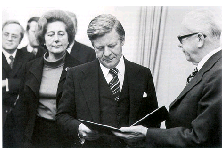

 
  
 # Leben in Deutschland ([reference](https://oet.bamf.de/ords/oetut/f?p=534:1::::::))
 
  
 |#|#|#|#|#|#|#|#|#|#|
 |-|-|-|-|-|-|-|-|-|-|
 |[001](#frage-001)|[002](#frage-002)|[003](#frage-003)|[004](#frage-004)|[005](#frage-005)|[006](#frage-006)|[007](#frage-007)|[008](#frage-008)|[009](#frage-009)|[010](#frage-010)|
 |[011](#frage-011)|[012](#frage-012)|[013](#frage-013)|[014](#frage-014)|[015](#frage-015)|[016](#frage-016)|[017](#frage-017)|[018](#frage-018)|[019](#frage-019)|[020](#frage-020)|
 |[021](#frage-021)|[022](#frage-022)|[023](#frage-023)|[024](#frage-024)|[025](#frage-025)|[026](#frage-026)|[027](#frage-027)|[028](#frage-028)|[029](#frage-029)|[030](#frage-030)|
 |[031](#frage-031)|[032](#frage-032)|[033](#frage-033)|[034](#frage-034)|[035](#frage-035)|[036](#frage-036)|[037](#frage-037)|[038](#frage-038)|[039](#frage-039)|[040](#frage-040)|
 |[041](#frage-041)|[042](#frage-042)|[043](#frage-043)|[044](#frage-044)|[045](#frage-045)|[046](#frage-046)|[047](#frage-047)|[048](#frage-048)|[049](#frage-049)|[050](#frage-050)|
 |[051](#frage-051)|[052](#frage-052)|[053](#frage-053)|[054](#frage-054)|[055](#frage-055)|[056](#frage-056)|[057](#frage-057)|[058](#frage-058)|[059](#frage-059)|[060](#frage-060)|
 |[061](#frage-061)|[062](#frage-062)|[063](#frage-063)|[064](#frage-064)|[065](#frage-065)|[066](#frage-066)|[067](#frage-067)|[068](#frage-068)|[069](#frage-069)|[070](#frage-070)|
 |[071](#frage-071)|[072](#frage-072)|[073](#frage-073)|[074](#frage-074)|[075](#frage-075)|[076](#frage-076)|[077](#frage-077)|[078](#frage-078)|[079](#frage-079)|[080](#frage-080)|
 |[081](#frage-081)|[082](#frage-082)|[083](#frage-083)|[084](#frage-084)|[085](#frage-085)|[086](#frage-086)|[087](#frage-087)|[088](#frage-088)|[089](#frage-089)|[090](#frage-090)|
 |[091](#frage-091)|[092](#frage-092)|[093](#frage-093)|[094](#frage-094)|[095](#frage-095)|[096](#frage-096)|[097](#frage-097)|[098](#frage-098)|[099](#frage-099)|[100](#frage-100)|
 |[101](#frage-101)|[102](#frage-102)|[103](#frage-103)|[104](#frage-104)|[105](#frage-105)|[106](#frage-106)|[107](#frage-107)|[008](#frage-108)|[109](#frage-009)|[110](#frage-110)|
 |[111](#frage-111)|[112](#frage-112)|[113](#frage-113)|[114](#frage-114)|[115](#frage-115)|[116](#frage-116)|[117](#frage-117)|[018](#frage-118)|[119](#frage-019)|[120](#frage-120)|
 |[121](#frage-121)|[122](#frage-122)|[123](#frage-123)|[124](#frage-124)|[125](#frage-125)|[126](#frage-126)|[127](#frage-127)|[028](#frage-128)|[129](#frage-029)|[130](#frage-130)|
 |[131](#frage-131)|[132](#frage-132)|[133](#frage-133)|[134](#frage-134)|[135](#frage-135)|[136](#frage-136)|[137](#frage-137)|[038](#frage-138)|[139](#frage-039)|[140](#frage-140)|
 |[141](#frage-141)|[142](#frage-142)|[143](#frage-143)|[144](#frage-144)|[145](#frage-145)|[146](#frage-146)|[147](#frage-147)|[048](#frage-148)|[149](#frage-049)|[150](#frage-150)|
 |[151](#frage-151)|[152](#frage-152)|[153](#frage-153)|[154](#frage-154)|[155](#frage-155)|[156](#frage-156)|[157](#frage-157)|[058](#frage-158)|[159](#frage-059)|[160](#frage-160)|
 |[161](#frage-161)|[162](#frage-162)|[163](#frage-163)|[164](#frage-164)|[165](#frage-165)|[166](#frage-166)|[167](#frage-167)|[068](#frage-168)|[169](#frage-069)|[170](#frage-170)|
 |[171](#frage-171)|[172](#frage-172)|[173](#frage-173)|[174](#frage-174)|[175](#frage-175)|[176](#frage-176)|[177](#frage-177)|[078](#frage-178)|[179](#frage-079)|[180](#frage-180)|
 |[181](#frage-181)|[182](#frage-182)|[183](#frage-183)|[184](#frage-184)|[185](#frage-185)|[186](#frage-186)|[187](#frage-187)|[088](#frage-188)|[189](#frage-089)|[190](#frage-190)|
 |[191](#frage-191)|[192](#frage-192)|[193](#frage-193)|[194](#frage-194)|[195](#frage-195)|[196](#frage-196)|[197](#frage-197)|[098](#frage-198)|[199](#frage-099)|[200](#frage-200)|
 |[201](#frage-201)|[202](#frage-202)|[203](#frage-203)|[204](#frage-204)|[205](#frage-205)|[206](#frage-206)|[207](#frage-207)|[208](#frage-208)|[209](#frage-209)|[210](#frage-210)|
 |[211](#frage-211)|[212](#frage-212)|[213](#frage-213)|[214](#frage-214)|[215](#frage-215)|[216](#frage-216)|[217](#frage-217)|[218](#frage-218)|[219](#frage-219)|[220](#frage-220)|
 |[221](#frage-221)|[222](#frage-222)|[223](#frage-223)|[224](#frage-224)|[225](#frage-225)|[226](#frage-226)|[227](#frage-227)|[228](#frage-228)|[229](#frage-229)|[230](#frage-230)|
 |[231](#frage-231)|[232](#frage-232)|[233](#frage-233)|[234](#frage-234)|[235](#frage-235)|[236](#frage-236)|[237](#frage-237)|[238](#frage-238)|[239](#frage-239)|[240](#frage-240)|
 |[241](#frage-241)|[242](#frage-242)|[243](#frage-243)|[244](#frage-244)|[245](#frage-245)|[246](#frage-246)|[247](#frage-247)|[248](#frage-248)|[249](#frage-249)|[250](#frage-250)|
 |[251](#frage-251)|[252](#frage-252)|[253](#frage-253)|[254](#frage-254)|[255](#frage-255)|[256](#frage-256)|[257](#frage-257)|[258](#frage-258)|[259](#frage-259)|[260](#frage-260)|
 |[261](#frage-261)|[262](#frage-262)|[263](#frage-263)|[264](#frage-264)|[265](#frage-265)|[266](#frage-266)|[267](#frage-267)|[268](#frage-268)|[269](#frage-269)|[270](#frage-270)|
 |[271](#frage-271)|[272](#frage-272)|[273](#frage-273)|[274](#frage-274)|[275](#frage-275)|[276](#frage-276)|[277](#frage-277)|[278](#frage-278)|[279](#frage-279)|[280](#frage-280)|
 |[281](#frage-281)|[282](#frage-282)|[283](#frage-283)|[284](#frage-284)|[285](#frage-285)|[286](#frage-286)|[287](#frage-287)|[288](#frage-288)|[289](#frage-289)|[290](#frage-290)|
 |[291](#frage-291)|[292](#frage-292)|[293](#frage-293)|[294](#frage-294)|[295](#frage-295)|[296](#frage-296)|[297](#frage-297)|[298](#frage-298)|[299](#frage-299)|[300](#frage-300)|
 
## Frage 001 
[ :top: ](#referecnce)
**In Deutchland dürfen Menschen offen etwas gegen die Regierung sagen, weil...**  

1. hier Religionsfreiheit gilt.
2. die Menschen Steuern zahlen.
3. die Menschen das Wahlrecht haben.
4. ✔️ hier Meinungsfreiheit gilt. 
 

| English | Deutsch | فارسی
|-|-|-|
|allow|dürfen|اجازه داشتن
|against|gegen|علیه
|because|weil| زیرا
|something|etwas|چیزی
|government|Regierung|دولت
|Religious freedom|Religions-freiheit| آزادی مذهبی
|apply|gilt (gelten)| اعمال شدن
|Taxes|Steuern| مالیات
|Pay|zahlen | پرداخت کردن
|Right to vote|Wahlrecht|حق رأی
|Freedom of opinion|Meinungs-freiheit|آزادی بیان

در آلمان، مردم اجازه دارند آشکارا علیه دولت صحبت کنند زیرا...
1. آزادی مذهبی اینجا مصداق دارد.
2. مردم مالیات می‌دهند
3. مردم حق رأی دارند
4. ✔️ آزادی بیان اینجا مصداق پیدا می‌کند. 

## Frage 002 
[ :top: ](#referecnce)
**In Deutchland können Eltern bis zum 14. Lebensjahr ihres Kindes entscheiden, ob es in der Schule am**
1. Geschichtsunterricht teilnimmt.
2. ✔️ Religionsunterricht teilnimmt. 
3. Politikunterricht teilnimmt.
4. Sprachunterricht teilnimmt.

| English | Deutsch | فارسی
|-|-|-|
|Age|Lebensjahr|سن
|decide|entscheiden|تصمیم گرفتن
|if|ob|اگر
|participates|teilnimmt(teilnehmen)|شرکت کردن
|History lessons|Geschichtsun-terricht|کلاس تاریخ
|Religious education|Religionsun-terricht|کلاس دینی
|Political education|Politikun-terricht|کلاس سیاست
|Language lessons|Sprachun-terricht|کلاس زبان

در آلمان، والدین می‌توانند تا 14 سالگی فرزندشان تصمیم بگیرند که آیا در مدرسه ...
1. در کلاس‌های تاریخ شرکت می‌کند.
2. ✔️ در کلاس‌های آموزش دینی شرکت می‌کند. 
3. در کلاس‌های سیاست شرکت می‌کند.
4. در کلاس‌های زبان شرکت می‌کند.

## Frage 003 
[ :top: ](#referecnce)
**Deutschland ist ein Rechtsstaat. Was ist damit gemeint?**
1. ✔️ Alle Einwohner / Einwohnerinnen und der Staat müssen sich an die Gesetze halten. 
2. Der Staat muss sich nicht an die Gesetze halten.
3. Nur Deutsche müssen die Gesetze befolgen.
4. Die Gerichte machen die Gesetze.

| English | Deutsch | فارسی
|-|-|-|
|Constitutional state|Rechtsstaat|مبتنی بر قانون (مشروطه)
|by this|damit|
|meant|gemeint(meinen)|معنی دادن
|Residents|Einwohner|ساکن (جمعیت)
|State|Staat|ایالت
|Laws|Gesetze (Gesetz)|قوانین
|abide by|halten|رعایت کردن
|follow|befolgen|پیروی کردن
|courts|Gerichte (Gericht)|دادگاه ها

آلمان یک کشور مبتنی بر قانون اساسی است. این به چه معناست؟
1. ✔️ همه ساکنان و دولت باید از قوانین پیروی کنند. 
2. دولت مجبور به رعایت قوانین نیست.
3. فقط آلمانی‌ها باید از قوانین پیروی کنند.
4. دادگاه‌ها قوانین را وضع می‌کنند.

## Frage 004 
[ :top: ](#referecnce)
**Welches Recht gehört zu den Grundrechten in Deutschland? **
1. Waffenbesitz
2. Faustrecht
3. ✔️ Meinungsfreiheit
4. Selbstjustiz

| English | Deutsch | فارسی
|-|-|-|
|right|Recht|حق
|belongs to|gehört (Hören)|شنیدن (متعلق به)
|Basic rights|Grundrechten|حقوق اساسی
|Weapons ownership|Waffenbesitz|مالکیت اسلحه
|Fist law|Faustrecht|قانون جنگل
|Vigilante justice|Selbstjustiz|عدالت خودجوش (خودسرانه)

کدام حق، جزو حقوق اساسی در آلمان است؟
1. مالکیت اسلحه
2. قانون جنگل
3. ✔️ آزادی بیان 
4. عدالت خودجوش (خودسرانه)

## Frage 005 
[ :top: ](#referecnce)
**Wahlen in Deutschland sind frei. Was bedeutet das?**
1. Man darf Geld annehmen, wenn man dafür einen bestimmten Kandidaten 
   / eine bestimmte Kandidatin wählt.
2. Nur Personen, die noch nie im Gefängnis waren, dürfen wählen.
3. ✔️ Der Wähler darf bei der Wahl weder beeinflusst
   noch zu einer bestimmten Stimmabgabe gezwungen 
   werden und keine Nachteile durch die Wahl haben.
4. Alle wahlberechtigten Personen müssen wählen.

| English | Deutsch | فارسی
|-|-|-|
|Elections|Wahlen|انتخابات
|accept|an-nehmen|قبول کردن
|for this|dafür|برای اینکه
|be in favor|dafür sein|طرفدار بودن
|certain|bestimmt|مشخص، خاص
|male/female Candidates|Kandidaten/Kandidatin|نامزهای مرد/زن
|select |wählt (Wählen)|انتخاب کردن
|Only,Just|Nur|فقط
|Prison|Gefängnis|زندان
|voters|Wähler|رأی دهندگان
|vote |Wahl |رأی
|neither |weder|هیچکدام
|beeinflusst|beeinflusst|تحت تاثیر قرار گرفته
|voting|Stimmabgabe|رأی گیری
|be forced|gezwungen werden|مجبور شدن به
|disadvantages|Nachteile|معایب
|eligible voters|wahlberechtigten|رأی‌دهندگان واجد شرایط

انتخابات در آلمان آزاد است؟ این یعنی چه؟
1. اگر به یک نامزد خاص رأی دهید، مجاز به دریافت پول هستید.
2. فقط افرادی که هرگز به زندان نرفته‌اند، مجاز به رأی دادن هستند.
3. ✔️ رأی‌دهنده ممکن است در انتخابات تحت تأثیر قرار نگیرد
   یا مجبور به رأی دادن به شیوه‌ای خاص نشود
   و ممکن است در نتیجه انتخابات متحمل هیچ گونه ضرر و زیانی نشود. 
4. همه واجدین شرایط باید رأی بدهند.

## Frage 006 
[ :top: ](#referecnce)
**Wie heißt die deutsche Verfassung?**
1. Volksgesetz
2. Bundesgesetz
3. Deutsches Gesetz
4. ✔️ Grundgesetz

| English | Deutsch | فارسی
|-|-|-|
|Constitution|Verfassung|قانون اساسی
|People's law|Volksgesetz|قانون مردم
|Federal law|Bundesgesetz|قانون فدرال
|Basic Law|Grundgesetz|قانون پایه

نام قانون اساسی آلمان چیست؟
1. قانون مردم
2. قانون فدرال
3. قانون آلمان
4. ✔️ قانون پایه

## Frage 007 
[ :top: ](#referecnce)
**Welches Recht gehört zu den Grundrechten, 
  die nach der deutschen Verfassung garantiert werden? Das Resht auf...**
1. ✔️ Glaubens- und Gewissensfreiheit.
2. Unterhaltung.
3. Arbeit.
4. Wohnung.

| English | Deutsch | فارسی
|-|-|-|
|fundamental right|Grundrechten|حقوق اساسی
|be guaranteed|garantiert werden|تضمین شده باشد
|freedom of conscience|Gewissensfreiheit|آزادی وجدان
|Freedom of belief|Glaubensfreiheit|آزادی عقیده
|Entertainment|Unterhaltung|سرگرمی

کدام حق، یکی از حقوق اساسی تضمین شده در قانون اساسی آلمان است؟ حقِ...
1. ✔️ آزادی عقیده و وجدان.
2. سرگرمی
3. کار
4. مسکن

## Frage 008 
[ :top: ](#referecnce)
**Was steht nicht im Grundgesetz von Deutschland?**
1. Die Würde des Menschen ist unantastbar.
2. ✔️ Alle sollen gleich viel Geld haben.
3. Jeder Mensch darf seine Meinung sagen.
4. Alle sind vor dem Gesetz gleich.

| English | Deutsch | فارسی
|-|-|-|
|stands|steht (stehen)|ایستادن، وجود داشتن
|Human dignity|Würde des Menschen|کرامت انسانی
|untouchable|unantastbar|مصون از تعرض
|be supposed to|sollen|باید
|equivalent |gleich|به یک اندازه
|every human being|Jeder Mensch|هر فرد
|opinion |Meinung|نظر

چه مواردی در قانون اساسی آلمان وجود ندارد؟
1. کرامت انسانی خدشه‌ناپذیر است.
2. ✔️ همه باید به یک اندازه پول داشته باشند.
3. هر کسی اجازه دارد نظر خود را بیان کند.
4. همه در برابر قانون برابرند.

## Frage 009 
[ :top: ](#referecnce)
**Welches Grundrecht gilt in Deutschland nur für Ausländer/Ausländerinnen? Das Grundrecht auf**
1. Schutz der Familie
2. Menschenwürde
3. ✔️ Asyl
4. Meinungsfreiheit

| English | Deutsch | فارسی
|-|-|-|
|protection|Schutz|حفاظت
|Human dignity|Menschenwürde|کرامت انسانی
|Asylum|Asyl|پناهندگی

کدام حق اساسی فقط برای خارجی‌ها در آلمان اعمال می‌شود؟ حق اساسی برای
1. حفاظت از خانواده
2. کرامت انسانی
3. ✔️ پناهندگی
4. آزادی بیان

## Frage 010 
[ :top: ](#referecnce)
**Was ist mit dem deutschen Grundgesetz vereinbar?**
1. die Prügelstrafe
2. die Folter
3. die Todesstrafe
4. ✔️ die Geldstrafe

| English | Deutsch | فارسی
|-|-|-|
|compatible|vereinbar|سازگار
|Corporal punishment|Prügelstrafe|تنبیه بدنی
|torture|die Folter|
|Death penalty|Todesstrafe|مجازات اعدام
|penalty|Geldstrafe|جریمه

چه چیزی با قانون اساسی آلمان سازگار است؟
1. تنبیه بدنی
2. شکنجه
3. مجازات اعدام
4. ✔️ جریمه

## Frage 011 
[ :top: ](#referecnce)
**Wie wird die Verfassung der Bundesrepublik Deutschland genannt?**
1. ✔️ Grundgesetz
2. Bundesverfassung
3. Gesetzbuch
4. Verfassungsvertrag

| English | Deutsch | فارسی
|-|-|-|
|becomes|wird ()|میشود
|called|genannt (nennen)|نامیدن
|Federal Republic|Bundesrepublik|جمهوری فدرال
|Federal Constitution|Bundesverfassung|قانون اساسی فدرال
|Basic Law|Gesetzbuch|قانون اساسی
|Constitutional Treaty|Verfassungsvertrag|پیمان قانون اساسی

قانون اساسی جمهوری فدرال آلمان چه نام دارد؟
1. ✔️ قانون اساسی
2. قانون اساسی فدرال
3. قانون
4. پیمان قانون اساسی

## Frage 012 
[ :top: ](#referecnce)
**Eine Partei im Deutschen Bundestag will die Pressefreiheit abschaffen. Ist das möglich?**
1. Ja, wenn mehr als die Hälfte der Abgeordneten im Bundestag dafür sind.
2. Ja, aber dazu müssen zwei Drittel der Abgeordneten im Bundestag dafür sein.
3. ✔️ Nein, denn die Pressefreiheit ist ein Grundrecht. Sie kann nicht abgeschafft werden.
4. Nein, denn nur der Bundesrat kann die Pressefreiheit abschaffen.

| English | Deutsch | فارسی
|-|-|-|
|||
|||

یک حزب در مجلس فدرال آلمان می‌خواهد آزادی مطبوعات را لغو کند. آیا این ممکن است؟
1. بله، اگر بیش از نیمی از اعضای بوندستاگ موافق باشند.
2. بله، اما دو سوم اعضای بوندستاگ باید موافق آن باشند.
3. ✔️ نه، زیرا آزادی مطبوعات یک حق اساسی است. نمی‌توان آن را لغو کرد.
4. نه، زیرا فقط شورای فدرال می‌تواند آزادی مطبوعات را لغو کند.

## Frage 013 
[ :top: ](#referecnce)
**Im Parlament steht der Begriff "Opposition" für**
1. die regierenden Parteien.
2. die Fraktion mit den meisten Abgeordneten.
3. alle Parteien, die bei der letzten Wahl die 5%-Hürde erreichen konnten.
4. ✔️ alle Abgeordneten, die nicht zu der Regierungspartei/den Regierungsparteien gehören.

| English | Deutsch | فارسی
|-|-|-|
|||
|||

در پارلمان، اصطلاح «اپوزیسیون» مخفف ...
1. احزاب حاکم.
2. گروهی که بیشترین عضو را دارد.
3. تمام احزابی که در انتخابات گذشته به مانع ۵٪ رسیدند.
4. ✔️ تمام نمایندگان مجلس که به حزب (های) حاکم تعلق ندارند.

## Frage 014 
[ :top: ](#referecnce)
**Meinungsfreiheit in Deutschland heißt zum Beispiel, dass ich**
1. Passanten auf der Straße beschimpfen darf
2. ✔️ meine Meinung im Internet äußern kann
3. Nazi-, Hamas- oder Islamischer Staat-Symbole öffentlich tragen darf
4. meine Meinung nur dann äußern darf, solange ich der Regierung nicht widerspreche

| English | Deutsch | فارسی
|-|-|-|
|||
|||

آزادی بیان در آلمان به این معنی است که، برای مثال، من
1. ممکن است در خیابان به رهگذران توهین کند
2. ✔️ می‌توانم نظرم را در اینترنت بیان کنم
3. ممکن است در ملاء عام نمادهای نازی، حماس یا دولت اسلامی را بپوشند
4. من فقط می‌توانم نظر خودم را بیان کنم، تا زمانی که با دولت در تضاد نباشد.

## Frage 015 
[ :top: ](#referecnce)
**Was verbietet das deutsche Grundgesetz?**
1. Militärdienst
2. ✔️ Zwangsarbeit
3. freie Berufswahl
4. Arbeit im Ausland

| English | Deutsch | فارسی
|-|-|-|
|||
|||

قانون اساسی آلمان چه چیزهایی را ممنوع می‌کند؟
1. خدمت سربازی
2. ✔️ کار اجباری
3. انتخاب آزاد حرفه
4. کار در خارج از کشور

## Frage 016 
[ :top: ](#referecnce)
**Wann ist die Meinungsfreiheit in Deutschland eingeschränkt?**
1. ✔️ bei der öffentlichen Verbreitung falscher Behauptungen über einzelne Personen
2. bei Meinungsäußerungen über die Bundesregierung
3. bei Diskussionen über Religionen
4. bei Kritik am Staat

| English | Deutsch | فارسی
|-|-|-|
|||
|||

چه زمانی آزادی بیان در آلمان محدود می‌شود؟
1. ✔️ در انتشار عمومی ادعاهای دروغین درباره افراد
2. هنگام ابراز نظرات در مورد دولت فدرال
3. در بحث‌های مربوط به ادیان
4. هنگام انتقاد از دولت

## Frage 017 
[ :top: ](#referecnce)
**Die deutschen Gesetze verbieten...**
1. Meinungsfreiheit der Einwohner und Einwohnerinnen.
2. Petitionen der Bürger und Bürgerinnen.
3. Versammlungsfreiheit der Einwohner und Einwohnerinnen.
4. ✔️ Ungleichbehandlung der Bürger und Bürgerinnen durch den Staat.

| English | Deutsch | فارسی
|-|-|-|
|||
|||

طبق قانون آلمان، ... ممنوع است.
1. آزادی بیان برای ساکنان.
2. دادخواست‌های شهروندان.
3. آزادی تجمع برای ساکنان.
4. ✔️ رفتار نابرابر دولت با شهروندان.

## Frage 018 
[ :top: ](#referecnce)
**Welches Grundrecht ist in Artikel 1 des Grundgesetzes der Bundesrepublik Deutschland garantiert?**
1. ✔️ die Unantastbarkeit der Menschenwürde
2. das Recht auf Leben
3. Religionsfreiheit
4. Meinungsfreiheit

| English | Deutsch | فارسی
|-|-|-|
|||
|||

کدام حق اساسی در ماده ۱ قانون اساسی جمهوری فدرال آلمان تضمین شده است؟
1. ✔️ خدشه‌ناپذیری کرامت انسانی
2. حق حیات
3. آزادی مذهب
4. آزادی بیان

## Frage 019 
[ :top: ](#referecnce)
**Was versteht man unter dem Recht der "Freizügigkeit" in Deutschland?**
1. ✔️ Man darf sich seinen Wohnort selbst aussuchen.
2. Man kann seinen Beruf wechseln.
3. Man darf sich für eine andere Religion entscheiden.
4. Man darf sich in der Öffentlichkeit nur leicht bekleidet bewegen.

| English | Deutsch | فارسی
|-|-|-|
|||
|||

منظور از حق «آزادی رفت و آمد» در آلمان چیست؟
1. ✔️ شما می‌توانید محل زندگی خود را انتخاب کنید.
2. می‌توانید شغلتان را تغییر دهید.
3. شما آزاد هستید که دین دیگری را انتخاب کنید.
4. شما فقط مجاز به رفت و آمد در اماکن عمومی با لباس سبک هستید.

## Frage 020 
[ :top: ](#referecnce)
**Eine Partei in Deutschland verfolgt das Ziel, eine Diktatur zu errichten. Sie ist denn...**
1. tolerant. 
2. rechtsstaatlich orientiert.
3. gesetzestreu.
4. ✔️ verfassungswidrig.

| English | Deutsch | فارسی
|-|-|-|
|||
|||

حزبی در آلمان هدف ایجاد دیکتاتوری را دنبال می‌کند. این ...
1. بردبار.
2. با محوریت حاکمیت قانون.
3. مطیع قانون.
4. ✔️ خلاف قانون اساسی.

## Frage 021 
[ :top: ](#referecnce)
**Welches ist das Wappen der Bundesrepublik Deutschland?**

✔️ 

| English | Deutsch | فارسی
|-|-|-|
|||
|||

نشان ملی جمهوری فدرال آلمان چیست؟
1. ✔️ 
2.
3.
4.

## Frage 022 
[ :top: ](#referecnce)
**Was für eine Staatsform hat Deutschland?**
1. Monarchie 
2. Diktatur
3. ✔️ Republik
4. Fürstentum

| English | Deutsch | فارسی
|-|-|-|
|||
|||

آلمان چه نوع حکومتی دارد؟
1. سلطنت
2. دیکتاتوری
3. ✔️ جمهوری
4. شاهزاده‌نشین

## Frage 023 
[ :top: ](#referecnce)
**In Deutschland sind die meisten Erwerbstätigen...**
1. in kleinen Familienunternehmen beschäftigt.
2. ehrenamtlich für ein Bundesland tätig.
3. selbständig mit einer eigenen Firma tätig.
4. ✔️  bei einer Firma oder Behörde beschäftigt.

| English | Deutsch | فارسی
|-|-|-|
|||
|||

در آلمان، بیشتر شاغلین ...
1. در کسب و کارهای کوچک خانوادگی مشغول به کار هستند.
2. کار داوطلبانه برای یک ایالت فدرال.
3. با شرکت خودش به صورت آزاد کار می‌کند.
4. ✔️ توسط یک شرکت یا مرجع استخدام شده باشد.

## Frage 024 
[ :top: ](#referecnce)
**Wie viele Bundesländer hat die Bundesrepublik Deutschland?**
1. 14
2. 15
3. ✔️ 16
4. 17

| English | Deutsch | فارسی
|-|-|-|
|||
|||

جمهوری فدرال آلمان چند ایالت فدرال دارد؟
1. 14
2. 15
3. ✔️ 16
4. 17

## Frage 025 
[ :top: ](#referecnce)
**Was ist kein Bundesland der Bundesrepublik Deutschland?**
1. ✔️ Elsass-Lothringen
2. Nordrhein-Westfalen
3. Mecklenburg-Vorpommern
4. Sachsen-Anhalt

| English | Deutsch | فارسی
|-|-|-|
|||
|||

کدام ایالت، جزو جمهوری فدرال آلمان نیست؟
1. ✔️ آلزاس-لورن
2. نوردراین-وستفالن
3. مکلنبورگ-پومرانی غربی
4. زاکسن-آنهالت

## Frage 026 
[ :top: ](#referecnce)
**Deutschland ist ...**
1. eine kommunistische Republik.
2. ✔️ ein demokratischer und sozialer Bundesstaat.
3. eine kapitalistische und soziale Monarchie.
4. ein sozialer und sozialistischer Bundesstaat.

| English | Deutsch | فارسی
|-|-|-|
|||
|||

آلمان ... است
1. یک جمهوری کمونیستی.
2. ✔️ یک دولت فدرال دموکراتیک و اجتماعی.
3. یک سلطنت سرمایه‌داری و اجتماعی.
4. یک دولت فدرال سوسیالیستی و اجتماعی.

## Frage 027 
[ :top: ](#referecnce)
**Deutschland ist ...**
1. ein sozialistischer Staat. 
2. ✔️ ein Bundesstaat.
3. eine Diktatur.
4. eine Monarchie.

| English | Deutsch | فارسی
|-|-|-|
|||
|||

آلمان ... است
1. یک دولت سوسیالیستی.
2. ✔️ یک ایالت فدرال.
3. یک دیکتاتوری.
4. یک سلطنت.

## Frage 028 
[ :top: ](#referecnce)
**Wer wählt in Deutschland die Abgeordneten zum Bundestag?**
1. das Militär
2. die Wirtschaft
3. ✔️ das wahlberechtigte Volk
4. die Verwaltung

| English | Deutsch | فارسی
|-|-|-|
|||
|||

چه کسی اعضای بوندستاگ (مجلس فدرال) در آلمان را انتخاب می‌کند؟
1. ارتش
2. اقتصاد
3. ✔️ جمعیت رأی دهنده
4. اداره (administration/management)

## Frage 029 
[ :top: ](#referecnce)
**Welches Tier ist das Wappentier der Bundesrepublik Deutschland?**
1. Löwe
2. ✔️ Adler
3. Bär
4. Pferd

| English | Deutsch | فارسی
|-|-|-|
|||
|||

کدام حیوان نشان جمهوری فدرال آلمان است؟
1. شیر
2. ✔️ عقاب
3. خرس
4. اسب

## Frage 030 
[ :top: ](#referecnce)
**Was ist kein Merkmal unserer Demokratie?**
1. regelmäßige Wahlen
2. ✔️ Pressezensur
3. Meinungsfreiheit
4. verschiedene Parteien

| English | Deutsch | فارسی
|-|-|-|
|||
|||

کدام مورد از ویژگی‌های دموکراسی ما نیست؟
1. انتخابات عادی
2. ✔️ سانسور مطبوعات
3. آزادی بیان
4. احزاب مختلف

## Frage 031 
[ :top: ](#referecnce)
**Die Zusammenarbeit von Parteien zur Bildung einer Regierung nennt man in Deutschland ...**
1. Einheit.
2. ✔️ Koalition.
3. Ministerium.
4. Fraktion.

| English | Deutsch | فارسی
|-|-|-|
|||
|||

در آلمان به همکاری احزاب برای تشکیل دولت ... گفته می شود.
1. واحد
2. ✔️ ائتلاف
3. وزارتخانه
4. کسری

## Frage 032 
[ :top: ](#referecnce)
**Was ist keine staatliche Gewalt in Deutschland?**
1. Gesetzgebung
2. Regierung
3. ✔️ Presse
4. Rechtsprechung

| English | Deutsch | فارسی
|-|-|-|
|||
|||

چه چیزی در آلمان قدرت دولتی نیست؟
1. قانونگذاری
2. دولت
3. ✔️ مطبوعات
4. رویه قضایی

## Frage 033 
[ :top: ](#referecnce)
**Welche Aussage ist richtig? in Deutschland ...**
1. ✔️ sind Staat und Religionsgemeinschaften voneinander getrennt.
2. bilden die Religionsgemeinschaften den Staat.
3. ist der Staat abhängig von den Religionsgemeinschaften.
4. bilden Staat und Religionsgemeinschaften eine Einheit.

| English | Deutsch | فارسی
|-|-|-|
|||
|||

کدام جمله صحیح است؟ در آلمان...
1. ✔️ جوامع دولتی و مذهبی از یکدیگر جدا هستند.
2. جوامع مذهبی دولت را تشکیل می‌دهند.
3. دولت به جوامع مذهبی وابسته است.
4. دولت و جوامع مذهبی یک وحدت را تشکیل می‌دهند.

## Frage 034
[ :top: ](#referecnce)
**Was ist Deutschland nicht?**
1. eine Demokratie 
2. ein Rechtsstaat
3. ✔️ eine Monarchie
4. ein Sozialstaat

| English | Deutsch | فارسی
|-|-|-|
|||
|||

آلمان چه چیزی نیست؟
1. یک دموکراسی
2. یک دولت مشروطه
3. ✔️ یک سلطنت
4. یک دولت رفاه

## Frage 035
[ :top: ](#referecnce)
**Womit finanziert der deutsche Staat die Sozialversicherung?**
1. Kirchensteuern
2. ✔️ Sozialabgaben
3. Spendengeldern
4. Vereinsbeiträgen

| English | Deutsch | فارسی
|-|-|-|
|||
|||

دولت آلمان چگونه تأمین اجتماعی را تأمین مالی می‌کند؟
1. مالیات کلیسا
2. ✔️ مشارکت‌های تأمین اجتماعی
3. کمک‌های مالی
4. کمک‌های مالی باشگاه

## Frage 036
[ :top: ](#referecnce)
**Welche Maßnahme schafft in Deutschland soziale Sicherheit?**
1. ✔️ die Krankenversicherung
2. die Autoversicherung
3. die Gebäudeversicherung
4. die Haftpflichtversicherung

| English | Deutsch | فارسی
|-|-|-|
|||
|||

کدام اقدام، امنیت اجتماعی را در آلمان ایجاد می‌کند؟
1. ✔️ بیمه سلامت
2. بیمه خودرو
3. بیمه ساختمان
4. بیمه مسئولیت مدنی

## Frage 037
[ :top: ](#referecnce)
**Wie werden die Regierungschefs/Regierungschefinnen der meisten Bundesländer in Deutschland genannt?**
1. Erster Minister/ Erste Ministerin
2. Premierminister/ Premierministerin
3. Senator/ Senatorin
4. ✔️ Ministerpräsident/ Ministerpräsidentin

| English | Deutsch | فارسی
|-|-|-|
||Regierungschefs|روسای دولت
|||

روسای دولت اکثر ایالت‌های فدرال در آلمان چه نامیده می‌شوند؟
1. وزیر اول
2. نخست وزیر (Premierminister)
3. سناتور
4. ✔️ نخست وزیر (Ministerpräsident)

## Frage 038
[ :top: ](#referecnce)
**Die Bundesrepublik Deutschland ist ein demokratischer und sozialer...**
1. Staatenverbund.
2. ✔️ Bundesstaat.
3. Staatenbund.
4. Zentralstaat.

| English | Deutsch | فارسی
|-|-|-|
|||
|||

جمهوری فدرال آلمان کشوری دموکراتیک و اجتماعی است...
1. اتحادیه ایالت‌ها
2. ✔️ ایالت فدرال
3. کنفدراسیون ایالت‌ها.
4. حکومت مرکزی.

## Frage 039
[ :top: ](#referecnce)
**Was hat jedes deutsche Bundesland?**
1. einen eigenen Außenminister / eine eigene Außenministerin
2. eine eigene Währung
3. eine eigene Armee
4. ✔️ eine eigene Regierung

| English | Deutsch | فارسی
|-|-|-|
|||
|||

هر ایالت فدرال آلمان چه دارد؟
1. وزیر امور خارجه خودش
2. واحد پول خودش
3. ارتش خودش
4. ✔️ دولت خودش

## Frage 040
[ :top: ](#referecnce)
**Mit welchen Worten beginnt die deutsche Nationalhymne?**
1. Völker, hört die Signale ...
2. ✔️ Einigkeit und Recht und Freiheit ...
3. Freude schöner Götterfunken ...
4. Deutschland einig Vaterland ...

| English | Deutsch | فارسی
|-|-|-|
|||
|||

سرود ملی آلمان با چه کلماتی آغاز می‌شود؟
1. ای مردم، به سیگنال‌ها گوش دهید...
2. ✔️ وحدت و عدالت و آزادی...
3. شادی، جرقه زیبای خدایان...
4. آلمان، سرزمین پدری متحد...

## Frage 041
[ :top: ](#referecnce)
**Warum gibt es in einer Demokratie mehr als eine Partei?**
1. ✔️ weil dadurch die unterschiedlichen Meinungen der Bürger und Bürgerinnen vertreten werden
2. damit Bestechung in der Politik begrenzt wird
3. um politische Demonstrationen zu verhindern
4. um wirtschaftlichen Wettbewerb anzuregen

| English | Deutsch | فارسی
|-|-|-|
|||
|||

چرا در یک دموکراسی بیش از یک حزب وجود دارد؟
1. ✔️ زیرا نمایانگر نظرات مختلف شهروندان است
2. محدود کردن رشوه در سیاست
3. برای جلوگیری از تظاهرات سیاسی
4. برای تحریک رقابت اقتصادی

## Frage 042
[ :top: ](#referecnce)
**Wer beschließt in Deutschland ein neues Gesetz?**
1. die Regierung
2. ✔️ das Parlament
3. die Gerichte
4. die Polizei

| English | Deutsch | فارسی
|-|-|-|
|||
|||

چه کسی در آلمان در مورد قانون جدید تصمیم می‌گیرد؟
1. دولت
2. ✔️ مجلس
3. دادگاه‌ها
4. پلیس

## Frage 043
[ :top: ](#referecnce)
**Wann kann in Deutschland eine Partei verboten werden?**
1. wenn ihr Wahlkampf zu teuer ist
2. ✔️ wenn sie gegen die Verfassung kämpft
3. wenn sie Kritik am Staatsoberhaupt äußert
4. wenn ihr Programm eine neue Richtung vorschlägt

| English | Deutsch | فارسی
|-|-|-|
|||
|||

چه زمانی می‌توان یک حزب را در آلمان ممنوع کرد؟
1. اگر مبارزات انتخاباتی آنها خیلی پرهزینه باشد
2. ✔️ وقتی او علیه قانون اساسی می‌جنگد
3. وقتی از رئیس دولت انتقاد می‌کند
4. اگر برنامه آنها جهت جدیدی را پیشنهاد کند

## Frage 044
[ :top: ](#referecnce)
**Wen  kann man als Bürger / Bürgerin in Deutschland nicht direkt wählen?**
1. Abgeordnete des EU-Parlaments
2. ✔️ den Bundespräsidenten / die Bundespräsidentin
3. Landtagsabgeordnete
4. Bundestagsabgeordnete

| English | Deutsch | فارسی
|-|-|-|
|||
|||

چه کسانی نمی‌توانند مستقیماً به عنوان شهروند در آلمان انتخاب شوند؟
1. اعضای پارلمان اروپا
2. ✔️ رئیس جمهور فدرال
3. اعضای پارلمان ایالتی
4. اعضای مجلس فدرال (بوندستاگ)

## Frage 045
[ :top: ](#referecnce)
**Zu welcher Versicherung gehört die Pflegeversicherung?**
1. ✔️ Sozialversicherung
2. Unfallversicherung
3. Hausratversicherung
4. Haftpflicht- und Feuerversicherung

| English | Deutsch | فارسی
|-|-|-|
|||
|||

بیمه مراقبت طولانی مدت به کدام بیمه تعلق دارد؟
1. ✔️ تامین اجتماعی
2. بیمه حوادث
3. بیمه وسایل منزل
4. بیمه مسئولیت مدنی و آتش سوزی

## Frage 046
[ :top: ](#referecnce)
**Der deutsche Staat hat viele Aufgaben. Welche Aufgabe gehört dazu?**
1. ✔️ Er baut Straßen und Schulen.
2. Er verkauft Lebensmittel und Kleidung.
3. Er versorgt alle Einwohner und Einwohnerinnen kostenlos mit Zeitungen.
4. Er produziert Autos und Busse.

| English | Deutsch | فارسی
|-|-|-|
|||
|||

دولت آلمان مسئولیت‌های زیادی دارد. برخی از آنها چیست؟
1. ✔️ او جاده و مدرسه می‌سازد.
2. او غذا و لباس می‌فروشد.
3. این روزنامه‌ها را به صورت رایگان در اختیار همه ساکنان قرار می‌دهد.
4. ماشین و اتوبوس تولید می‌کند.

## Frage 047
[ :top: ](#referecnce)
**Der deutsche Staat hat viele Aufgaben. Welche Aufgabe gehört nicht dazu?**
1. ✔️ Er bezahlt für alle Staatsangehörigen Urlaubsreisen.
2. Er zahlt Kindergeld.
3. Er unterstützt Museen.
4. Er fördert Sportler und Sportlerinnen.

| English | Deutsch | فارسی
|-|-|-|
|||
|||

دولت آلمان مسئولیت‌های زیادی دارد. کدام یک از آنها نیست؟
1. ✔️ او هزینه سفرهای تفریحی همه شهروندان را پرداخت می‌کند.
2. او کمک هزینه فرزند پرداخت می‌کند.
3. او از موزه‌ها حمایت می‌کند.
4. او از ورزشکاران حمایت می‌کند.

## Frage 048
[ :top: ](#referecnce)
**Welche Organ gehört nicht zu den Verfassungsorganen?**
1. der Bundesrat
2. der Bundespräsident / die Bundespräsidentin
3. ✔️ die Bürgerversammlung
4. die Regierung

| English | Deutsch | فارسی
|-|-|-|
|||
|||

کدام نهاد، نهادی مطابق قانون اساسی نیست؟
1. شورای فدرال
2. رئیس جمهور فدرال
3. ✔️ مجلس شهروندان
4. دولت

## Frage 049
[ :top: ](#referecnce)
**Wer bestimmt in Deutschland die Schulpolitik?**
1. die Lehrer und Lehrerinnen
2. ✔️ die Bundesländer
3. das Familienministerium
4. die Universitäten

| English | Deutsch | فارسی
|-|-|-|
|||
|||

چه کسی سیاست مدارس در آلمان را تعیین می‌کند؟
1. معلمان
2. ✔️ ایالت‌های فدرال
3. وزارت امور خانواده
4. دانشگاه‌ها

## Frage 050
[ :top: ](#referecnce)
**Die Wirtschaftsform in Deutschland nennt man ...**
1. freie Zentralwirtschaft.
2. ✔️ soziale Marktwirtschaft.
3. gelenkte Zentralwirtschaft.
4. Planwirtschaft.

| English | Deutsch | فارسی
|-|-|-|
|||
|||

سیستم اقتصادی در آلمان ... نامیده می شود.
1. اقتصاد مرکزی آزاد
2. ✔️ اقتصاد بازار اجتماعی.
3. اقتصاد مرکزی کنترل‌شده
4. اقتصاد برنامه ریزی شده

## Frage 051
[ :top: ](#referecnce)
**Zu einem demokratischen Rechtsstaat gehört es nicht, dass...**
1. Menschen sich kritisch über die Regierung äußern können.
2. Bürger friedlich demonstrieren gehen dürfen.
3. ✔️ Menschen von einer Privatpolizei ohne Grund verhaftet werden.
4. jemand ein Verbrechen begeht und deshalb verhaftet wird.

| English | Deutsch | فارسی
|-|-|-|
|||
|||

یک دولت دموکراتیک مبتنی بر قانون اساسی شامل ... نمی‌شود.
1. مردم می‌توانند نظرات انتقادی خود را در مورد دولت بیان کنند.
2. شهروندان اجازه دارند به صورت مسالمت‌آمیز تظاهرات کنند.
3. ✔️ مردم بدون هیچ دلیلی توسط پلیس خصوصی دستگیر می‌شوند.
4. کسی مرتکب جرمی می‌شود و به خاطر آن دستگیر می‌شود.

## Frage 052
[ :top: ](#referecnce)
**Was bedeutet "Volkssouveränität"? Alle Staatsgewalt geht vom...**
1. ✔️ Volke aus.
2. Bundestag aus.
3. preußischen König aus.
4. Bundesverfassungsgericht aus.

| English | Deutsch | فارسی
|-|-|-|
|||
|||

«حاکمیت مردمی» به چه معناست؟ تمام قدرت دولتی از ... سرچشمه می‌گیرد.
1. ✔️ مردم بیرون.
2. بوندستاگ
3. پادشاه پروس.
4. دادگاه قانون اساسی فدرال.

## Frage 053
[ :top: ](#referecnce)
**Was bedeutet "Rechtsstaat" in Deutschland?"**
1. Der Staat hat Recht.
2. Es gibt nur rechte Parteien.
3. Die Bürger und Bürgerinnen entscheiden über Gesetze.
4. ✔️ Der Staat muss die Gesetze einhalten.

| English | Deutsch | فارسی
|-|-|-|
|||
|||

«حاکمیت قانون» در آلمان به چه معناست؟
1. حق با ایالت است.
2. فقط احزاب راست‌گرا وجود دارند.
3. شهروندان در مورد قوانین تصمیم می‌گیرند.
4. ✔️ دولت باید از قوانین اطاعت کند.

## Frage 054
[ :top: ](#referecnce)
**Was ist keine staatliche Gewalt in Deutschland?**
1. Legislative
2. Judikative
3. Exekutive
4. ✔️ Direktive

| English | Deutsch | فارسی
|-|-|-|
|||
|||

چه چیزی در آلمان قدرت دولتی نیست؟
1. قوه مقننه
2. قوه قضائیه
3. اجرایی
4. ✔️ بخشنامه

## Frage 055
[ :top: ](#referecnce)
**Was zeigt dieses Bild?**

1. ✔️ den Bundestagssitz in Berlin
2. das Bundesverfassungsgericht in Karlsruhe
3. das Bundesratsgebäude in Berlin
4. das Bundeskanzleramt in Berlin

| English | Deutsch | فارسی
|-|-|-|
|||
|||

این تصویر چه چیزی را نشان می‌دهد؟
1. ✔️ کرسی بوندس‌تاگ در برلین
2. دادگاه قانون اساسی فدرال در کارلسروهه
3. ساختمان شورای فدرال در برلین
4. دفتر صدراعظم فدرال در برلین

## Frage 056
[ :top: ](#referecnce)
**Welches Amt gehört in Deutschland zur Gemeindeverwaltung?**
1. Pfarramt
2. ✔️ Ordnungsamt
3. Finanzamt
4. Auswärtiges Amt

| English | Deutsch | فارسی
|-|-|-|
|||
|||

کدام اداره متعلق به اداره شهرداری در آلمان است؟
1. دفتر کلیسا
2. ✔️ اداره نظم عمومی
3. اداره مالیات
4. وزارت امور خارجه

## Frage 057
[ :top: ](#referecnce)
**Wer wird meistens zum Präsidenten / zur Präsidentin des Deutschen Bundestages gewählt?**
1. der / die älteste Abgeordnete im Parlament
2. der Ministerpräsident / die Ministerpräsidentin des größten Bundeslandes
3. ein ehemaliger Bundeskanzler / eine ehemalige Bundeskanzlerin
4. ✔️ ein Abgeordneter / eine Abgeordnete der stärksten Fraktion

| English | Deutsch | فارسی
|-|-|-|
|||
|||

چه کسی اغلب به عنوان رئیس مجلس فدرال آلمان انتخاب می‌شود؟
1. مسن‌ترین نماینده مجلس
2. نخست وزیر بزرگترین ایالت فدرال
3. صدراعظم سابق فدرال
4. ✔️ عضوی از قوی‌ترین گروه پارلمانی

## Frage 058
[ :top: ](#referecnce)
**Wer ernennt in Deutschland die Minister/ die Ministerinnen der Bundesregierung?**
1. der Präsident / die Präsidentin des Bundesverfassungsgerichtes
2. ✔️ der Bundespräsident / die Bundespräsidentin
3. der Bundesratspräsident / die Bundesratspräsidentin
4. der Bundestagspräsident / die Bundestagspräsidentin

| English | Deutsch | فارسی
|-|-|-|
|||
|||

چه کسی وزرای دولت فدرال در آلمان را منصوب می‌کند؟
1. رئیس دادگاه قانون اساسی فدرال
2. ✔️ رئیس جمهور فدرال
3. رئیس شورای فدرال
4. رئیس مجلس فدرال

## Frage 059
[ :top: ](#referecnce)
**Vor wie vielen Jahren gab es erstmals eine jüdische Gemeinde auf dem Gebiet des heutigen Deutschlands?**
1. vor etwa 300 Jahren
2. vor etwa 700 Jahren
3. vor etwa 1150 Jahren
4. ✔️ vor etwa 1700 Jahren

| English | Deutsch | فارسی
|-|-|-|
|||
|||

چند سال پیش اولین جامعه یهودی در جایی که اکنون آلمان است، وجود داشت؟
1. حدود ۳۰۰ سال پیش
2. حدود ۷۰۰ سال پیش
3. حدود ۱۱۵۰ سال پیش
4. ✔️ حدود ۱۷۰۰ سال پیش

## Frage 060
[ :top: ](#referecnce)
**In Deutschland gehören der Bundestag und der Bundesrat zur ...**
1. Exekutive.
2. ✔️ Legislative.
3. Direktive.
4. Judikative.

| English | Deutsch | فارسی
|-|-|-|
|||
|||

در آلمان، مجلس فدرال (بوندستاگ) و مجلس فدرال (بوندسرات) متعلق به ...
1. اجرایی
2. ✔️ قوه مقننه.
3. دستورالعمل.
4. قوه قضائیه.

## Frage 061
[ :top: ](#referecnce)
**Was bedeutet "Volkssouveränität"?**
1. Der König / die Königin herrscht über das Volk.
2. Das Bundesverfassungsgericht steht über der Verfassung.
3. Die Interessenverbände üben die Souveränität zusammen mit der Regierung aus.
4. ✔️ Die Staatsgewalt geht vom Volke aus.

| English | Deutsch | فارسی
|-|-|-|
|||
|||

«حاکمیت مردمی» به چه معناست؟
1. پادشاه/ملکه بر مردم حکومت می‌کند.
2. دادگاه قانون اساسی فدرال بالاتر از قانون اساسی است.
3. گروه‌های ذی‌نفع به همراه دولت، حاکمیت را اعمال می‌کنند.
4. ✔️ قدرت دولت از مردم سرچشمه می‌گیرد.

## Frage 062
[ :top: ](#referecnce)
**Wenn das Parlament eines deutschen Bundeslandes gewählt wird, nennt man das ...**
1. Kommunalwahl.
2. ✔️ Landtagswahl.
3. Europawahl.
4. Bundestagswahl.

| English | Deutsch | فارسی
|-|-|-|
|||
|||

وقتی پارلمان یک ایالت فدرال آلمان انتخاب می‌شود، به آن می‌گویند...
1. انتخابات محلی.
2. ✔️ انتخابات ایالتی.
3. انتخابات اروپا.
4. انتخابات فدرال.

## Frage 063
[ :top: ](#referecnce)
**Was gehört in Deutschland nicht zur Exekutive?**
1. die Polizei
2. ✔️ die Gerichte
3. das Finanzamt
4. die Ministerien

| English | Deutsch | فارسی
|-|-|-|
|||
|||

چه چیزی در آلمان به قوه مجریه تعلق ندارد؟
1. پلیس 
2. ✔️ دادگاه‌ها
3. اداره مالیات
4. وزارتخانه ها

## Frage 064
[ :top: ](#referecnce)
**Die bundesrepublik Deutschland ist heute gegliedert in ...**
1. vier Besatzungszonen.
2. einen Oststaat und einen Weststaat.
3. 16 Kantone.
4. ✔️ Bund, Länder und Kommunen.

| English | Deutsch | فارسی
|-|-|-|
|||
|||

جمهوری فدرال آلمان امروزه به ... بخش تقسیم شده است
1. چهار منطقه اشغالی.
2. یک ایالت شرقی و یک ایالت غربی.
3. ۱۶ کانتون.
4. ✔️ دولت‌های فدرال، ایالتی و محلی.

## Frage 065
[ :top: ](#referecnce)
**Es gehört nicht zu den Aufgaben des Deutschen Bundestages, ...**
1. Gesetze zu entwerfen.
2. die Bundesregierung zu kontrollieren.
3. den Bundeskanzler / die Bundeskanzlerin zu wählen.
4. ✔️ das Bundeskabinett zu bilden.

| English | Deutsch | فارسی
|-|-|-|
|||
|||

وظیفه مجلس فدرال آلمان (بوندستاگ) نیست که ...
1. برای تدوین قوانین.
2. برای کنترل دولت فدرال.
3. برای انتخاب صدراعظم فدرال.
4. ✔️ برای تشکیل کابینه فدرال.

## Frage 066
[ :top: ](#referecnce)
**Welche Städte haben die größten jüdischen Gemeinden in Deutschland?**
1. ✔️ Berlin und München
2. Hamburg und Essen
3. Nürnberg und Stuttgart
4. Worms und Speyer

| English | Deutsch | فارسی
|-|-|-|
|||
|||

کدام شهرها بزرگترین جوامع یهودی را در آلمان دارند؟
1. ✔️ برلین و مونیخ
2. هامبورگ و اسن
3. نورنبرگ و اشتوتگارت
4. کرم‌ها و اسپایر

## Frage 067
[ :top: ](#referecnce)
**Was ist in Deutschland vor allem eine Aufgabe de Bundesländer?**
1. Verteidigungspolitik
2. Außenpolitik
3. Wirtschaftspolitik
4. ✔️ Schulpolitik

| English | Deutsch | فارسی
|-|-|-|
|||
|||

مسئولیت اصلی ایالت‌های فدرال در آلمان چیست؟
1. سیاست دفاعی
2. سیاست خارجی
3. سیاست اقتصادی
4. ✔️ سیاست مدرسه

## Frage 068
[ :top: ](#referecnce)
**Warum kontrolliert der Staat in Deutschland das Schulwesen?**
1. weil es in Deutschland nur staatliche Schulen gibt
2. weil alle Schüler und Schülerinnen einen Schulabschluss haben müssen
3. weil es in den Bundesländern verschiedene Schulen gibt
4. ✔️ weil es nach dem Grundgesetz seine Aufgabe ist

| English | Deutsch | فارسی
|-|-|-|
|||
|||

چرا دولت سیستم مدارس آلمان را کنترل می‌کند؟
1. زیرا در آلمان فقط مدارس دولتی وجود دارد
2. زیرا همه دانش‌آموزان باید گواهی پایان دوره مدرسه داشته باشند.
3. زیرا مدارس مختلفی در ایالت‌های فدرال وجود دارد
4. ✔️ زیرا طبق قانون اساسی این وظیفه اوست

## Frage 069
[ :top: ](#referecnce)
**Die Bundesrepublik Deutschland hat einen dreistufigen Verwaltungsaufbau. Wie heißt die unterste politische Stufe?**
1. Stadträte
2. Landräte
3. ✔️ Gemeinden
4. Bezirksämter

| English | Deutsch | فارسی
|-|-|-|
|||
|||

جمهوری فدرال آلمان دارای ساختار اداری سه لایه است. نام پایین ترین سطح سیاسی چیست؟
1. اعضای شورای شهر
2. مدیران منطقه
3. ✔️ شهرداری‌ها
4. دفاتر منطقه‌ای

## Frage 070
[ :top: ](#referecnce)
**Der deutsche Bundespräsident Gustav Heinemann gibt Helmut Schmidt 1974 die Ernennungsurkundezum deutschen Bundeskanzler. 
Was gehört zu den Aufgaben des deutschen Bundespräsidenten / der deutschen Bundespräsidentin?**

1. Er / Sie führt die Regierungsgeschäfte.
2. Er / Sie kontrolliert die Regierungspartei.
3. Er / Sie wählt die Minister / Ministerinnen aus.
4. ✔️ Er / Sie schlägt den Kanzler / die Kanzlerin zur Wahl vor.

| English | Deutsch | فارسی
|-|-|-|
|||
|||

گوستاو هاینمن، رئیس جمهور فدرال آلمان، در سال ۱۹۷۴ گواهی انتصاب هلموت اشمیت به عنوان صدراعظم آلمان را به او اهدا کرد.
وظایف رئیس جمهور فدرال آلمان چیست؟
1. او دولت را اداره می‌کند.
2. او حزب حاکم را کنترل می‌کند.
3. او وزرا را انتخاب می‌کند.
4. ✔️ او صدراعظم را برای انتخابات پیشنهاد می‌دهد.

## Frage 071
[ :top: ](#referecnce)
**Wo hält sich der deutsche Bundeskanzler / die deutsche Bundeskanzlerin am häufigsten auf? am häufigsten ist er/sie ...**
1. in Bonn, weil sich dort das Bundeskanzleramt und der Bundestag befinden.
2. auf Schloss Meseberg, dem Gästehaus der Bundesregierung, um Staatsgäste zu empfangen.
3. auf Schloss Bellevue, dem Amtssitz des Bundespräsidenten / der Bundespräsidentin, um Staatsgäste zu empfangen.
4. ✔️ in Berlin, weil sich dort das Bundeskanzleramt und der Bundestag befinden.

| English | Deutsch | فارسی
|-|-|-|
|||
|||

صدراعظم آلمان بیشتر وقت خود را کجا می‌گذراند؟ او اغلب وقع خود را ... میگذراند
1. در بن، زیرا دفتر صدراعظم فدرال و مجلس فدرال در آنجا واقع شده‌اند.
2. در قلعه مسبرگ، مهمانسرای دولت فدرال، برای پذیرایی از مهمانان ایالتی.
3. در کاخ بلوو، اقامتگاه رسمی رئیس جمهور فدرال، برای پذیرایی از مهمانان رسمی.
4. ✔️ در برلین، زیرا دفتر صدراعظم فدرال و مجلس فدرال در آنجا واقع شده‌اند.

## Frage 072
[ :top: ](#referecnce)
**Wie heißt der jetzige Bundeskanzler / die jetzige Bundeskanzlerin von Deutschland?**
1. Gerhard Schröder
2. Angela Merkel
3. Ursula von der Leyen
4. ✔️ Friedrich Merz

| English | Deutsch | فارسی
|-|-|-|
|||
|||

نام صدراعظم فعلی آلمان چیست؟
1. گرهارد شرودر
2. آنگلا مرکل
3. اورسولا فون در لاین
4. ✔️ فردریش مرز

## Frage 073
[ :top: ](#referecnce)
**Die beiden größten Fraktionen im Deutschen Bundestag heißen zurzeit ...**
1. ✔️ CDU/CSU und AfD.
2. Die Linke und Bündnis 90/Die Grünen.
3. Bündnis 90/Die Grünen und SPD.
4. Die Linke und CDU/CSU.

| English | Deutsch | فارسی
|-|-|-|
|||
|||

دو گروه بزرگ پارلمانی در بوندستاگ آلمان در حال حاضر ... نامیده می‌شوند.
1. ✔️ احزاب دموکرات مسیحی/سوسیال مسیحی و حزب آلترناتیو برای آلمان (AfD)
2. چپ‌ها و اتحاد ۹۰/سبزها.
3. اتحاد ۹۰/سبزها و حزب سوسیال دموکرات.
4. چپ‌ها و CDU/CSU.

## Frage 074
[ :top: ](#referecnce)
**Wie heißt das Parlament für ganz Deutschland?**
1. Bundesversammlung
2. Volkskammer
3. ✔️ Bundestag
4. Bundesgerichtshof

| English | Deutsch | فارسی
|-|-|-|
|||
|||

نام پارلمان کل آلمان چیست؟
1. مجلس فدرال
2. مجلس مردمی
3. ✔️ بوندستاگ
4. دادگاه فدرال

## Frage 075
[ :top: ](#referecnce)
**Wie heißt Deutschlands heutiges Staatsoberhaupt?**
1. ✔️ Frank-Walter Steinmeier 
2. Bärbel Bas
3. Bodo Ramelow
4. Joachim Gauck

| English | Deutsch | فارسی
|-|-|-|
|||
|||

نام رئیس دولت فعلی آلمان چیست؟
1. ✔️ فرانک والتر اشتاین مایر
2. باربل بس
3. بودو راملو
4. یواخیم گاوک

## Frage 076
[ :top: ](#referecnce)
**Was bedeutet die Abkürzung CDU in Deutschland?**
1. Christliche Deutsche Union
2. Club Deutscher Unternehmer
3. Christlicher Deutscher Umweltschutz
4. ✔️ Christlich Demokratische Union

| English | Deutsch | فارسی
|-|-|-|
|||
|||

مخفف CDU در آلمان به چه معناست؟
1. اتحادیه مسیحی آلمان
2. باشگاه کارآفرینان آلمانی
3. حفاظت از محیط زیست مسیحی آلمانی
4. ✔️ اتحادیه دموکرات مسیحی

## Frage 077
[ :top: ](#referecnce)
**Was ist die Bundeswehr?**
1. die deutsche Polizei
2. ein deutscher Hafen
3. eine deutsche Bürgerinitiative
4. ✔️ die deutsche Armee

| English | Deutsch | فارسی
|-|-|-|
|||
|||

بوندس‌ور چیست؟
1. پلیس آلمان
2. یک بندر آلمانی
3. ابتکار شهروندان آلمانی
4. ✔️ ارتش آلمان

## Frage 078
[ :top: ](#referecnce)
**Was bedeutet die Abkürzung SPD?**
1. Sozialistische Partei Deutschlands
2. Sozialpolitische Partei Deutschlands
3. ✔️ Sozialdemokratische Partei Deutschlands
4. Sozialgerechte Partei Deutschlands

| English | Deutsch | فارسی
|-|-|-|
|||
|||

مخفف SPD به چه معناست؟
1. حزب سوسیالیست آلمان
2. حزب سیاست اجتماعی آلمان
3. ✔️ حزب سوسیال دموکرات آلمان
4. حزب عدالت اجتماعی آلمان

## Frage 079
[ :top: ](#referecnce)
**Was bedeutet die Abkürzung FDP in Deutschland?**
1. Friedliche Demonstrative Partei
2. Freie Deutschland Partei
3. Führende Demokratische Partei
4. ✔️ Freie Demokratische Partei

| English | Deutsch | فارسی
|-|-|-|
|||
|||

مخفف FDP در آلمان به چه معناست؟
1. حزب تظاهرات مسالمت‌آمیز
2. حزب آلمان آزاد
3. حزب دموکرات پیشرو
4. ✔️ حزب دموکرات آزاد

## Frage 080
[ :top: ](#referecnce)
**Welches Gericht in Deutschland ist zuständig für die Auslegung des Grundgesetzes?**
1. Oberlandesgericht
2. Amtsgericht
3. ✔️ Bundesverfassungsgericht
4. Verwaltungsgericht

| English | Deutsch | فارسی
|-|-|-|
|||
|||

کدام دادگاه در آلمان مسئول تفسیر قانون اساسی است؟
1. دادگاه عالی منطقه‌ای
2. دادگاه ناحیه
3. ✔️ دادگاه قانون اساسی فدرال
4. دادگاه اداری

## Frage 081
[ :top: ](#referecnce)
**Wer wählt den Bundeskanzler / die Bundeskanzlerin in Deutschland?**
1. der Bundesrat
2. die Bundesversammlung
3. das Volk
4. ✔️ der Bundestag

| English | Deutsch | فارسی
|-|-|-|
|||
|||

چه کسی صدراعظم فدرال را در آلمان انتخاب می‌کند؟
1. شورای فدرال
2. مجلس فدرال
3. مردم
4. ✔️ مجلس فدرال

## Frage 082
[ :top: ](#referecnce)
**Wer leitet das deutsche Bundeskabinett?**
1. der Bundestagspräsident / die Bundestagspräsidentin
2. der Bundespräsident / die Bundespräsidentin
3. der Bundesratspräsident / die Bundesratspräsidentin
4. ✔️ der Bundeskanzler / die Bundeskanzlerin

| English | Deutsch | فارسی
|-|-|-|
|||
|||

چه کسی ریاست کابینه فدرال آلمان را بر عهده دارد؟
1. رئیس مجلس فدرال
2. رئیس جمهور فدرال
3. رئیس شورای فدرال
4. ✔️ صدراعظم فدرال

## Frage 083
[ :top: ](#referecnce)
**Wer wählt den deutschen Bundeskanzler / die deutsche Bundeskanzlerin?**
1. das Volk
2. die Bundesversammlung
3. ✔️ der Bundestag
4. die Bundesregierung

| English | Deutsch | فارسی
|-|-|-|
|||
|||

چه کسی صدراعظم آلمان را انتخاب می‌کند؟
1. مردم
2. مجلس (Bundesversammlung) فدرال
3. ✔️ مجلس (Bundestag) فدرال 
4. دولت فدرال

## Frage 084
[ :top: ](#referecnce)
**Welche Hauptaufgabe hat der deutsche Bundespräsident / die deutsche Bundespräsidentin? Er/Sie ...**
1. regiert das Land.
2. entwirft die Gesetze.
3. ✔️ repräsentiert das Land.
4. überwacht die Einhaltung der Gesetze.

| English | Deutsch | فارسی
|-|-|-|
|||
|||

وظیفه اصلی رئیس جمهور فدرال آلمان چیست؟ او ...
1. بر کشور حکومت می‌کند.
2. قوانین را تدوین می‌کند.
3. ✔️ کشور را نشان می‌دهد.
4. بر رعایت قانون نظارت می‌کند.

## Frage 085
[ :top: ](#referecnce)
**Wer bildet den deutschen Bundesrat?**
1. die Abgeordneten des Bundestages
2. die Minister und Ministerinnen der Bundesregierung
3. ✔️ die Regierungsvertreter der Bundesländer
4. die Parteimitglieder

| English | Deutsch | فارسی
|-|-|-|
|||
|||

چه کسی بوندسرات آلمان را تشکیل می‌دهد؟
1. اعضای بوندستاگ
2. وزرای دولت فدرال
3. ✔️ نمایندگان دولت ایالت‌های فدرال
4. اعضای حزب

## Frage 086
[ :top: ](#referecnce)
**Wer wählt in Deutschland den Bundespräsidenten / die Bundespräsidentin?**
1. ✔️ die Bundesversammlung
2. der Bundesrat
3. das Bundesparlament
4. das Bundesverfassungsgericht

| English | Deutsch | فارسی
|-|-|-|
|||
|||

چه کسی رئیس جمهور فدرال را در آلمان انتخاب می‌کند؟
1. ✔️ مجلس فدرال (Bundesversammlung)
2. شورای فدرال
3. پارلمان فدرال
4. دادگاه قانون اساسی فدرال

## Frage 087
[ :top: ](#referecnce)
**Wer ist das Staatsoberhaupt der Bundesrepublik Deutschland?**
1. der Bundeskanzler / die Bundeskanzlerin
2. ✔️ der Bundespräsident / die Bundespräsidentin
3. der Bundesratspräsident / die Bundesratspräsidentin
4. der Bundestagspräsident / die Bundestagspräsidentin

| English | Deutsch | فارسی
|-|-|-|
|||
|||

رئیس دولت جمهوری فدرال آلمان کیست؟
1. صدراعظم فدرال
2. ✔️ رئیس جمهور فدرال
3. رئیس شورای فدرال
4. رئیس مجلس فدرال

## Frage 088
[ :top: ](#referecnce)
**Die parlamentarische Opposition im Deutschen Bundestag...**
1. ✔️ kontrolliert die Regierung.
2. entscheidet, wer Bundesminister / Bundesministerin wird.
3. bestimmt, wer im Bundesrat sitzt.
4. schlägt die Regierungschefs / Regierungschefinnen der Länder vor.

| English | Deutsch | فارسی
|-|-|-|
|||
|||

اپوزیسیون پارلمانی در بوندستاگ آلمان...
1. ✔️ دولت را کنترل می‌کند.
2. تصمیم می‌گیرد چه کسی وزیر فدرال شود.
3. تعیین می‌کند چه کسی در شورای فدرال عضویت داشته باشد.
4. روسای حکومت ایالت‌ها را پیشنهاد می‌دهد.

## Frage 089
[ :top: ](#referecnce)
**Wie nennt man in Deutschland die Vereinigung von Abgeordneten einer Partei im Parlament?**
1. Verband
2. Ältestenrat
3. ✔️ Fraktion
4. Opposition
 

| English | Deutsch | فارسی
|-|-|-|
|||
|||

در آلمان به انجمن اعضای یک حزب در پارلمان چه نامی داده می‌شود؟
1. انجمن
2. شورای بزرگان
3. ✔️ جناح
4. مخالفت

## Frage 090
[ :top: ](#referecnce)
**Die deutschen Bundesländer wirken an der Gesetzgebung des Bundes mit durch ...**
1. ✔️ den Bundesrat.
2. die Bundesversammlung.
3. den Bundestag.
4. die Bundesregierung.

| English | Deutsch | فارسی
|-|-|-|
|||
|||

ایالت‌های فدرال آلمان از طریق ... در قانون‌گذاری فدرال مشارکت می‌کنند.
1. ✔️ شورای فدرال.
2. مجلس فدرال (Bundesversammlung).
3. بوندستاگ.
4. دولت فدرال.

## Frage 091
[ :top: ](#referecnce)
**In Deutschland kann ein Regierungswechsel in einem Bundesland Auswirkungen auf die Bundespolitik haben. Das Regieren wird …**
1. schwieriger, wenn sich dadurch die Mehrheit im Bundestag ändert.
2. leichter, wenn dadurch neue Parteien in den Bundesrat kommen.
3. ✔️ schwieriger, wenn dadurch die Mehrheit im Bundesrat verändert wird.
4. leichter, wenn es sich um ein reiches Bundesland handelt.

| English | Deutsch | فارسی
|-|-|-|
|||
|||

در آلمان، تغییر دولت در یک ایالت فدرال می‌تواند بر سیاست‌های فدرال تأثیر بگذارد. دولت...
1. اگر این امر اکثریت را در بوندستاگ تغییر دهد، دشوارتر خواهد شد.
2. اگر احزاب جدیدی را به شورای فدرال بیاورد، آسان‌تر است.
3. ✔️ اگر این امر اکثریت شورای فدرال را تغییر دهد، دشوارتر خواهد شد.
4. اگر یک ایالت ثروتمند باشد، آسان‌تر است.

## Frage 092
[ :top: ](#referecnce)
**Was bedeutet die Abkürzung CSU in Deutschland?**
1. Christlich Sichere Union
2. Christlich Süddeutsche Union
3. Christlich Sozialer Unternehmerverband
4. ✔️ Christlich Soziale Union

| English | Deutsch | فارسی
|-|-|-|
|||
|||

مخفف CSU در آلمان به چه معناست؟
1. اتحادیه امن مسیحی
2. اتحادیه مسیحی جنوب آلمان
3. انجمن کارآفرینان اجتماعی مسیحی
4. ✔️ اتحادیه اجتماعی مسیحی

## Frage 093
[ :top: ](#referecnce)
**Je mehr "Zweitstimmen" eine Partei bei einer Bundestagswahl bekommt, desto...**
1. weniger Erststimmen kann sie haben.
2. mehr Direktkandidaten der Partei ziehen ins Parlament ein.
3. größer ist das Risiko, eine Koalition bilden zu müssen.
4. ✔️ mehr Sitze erhält die Partei im Parlament.

| English | Deutsch | فارسی
|-|-|-|
|||
|||

هرچه یک حزب در انتخابات فدرال «آرای دوم» بیشتری کسب کند،...
1. می‌تواند آرای کمتری از طریق انتخابات اکثریت نسبی داشته باشد.
2. تعداد بیشتری از نامزدهای مستقیم حزب وارد پارلمان می‌شوند.
3. خطر تشکیل ائتلاف بیشتر می‌شود.
4. ✔️ حزب کرسی‌های بیشتری در پارلمان به دست می‌آورد.

## Frage 094
[ :top: ](#referecnce)
**Ab welchem Alter darf man in Deutschland an der Wahl zum Deutschen Bundestag teilnehmen?**
1. 16
2. ✔️ 18
3. 21
4. 23

| English | Deutsch | فارسی
|-|-|-|
|||
|||

از چه سنی می‌توان در انتخابات مجلس فدرال آلمان (بوندستاگ) شرکت کرد؟
1. 16
2. ✔️ 18
3. 21
4. 23

## Frage 095
[ :top: ](#referecnce)
**Was gilt für die meisten Kinder deutschland?**
1. Wahlpflicht
2. ✔️ Schulpflicht
3. Schweigepflicht
4. Religionspflicht

| English | Deutsch | فارسی
|-|-|-|
|||
|||

چه چیزی در مورد اکثر کودکان در آلمان صدق می‌کند؟
1. رأی‌گیری اجباری
2. ✔️ آموزش اجباری
3. محرمانگی
4. وظیفه دینی

## Frage 096
[ :top: ](#referecnce)
**Wie kann jemand, der den Holocaust leugnet, bestraft werden?**
1. Kürzung sozialer Leistungen
2. bis zu 100 Sozialstunden
3. gar nicht, Holocaustleugnung ist erlaubt
4. ✔️ mit Freiheitsstrafe bis zu fünf Jahren oder mit Geldstrafe

| English | Deutsch | فارسی
|-|-|-|
|||
|||

چگونه می‌توان کسی را که هولوکاست را انکار می‌کند، مجازات کرد؟
1. کاهش مزایای اجتماعی
2. تا ۱۰۰ ساعت خدمات اجتماعی
3. به هیچ وجه، انکار هولوکاست مجاز است
4. ✔️ با حبس تا پنج سال یا جریمه نقدی

## Frage 097
[ :top: ](#referecnce)
**Was bezahlt man in Deutschland automatisch, wenn man fest angestellt ist?**
1. ✔️ Sozialversicherung
2. Sozialhilfe
3. Kindergeld
4. Wohngeld

| English | Deutsch | فارسی
|-|-|-|
|||
|||

اگر به طور دائم شاغل باشید، در آلمان به طور خودکار چه حقوقی دریافت می‌کنید؟
1. ✔️ تامین اجتماعی
2. کمک‌های اجتماعی
3. کمک هزینه فرزند
4. کمک هزینه مسکن

## Frage 098
[ :top: ](#referecnce)
**Wenn Abgeordnete im Deutschen Bundestag ihre Fraktion wechseln,...**
1. dürfen sie nicht mehr an den Sitzungen des Parlaments teilnehmen.
2. ✔️ kann die Regierung ihre Mehrheit verlieren.
3. muss der Bundespräsident / die Bundespräsidentin zuvor sein / ihr Einverständnis geben.
4. dürfen die Wähler / Wählerinnen dieser Abgeordneten noch einmal wählen.

| English | Deutsch | فارسی
|-|-|-|
|||
|||

وقتی اعضای مجلس فدرال آلمان (بوندستاگ) گروه پارلمانی خود را تغییر می‌دهند،...
1. آنها دیگر اجازه شرکت در جلسات پارلمان را ندارند.
2. ✔️ دولت ممکن است اکثریت خود را از دست بدهد.
3. رئیس جمهور فدرال باید قبلاً رضایت خود را اعلام کند.
4. رأی‌دهندگان این نمایندگان می‌توانند دوباره رأی دهند.

## Frage 099
[ :top: ](#referecnce)
**Wer bezahlt in deutschland die Sozialversicherungen?**
1. ✔️ Arbeitgeber / Arbeitgeberinnen und Arbeitnehmer / Arbeitnehmerinnen
2. nur Arbeitnehmer / Arbeitnehmerinnen
3. alle Staatsangehörigen
4. nur Arbeitgeber / Arbeitgeberinnen

| English | Deutsch | فارسی
|-|-|-|
|||
|||

چه کسی در آلمان هزینه تامین اجتماعی را پرداخت می‌کند؟
1. ✔️ کارفرمایان و کارمندان
2. فقط کارمندان
3. همه شهروندان
4. فقط کارفرمایان

## Frage 100
[ :top: ](#referecnce)
**Was gehört nicht zur gesetzlichen Sozialversicherung?**
1. ✔️ die Lebensversicherung
2. die gesetzliche Rentenversicherung
3. die Arbeitslosenversicherung
4. die Pflegeversicherung

| English | Deutsch | فارسی
|-|-|-|
|||
|||

چه مواردی تحت پوشش بیمه اجتماعی قانونی نیست؟
1. ✔️ بیمه عمر
2. بیمه بازنشستگی قانونی
3. بیمه بیکاری
4. بیمه مراقبت‌های پرستاری

## Frage 101
[ :top: ](#referecnce)
**Gewerkschaften sind Interessenverbände der …**
1. Jugendlichen
2. ✔️ Arbeitnehmer und Arbeitnehmerinnen.
3. Rentner und Rentnerinnen.
4. Arbeitgeber und Arbeitgeberinnen.

| English | Deutsch | فارسی
|-|-|-|
|||
|||

اتحادیه‌های کارگری گروه‌های ذی‌نفع ...
1. جوانان
2. ✔️ کارمندان
3. بازنشستگان
4. کارفرمایان

## Frage 102
[ :top: ](#referecnce)
**Womit kann man in der Bundesrepublik Deutschland geehrt werden, 
wenn man auf politischem, wirtschaftlichem, kulturellem, geistigem oder sozialem Gebiet eine besondere Leistung erbracht hat? Mit dem …**
1. Bundesadler
2. ✔️ Bundesverdienstkreuz
3. Vaterländischen Verdienstorden
4. Ehrentitel "Held der Deutschen Demokratischen Republik"

| English | Deutsch | فارسی
|-|-|-|
|||
|||

در جمهوری فدرال آلمان، چه نشان افتخاری را می‌توان برای دستاوردهای استثنایی در زمینه‌های سیاسی، اقتصادی، فرهنگی، فکری یا اجتماعی دریافت کرد؟ ...
1. نشان عقاب فدرال
2. ✔️ صلیب لیاقت فدرال
3. نشان لیاقت میهن‌پرستانه
4. عنوان افتخاری "قهرمان جمهوری دموکراتیک آلمان"

## Frage 103
[ :top: ](#referecnce)
**Was wird in Deutschland als "Ampelkoalition" bezeichnet**
1. der Bundestagsfraktionen von CDU und CSU
2. ✔️ von SPD, FDP und Bündnis 90/Die Grünen in einer Regierung
3. von CSU, Die Linke und Bündnis 90/Die Grünen in einer Regierung
4. der Bundestagsfraktionen von CDU und SPD

| English | Deutsch | فارسی
|-|-|-|
|||
|||

سوال ۱۰۳: در آلمان به چه چیزی «ائتلاف چراغ راهنمایی» گفته می‌شود؟
1. از گروه‌های پارلمانی CDU و CSU در بوندستاگ
2. ✔️ از SPD، FDP و اتحاد ۹۰/سبزها در یک دولت
3. از CSU، حزب چپ و اتحاد ۹۰/سبزها در یک دولت
4. از گروه‌های پارلمانی CDU و SPD در بوندستاگ

## Frage 104
[ :top: ](#referecnce)
**Eine Frau in Deutschland verliert ihre Arbeit. Was darf nicht der Grund für diese Entlassung sein?**
1. Die Frau ist lange krank und arbeitsunfähig.

2. Die Frau kam oft zu spät zur Arbeit.

3. Die Frau erledigt private Sachen während der Arbeitszeit.

4. ✔️ Die Frau bekommt ein Kind und ihr Chef weiß das.

| English | Deutsch | فارسی
|-|-|-|
|||
|||

سوال ۱۰۴: زنی در آلمان شغل خود را از دست می‌دهد. دلیل این اخراج چه چیزی نباید باشد؟
1. این زن مدت زیادی بیمار بوده و قادر به کار کردن نیست.
2. این زن اغلب دیر به سر کار می‌رسید.
3. این زن در طول ساعات کاری به امور شخصی خود رسیدگی می‌کند.
4. ✔️ این زن بچه‌دار می‌شود و رئیسش این را می‌داند.

## Frage 105
[ :top: ](#referecnce)
**Was ist eine Aufgabe von Wahlhelfern / Wahlhelferinnen in Deutschland?**
1. Sie helfen alten Menschen bei der Stimmabgabe in der Wahlkabine.
2. Sie schreiben die Wahlbenachrichtigungen vor der Wahl.
3. Sie geben Zwischenergebnisse an die Medien weiter.
4. ✔️ Sie zählen die Stimmen nach dem Ende der Wahl.

| English | Deutsch | فارسی
|-|-|-|
|||
|||

نقش کارکنان انتخابات در آلمان چیست؟
1. آنها به افراد مسن در رأی دادن در غرفه رأی‌گیری کمک می‌کنند.
2. آنها قبل از انتخابات اطلاعیه‌های رأی‌گیری را می‌نویسند.
3. آنها نتایج موقت را به رسانه‌ها اطلاع می‌دهند.
4. ✔️ آنها آرا را پس از انتخابات می‌شمارند.

## Frage 106
[ :top: ](#referecnce)
**In Deutschland helfen ehrenamtliche Wahlhelfer und Wahlhelferinnen bei den Wahlen. Was ist eine Aufgabe von Wahlhelfern / Wahlhelferinnen?**
1. Sie helfen Kindern und alten Menschen beim Wählen.
2. Sie schreiben Karten und Briefe mit der Angabe des Wahllokals.
3. Sie geben Zwischenergebnisse an Journalisten weiter.
4. ✔️ Sie zählen die Stimmen nach dem Ende der Wahl.

| English | Deutsch | فارسی
|-|-|-|
|||
|||

در آلمان، کارکنان داوطلب انتخابات در انتخابات کمک می‌کنند. نقش کارکنان انتخابات چیست؟
1. آنها به کودکان و سالمندان در رأی دادن کمک می‌کنند.
2. آنها کارت‌ها و نامه‌هایی را می‌نویسند که محل رأی‌گیری را نشان می‌دهد.
3. آنها نتایج موقت را به روزنامه‌نگاران ارائه می‌دهند.
4. ✔️ آنها آرا را پس از انتخابات می‌شمارند.

## Frage 107
[ :top: ](#referecnce)
**Für wie viele Jahre wird der Bundestag in Deutschland gewählt?**
1. 2 Jahre
2. ✔️ 4 Jahre
3. 6 Jahre
4. 8 Jahre

| English | Deutsch | فارسی
|-|-|-|
|||
|||

دوره انتخاب نمایندگان مجلس فدرال در آلمان چند سال است؟
1. ۲ سال
2. ✔️ ۴ سال
3. ۶ سال
4. ۸ سال

## Frage 108
[ :top: ](#referecnce)
**Bei einer Bundestagswahl in Deutschland darf jeder wählen, der …**
1. in der Bundesrepublik Deutschland wohnt und wählen möchte.
2. ✔️ Bürger / Bürgerin der Bundesrepublik Deutschland ist und mindestens 18 Jahre alt ist.
3. seit mindestens 3 Jahren in der Bundesrepublik Deutschland lebt.
4. Bürger / Bürgerin der Bundesrepublik Deutschland ist und mindestens 21 Jahre alt ist.

| English | Deutsch | فارسی
|-|-|-|
|||
|||

در انتخابات فدرال در آلمان، هر کسی که
1. در جمهوری فدرال آلمان زندگی می‌کند و مایل به رأی دادن است.
2. ✔️ شهروند جمهوری فدرال آلمان است و حداقل ۱۸ سال سن دارد.
3. حداقل ۳ سال در جمهوری فدرال آلمان زندگی کرده است.
4. شهروند جمهوری فدرال آلمان است و حداقل ۲۱ سال سن دارد. حق رأی دادن دارد.
1. 

## Frage 109
[ :top: ](#referecnce)
**Wie oft gibt es normalerweise Bundestagswahlen in Deutschland?**
1. alle drei Jahre
2. ✔️ alle vier Jahre
3. alle fünf Jahre
4. alle sechs Jahre

| English | Deutsch | فارسی
|-|-|-|
|||
|||

انتخابات فدرال در آلمان چند وقت یکبار برگزار می‌شود؟
1. هر سه سال
2. ✔️ هر چهار سال
3. هر پنج سال
4. هر شش سال

## Frage 110
[ :top: ](#referecnce)
**Für wie viele Jahre wird der Bundestag in Deutschland gewählt?**
1. 2 Jahre
2. 3 Jahre
3. ✔️ 4 Jahre
4. 5 Jahre

| English | Deutsch | فارسی
|-|-|-|
|||
|||

دوره انتخاب نمایندگان مجلس فدرال در آلمان چند سال است؟
1. ۲ سال
2. ۳ سال
3. ✔️ ۴ سال
4. ۵ سال

## Frage 111
[ :top: ](#referecnce)
** Frage **
1. 
2.
3.
4.

| English | Deutsch | فارسی
|-|-|-|
|||
|||

سوال
1. 
2.
3.
4.

## Frage ???
[ :top: ](#referecnce)
** Frage **
1. 
2.
3.
4.

| English | Deutsch | فارسی
|-|-|-|
|||
|||

سوال
1. 
2.
3.
4.

## Frage ???
[ :top: ](#referecnce)
** Frage **
1. 
2.
3.
4.

| English | Deutsch | فارسی
|-|-|-|
|||
|||

سوال
1. 
2.
3.
4.

## Frage ???
[ :top: ](#referecnce)
** Frage **
1. 
2.
3.
4.

| English | Deutsch | فارسی
|-|-|-|
|||
|||

سوال
1. 
2.
3.
4.

## Frage ???
[ :top: ](#referecnce)
** Frage **
1. 
2.
3.
4.

| English | Deutsch | فارسی
|-|-|-|
|||
|||

سوال
1. 
2.
3.
4.

## Frage ???
[ :top: ](#referecnce)
** Frage **
1. 
2.
3.
4.

| English | Deutsch | فارسی
|-|-|-|
|||
|||

سوال
1. 
2.
3.
4.

## Frage ???
[ :top: ](#referecnce)
** Frage **
1. 
2.
3.
4.

| English | Deutsch | فارسی
|-|-|-|
|||
|||

سوال
1. 
2.
3.
4.

## Frage ???
[ :top: ](#referecnce)
** Frage **
1. 
2.
3.
4.

| English | Deutsch | فارسی
|-|-|-|
|||
|||

سوال
1. 
2.
3.
4.

## Frage ???
[ :top: ](#referecnce)
** Frage **
1. 
2.
3.
4.

| English | Deutsch | فارسی
|-|-|-|
|||
|||

سوال
1. 
2.
3.
4.

## Frage ???
[ :top: ](#referecnce)
** Frage **
1. 
2.
3.
4.

| English | Deutsch | فارسی
|-|-|-|
|||
|||

سوال
1. 
2.
3.
4.

## Frage ???
[ :top: ](#referecnce)
** Frage **
1. 
2.
3.
4.

| English | Deutsch | فارسی
|-|-|-|
|||
|||

سوال
1. 
2.
3.
4.

## Frage ???
[ :top: ](#referecnce)
** Frage **
1. 
2.
3.
4.

| English | Deutsch | فارسی
|-|-|-|
|||
|||

سوال
1. 
2.
3.
4.

## Frage ???
[ :top: ](#referecnce)
** Frage **
1. 
2.
3.
4.

| English | Deutsch | فارسی
|-|-|-|
|||
|||

سوال
1. 
2.
3.
4.

## Frage ???
[ :top: ](#referecnce)
** Frage **
1. 
2.
3.
4.

| English | Deutsch | فارسی
|-|-|-|
|||
|||

سوال
1. 
2.
3.
4.

## Frage ???
[ :top: ](#referecnce)
** Frage **
1. 
2.
3.
4.

| English | Deutsch | فارسی
|-|-|-|
|||
|||

سوال
1. 
2.
3.
4.

## Frage ???
[ :top: ](#referecnce)
** Frage **
1. 
2.
3.
4.

| English | Deutsch | فارسی
|-|-|-|
|||
|||

سوال
1. 
2.
3.
4.

## Frage ???
[ :top: ](#referecnce)
** Frage **
1. 
2.
3.
4.

| English | Deutsch | فارسی
|-|-|-|
|||
|||

سوال
1. 
2.
3.
4.

## Frage ???
[ :top: ](#referecnce)
** Frage **
1. 
2.
3.
4.

| English | Deutsch | فارسی
|-|-|-|
|||
|||

سوال
1. 
2.
3.
4.

## Frage ???
[ :top: ](#referecnce)
** Frage **
1. 
2.
3.
4.

| English | Deutsch | فارسی
|-|-|-|
|||
|||

سوال
1. 
2.
3.
4.

## Frage ???
[ :top: ](#referecnce)
** Frage **
1. 
2.
3.
4.

| English | Deutsch | فارسی
|-|-|-|
|||
|||

سوال
1. 
2.
3.
4.

## Frage ???
[ :top: ](#referecnce)
** Frage **
1. 
2.
3.
4.

| English | Deutsch | فارسی
|-|-|-|
|||
|||

سوال
1. 
2.
3.
4.

## Frage ???
[ :top: ](#referecnce)
** Frage **
1. 
2.
3.
4.

| English | Deutsch | فارسی
|-|-|-|
|||
|||

سوال
1. 
2.
3.
4.

## Frage ???
[ :top: ](#referecnce)
** Frage **
1. 
2.
3.
4.

| English | Deutsch | فارسی
|-|-|-|
|||
|||

سوال
1. 
2.
3.
4.

## Frage ???
[ :top: ](#referecnce)
** Frage **
1. 
2.
3.
4.

| English | Deutsch | فارسی
|-|-|-|
|||
|||

سوال
1. 
2.
3.
4.

## Frage ???
[ :top: ](#referecnce)
** Frage **
1. 
2.
3.
4.

| English | Deutsch | فارسی
|-|-|-|
|||
|||

سوال
1. 
2.
3.
4.

## Frage ???
[ :top: ](#referecnce)
** Frage **
1. 
2.
3.
4.

| English | Deutsch | فارسی
|-|-|-|
|||
|||

سوال
1. 
2.
3.
4.

## Frage ???
[ :top: ](#referecnce)
** Frage **
1. 
2.
3.
4.

| English | Deutsch | فارسی
|-|-|-|
|||
|||

سوال
1. 
2.
3.
4.

## Frage ???
[ :top: ](#referecnce)
** Frage **
1. 
2.
3.
4.

| English | Deutsch | فارسی
|-|-|-|
|||
|||

سوال
1. 
2.
3.
4.

## Frage ???
[ :top: ](#referecnce)
** Frage **
1. 
2.
3.
4.

| English | Deutsch | فارسی
|-|-|-|
|||
|||

سوال
1. 
2.
3.
4.

## Frage ???
[ :top: ](#referecnce)
** Frage **
1. 
2.
3.
4.

| English | Deutsch | فارسی
|-|-|-|
|||
|||

سوال
1. 
2.
3.
4.

## Frage ???
[ :top: ](#referecnce)
** Frage **
1. 
2.
3.
4.

| English | Deutsch | فارسی
|-|-|-|
|||
|||

سوال
1. 
2.
3.
4.

## Frage ???
[ :top: ](#referecnce)
** Frage **
1. 
2.
3.
4.

| English | Deutsch | فارسی
|-|-|-|
|||
|||

سوال
1. 
2.
3.
4.

## Frage ???
[ :top: ](#referecnce)
** Frage **
1. 
2.
3.
4.

| English | Deutsch | فارسی
|-|-|-|
|||
|||

سوال
1. 
2.
3.
4.

## Frage ???
[ :top: ](#referecnce)
** Frage **
1. 
2.
3.
4.

| English | Deutsch | فارسی
|-|-|-|
|||
|||

سوال
1. 
2.
3.
4.

## Frage ???
[ :top: ](#referecnce)
** Frage **
1. 
2.
3.
4.

| English | Deutsch | فارسی
|-|-|-|
|||
|||

سوال
1. 
2.
3.
4.

## Frage ???
[ :top: ](#referecnce)
** Frage **
1. 
2.
3.
4.

| English | Deutsch | فارسی
|-|-|-|
|||
|||

سوال
1. 
2.
3.
4.

## Frage ???
[ :top: ](#referecnce)
** Frage **
1. 
2.
3.
4.

| English | Deutsch | فارسی
|-|-|-|
|||
|||

سوال
1. 
2.
3.
4.

## Frage ???
[ :top: ](#referecnce)
** Frage **
1. 
2.
3.
4.

| English | Deutsch | فارسی
|-|-|-|
|||
|||

سوال
1. 
2.
3.
4.

## Frage ???
[ :top: ](#referecnce)
** Frage **
1. 
2.
3.
4.

| English | Deutsch | فارسی
|-|-|-|
|||
|||

سوال
1. 
2.
3.
4.

## Frage ???
[ :top: ](#referecnce)
** Frage **
1. 
2.
3.
4.

| English | Deutsch | فارسی
|-|-|-|
|||
|||

سوال
1. 
2.
3.
4.

## Frage ???
[ :top: ](#referecnce)
** Frage **
1. 
2.
3.
4.

| English | Deutsch | فارسی
|-|-|-|
|||
|||

سوال
1. 
2.
3.
4.

## Frage ???
[ :top: ](#referecnce)
** Frage **
1. 
2.
3.
4.

| English | Deutsch | فارسی
|-|-|-|
|||
|||

سوال
1. 
2.
3.
4.

## Frage ???
[ :top: ](#referecnce)
** Frage **
1. 
2.
3.
4.

| English | Deutsch | فارسی
|-|-|-|
|||
|||

سوال
1. 
2.
3.
4.

## Frage ???
[ :top: ](#referecnce)
** Frage **
1. 
2.
3.
4.

| English | Deutsch | فارسی
|-|-|-|
|||
|||

سوال
1. 
2.
3.
4.

## Frage ???
[ :top: ](#referecnce)
** Frage **
1. 
2.
3.
4.

| English | Deutsch | فارسی
|-|-|-|
|||
|||

سوال
1. 
2.
3.
4.

## Frage ???
[ :top: ](#referecnce)
** Frage **
1. 
2.
3.
4.

| English | Deutsch | فارسی
|-|-|-|
|||
|||

سوال
1. 
2.
3.
4.

## Frage ???
[ :top: ](#referecnce)
** Frage **
1. 
2.
3.
4.

| English | Deutsch | فارسی
|-|-|-|
|||
|||

سوال
1. 
2.
3.
4.

## Frage ???
[ :top: ](#referecnce)
** Frage **
1. 
2.
3.
4.

| English | Deutsch | فارسی
|-|-|-|
|||
|||

سوال
1. 
2.
3.
4.

## Frage ???
[ :top: ](#referecnce)
** Frage **
1. 
2.
3.
4.

| English | Deutsch | فارسی
|-|-|-|
|||
|||

سوال
1. 
2.
3.
4.

## Frage ???
[ :top: ](#referecnce)
** Frage **
1. 
2.
3.
4.

| English | Deutsch | فارسی
|-|-|-|
|||
|||

سوال
1. 
2.
3.
4.

## Frage ???
[ :top: ](#referecnce)
** Frage **
1. 
2.
3.
4.

| English | Deutsch | فارسی
|-|-|-|
|||
|||

سوال
1. 
2.
3.
4.

## Frage ???
[ :top: ](#referecnce)
** Frage **
1. 
2.
3.
4.

| English | Deutsch | فارسی
|-|-|-|
|||
|||

سوال
1. 
2.
3.
4.

## Frage ???
[ :top: ](#referecnce)
** Frage **
1. 
2.
3.
4.

| English | Deutsch | فارسی
|-|-|-|
|||
|||

سوال
1. 
2.
3.
4.

## Frage ???
[ :top: ](#referecnce)
** Frage **
1. 
2.
3.
4.

| English | Deutsch | فارسی
|-|-|-|
|||
|||

سوال
1. 
2.
3.
4.

## Frage ???
[ :top: ](#referecnce)
** Frage **
1. 
2.
3.
4.

| English | Deutsch | فارسی
|-|-|-|
|||
|||

سوال
1. 
2.
3.
4.

## Frage ???
[ :top: ](#referecnce)
** Frage **
1. 
2.
3.
4.

| English | Deutsch | فارسی
|-|-|-|
|||
|||

سوال
1. 
2.
3.
4.

## Frage ???
[ :top: ](#referecnce)
** Frage **
1. 
2.
3.
4.

| English | Deutsch | فارسی
|-|-|-|
|||
|||

سوال
1. 
2.
3.
4.

## Frage ???
[ :top: ](#referecnce)
** Frage **
1. 
2.
3.
4.

| English | Deutsch | فارسی
|-|-|-|
|||
|||

سوال
1. 
2.
3.
4.

## Frage ???
[ :top: ](#referecnce)
** Frage **
1. 
2.
3.
4.

| English | Deutsch | فارسی
|-|-|-|
|||
|||

سوال
1. 
2.
3.
4.

## Frage ???
[ :top: ](#referecnce)
** Frage **
1. 
2.
3.
4.

| English | Deutsch | فارسی
|-|-|-|
|||
|||

سوال
1. 
2.
3.
4.

## Frage ???
[ :top: ](#referecnce)
** Frage **
1. 
2.
3.
4.

| English | Deutsch | فارسی
|-|-|-|
|||
|||

سوال
1. 
2.
3.
4.

## Frage ???
[ :top: ](#referecnce)
** Frage **
1. 
2.
3.
4.

| English | Deutsch | فارسی
|-|-|-|
|||
|||

سوال
1. 
2.
3.
4.

## Frage ???
[ :top: ](#referecnce)
** Frage **
1. 
2.
3.
4.

| English | Deutsch | فارسی
|-|-|-|
|||
|||

سوال
1. 
2.
3.
4.

## Frage ???
[ :top: ](#referecnce)
** Frage **
1. 
2.
3.
4.

| English | Deutsch | فارسی
|-|-|-|
|||
|||

سوال
1. 
2.
3.
4.

## Frage ???
[ :top: ](#referecnce)
** Frage **
1. 
2.
3.
4.

| English | Deutsch | فارسی
|-|-|-|
|||
|||

سوال
1. 
2.
3.
4.

## Frage ???
[ :top: ](#referecnce)
** Frage **
1. 
2.
3.
4.

| English | Deutsch | فارسی
|-|-|-|
|||
|||

سوال
1. 
2.
3.
4.

## Frage ???
[ :top: ](#referecnce)
** Frage **
1. 
2.
3.
4.

| English | Deutsch | فارسی
|-|-|-|
|||
|||

سوال
1. 
2.
3.
4.

