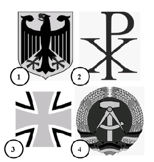
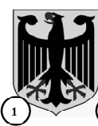
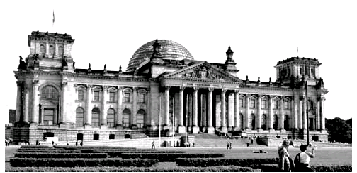

 
  
 # Leben in Deutschland ([reference](https://oet.bamf.de/ords/oetut/f?p=534:1::::::))
 
  
 |#|#|#|#|#|#|#|#|#|#|
 |-|-|-|-|-|-|-|-|-|-|
 |[001](#frage-001)|[002](#frage-002)|[003](#frage-003)|[004](#frage-004)|[005](#frage-005)|[006](#frage-006)|[007](#frage-007)|[008](#frage-008)|[009](#frage-009)|[010](#frage-010)|
 |[011](#frage-011)|[012](#frage-012)|[013](#frage-013)|[014](#frage-014)|[015](#frage-015)|[016](#frage-016)|[017](#frage-017)|[018](#frage-018)|[019](#frage-019)|[020](#frage-020)|
 |[021](#frage-021)|[022](#frage-022)|[023](#frage-023)|[024](#frage-024)|[025](#frage-025)|[026](#frage-026)|[027](#frage-027)|[028](#frage-028)|[029](#frage-029)|[030](#frage-030)|
 |[031](#frage-031)|[032](#frage-032)|[033](#frage-033)|[034](#frage-034)|[035](#frage-035)|[036](#frage-036)|[037](#frage-037)|[038](#frage-038)|[039](#frage-039)|[040](#frage-040)|
 |[041](#frage-041)|[042](#frage-042)|[043](#frage-043)|[044](#frage-044)|[045](#frage-045)|[046](#frage-046)|[047](#frage-047)|[048](#frage-048)|[049](#frage-049)|[050](#frage-050)|
 |[051](#frage-051)|[052](#frage-052)|[053](#frage-053)|[054](#frage-054)|[055](#frage-055)|[056](#frage-056)|[057](#frage-057)|[058](#frage-058)|[059](#frage-059)|[060](#frage-060)|
 
## Frage 001 
[ :top: ](#referecnce)
**In Deutchland dürfen Menschen offen etwas gegen die Regierung sagen, weil...**  

1. hier Religionsfreiheit gilt.
2. die Menschen Steuern zahlen.
3. die Menschen das Wahlrecht haben.
4. ✔️ hier Meinungsfreiheit gilt. 
 

| English | Deutsch | فارسی
|-|-|-|
|allow|dürfen|اجازه داشتن
|against|gegen|علیه
|because|weil| زیرا
|something|etwas|چیزی
|government|Regierung|دولت
|Religious freedom|Religions-freiheit| آزادی مذهبی
|apply|gilt (gelten)| اعمال شدن
|Taxes|Steuern| مالیات
|Pay|zahlen | پرداخت کردن
|Right to vote|Wahlrecht|حق رأی
|Freedom of opinion|Meinungs-freiheit|آزادی بیان

در آلمان، مردم اجازه دارند آشکارا علیه دولت صحبت کنند زیرا...
1. آزادی مذهبی اینجا مصداق دارد.
2. مردم مالیات می‌دهند
3. مردم حق رأی دارند
4. ✔️ آزادی بیان اینجا مصداق پیدا می‌کند. 

## Frage 002 
[ :top: ](#referecnce)
**In Deutchland können Eltern bis zum 14. Lebensjahr ihres Kindes entscheiden, ob es in der Schule am**
1. Geschichtsunterricht teilnimmt.
2. ✔️ Religionsunterricht teilnimmt. 
3. Politikunterricht teilnimmt.
4. Sprachunterricht teilnimmt.

| English | Deutsch | فارسی
|-|-|-|
|Age|Lebensjahr|سن
|decide|entscheiden|تصمیم گرفتن
|if|ob|اگر
|participates|teilnimmt(teilnehmen)|شرکت کردن
|History lessons|Geschichtsun-terricht|کلاس تاریخ
|Religious education|Religionsun-terricht|کلاس دینی
|Political education|Politikun-terricht|کلاس سیاست
|Language lessons|Sprachun-terricht|کلاس زبان

در آلمان، والدین می‌توانند تا 14 سالگی فرزندشان تصمیم بگیرند که آیا در مدرسه ...
1. در کلاس‌های تاریخ شرکت می‌کند.
2. ✔️ در کلاس‌های آموزش دینی شرکت می‌کند. 
3. در کلاس‌های سیاست شرکت می‌کند.
4. در کلاس‌های زبان شرکت می‌کند.

## Frage 003 
[ :top: ](#referecnce)
**Deutschland ist ein Rechtsstaat. Was ist damit gemeint?**
1. ✔️ Alle Einwohner / Einwohnerinnen und der Staat müssen sich an die Gesetze halten. 
2. Der Staat muss sich nicht an die Gesetze halten.
3. Nur Deutsche müssen die Gesetze befolgen.
4. Die Gerichte machen die Gesetze.

| English | Deutsch | فارسی
|-|-|-|
|Constitutional state|Rechtsstaat|مبتنی بر قانون (مشروطه)
|by this|damit|
|meant|gemeint(meinen)|معنی دادن
|Residents|Einwohner|ساکن (جمعیت)
|State|Staat|ایالت
|Laws|Gesetze (Gesetz)|قوانین
|abide by|halten|رعایت کردن
|follow|befolgen|پیروی کردن
|courts|Gerichte (Gericht)|دادگاه ها

آلمان یک کشور مبتنی بر قانون اساسی است. این به چه معناست؟
1. ✔️ همه ساکنان و دولت باید از قوانین پیروی کنند. 
2. دولت مجبور به رعایت قوانین نیست.
3. فقط آلمانی‌ها باید از قوانین پیروی کنند.
4. دادگاه‌ها قوانین را وضع می‌کنند.

## Frage 004 
[ :top: ](#referecnce)
**Welches Recht gehört zu den Grundrechten in Deutschland? **
1. Waffenbesitz
2. Faustrecht
3. ✔️ Meinungsfreiheit
4. Selbstjustiz

| English | Deutsch | فارسی
|-|-|-|
|right|Recht|حق
|belongs to|gehört (Hören)|شنیدن (متعلق به)
|Basic rights|Grundrechten|حقوق اساسی
|Weapons ownership|Waffenbesitz|مالکیت اسلحه
|Fist law|Faustrecht|قانون جنگل
|Vigilante justice|Selbstjustiz|عدالت خودجوش (خودسرانه)

کدام حق، جزو حقوق اساسی در آلمان است؟
1. مالکیت اسلحه
2. قانون جنگل
3. ✔️ آزادی بیان 
4. عدالت خودجوش (خودسرانه)

## Frage 005 
[ :top: ](#referecnce)
**Wahlen in Deutschland sind frei. Was bedeutet das?**
1. Man darf Geld annehmen, wenn man dafür einen bestimmten Kandidaten 
   / eine bestimmte Kandidatin wählt.
2. Nur Personen, die noch nie im Gefängnis waren, dürfen wählen.
3. ✔️ Der Wähler darf bei der Wahl weder beeinflusst
   noch zu einer bestimmten Stimmabgabe gezwungen 
   werden und keine Nachteile durch die Wahl haben.
4. Alle wahlberechtigten Personen müssen wählen.

| English | Deutsch | فارسی
|-|-|-|
|Elections|Wahlen|انتخابات
|accept|an-nehmen|قبول کردن
|for this|dafür|برای اینکه
|be in favor|dafür sein|طرفدار بودن
|certain|bestimmt|مشخص، خاص
|male/female Candidates|Kandidaten/Kandidatin|نامزهای مرد/زن
|select |wählt (Wählen)|انتخاب کردن
|Only,Just|Nur|فقط
|Prison|Gefängnis|زندان
|voters|Wähler|رأی دهندگان
|vote |Wahl |رأی
|neither |weder|هیچکدام
|beeinflusst|beeinflusst|تحت تاثیر قرار گرفته
|voting|Stimmabgabe|رأی گیری
|be forced|gezwungen werden|مجبور شدن به
|disadvantages|Nachteile|معایب
|eligible voters|wahlberechtigten|رأی‌دهندگان واجد شرایط

انتخابات در آلمان آزاد است؟ این یعنی چه؟
1. اگر به یک نامزد خاص رأی دهید، مجاز به دریافت پول هستید.
2. فقط افرادی که هرگز به زندان نرفته‌اند، مجاز به رأی دادن هستند.
3. ✔️ رأی‌دهنده ممکن است در انتخابات تحت تأثیر قرار نگیرد
   یا مجبور به رأی دادن به شیوه‌ای خاص نشود
   و ممکن است در نتیجه انتخابات متحمل هیچ گونه ضرر و زیانی نشود. 
4. همه واجدین شرایط باید رأی بدهند.

## Frage 006 
[ :top: ](#referecnce)
**Wie heißt die deutsche Verfassung?**
1. Volksgesetz
2. Bundesgesetz
3. Deutsches Gesetz
4. ✔️ Grundgesetz

| English | Deutsch | فارسی
|-|-|-|
|Constitution|Verfassung|قانون اساسی
|People's law|Volksgesetz|قانون مردم
|Federal law|Bundesgesetz|قانون فدرال
|Basic Law|Grundgesetz|قانون پایه

نام قانون اساسی آلمان چیست؟
1. قانون مردم
2. قانون فدرال
3. قانون آلمان
4. ✔️ قانون پایه

## Frage 007 
[ :top: ](#referecnce)
**Welches Recht gehört zu den Grundrechten, 
  die nach der deutschen Verfassung garantiert werden? Das Resht auf...**
1. ✔️ Glaubens- und Gewissensfreiheit.
2. Unterhaltung.
3. Arbeit.
4. Wohnung.

| English | Deutsch | فارسی
|-|-|-|
|fundamental right|Grundrechten|حقوق اساسی
|be guaranteed|garantiert werden|تضمین شده باشد
|freedom of conscience|Gewissensfreiheit|آزادی وجدان
|Freedom of belief|Glaubensfreiheit|آزادی عقیده
|Entertainment|Unterhaltung|سرگرمی

کدام حق، یکی از حقوق اساسی تضمین شده در قانون اساسی آلمان است؟ حقِ...
1. ✔️ آزادی عقیده و وجدان.
2. سرگرمی
3. کار
4. مسکن

## Frage 008 
[ :top: ](#referecnce)
**Was steht nicht im Grundgesetz von Deutschland?**
1. Die Würde des Menschen ist unantastbar.
2. ✔️ Alle sollen gleich viel Geld haben.
3. Jeder Mensch darf seine Meinung sagen.
4. Alle sind vor dem Gesetz gleich.

| English | Deutsch | فارسی
|-|-|-|
|stands|steht (stehen)|ایستادن، وجود داشتن
|Human dignity|Würde des Menschen|کرامت انسانی
|untouchable|unantastbar|مصون از تعرض
|be supposed to|sollen|باید
|equivalent |gleich|به یک اندازه
|every human being|Jeder Mensch|هر فرد
|opinion |Meinung|نظر

چه مواردی در قانون اساسی آلمان وجود ندارد؟
1. کرامت انسانی خدشه‌ناپذیر است.
2. ✔️ همه باید به یک اندازه پول داشته باشند.
3. هر کسی اجازه دارد نظر خود را بیان کند.
4. همه در برابر قانون برابرند.

## Frage 009 
[ :top: ](#referecnce)
**Welches Grundrecht gilt in Deutschland nur für Ausländer/Ausländerinnen? Das Grundrecht auf**
1. Schutz der Familie
2. Menschenwürde
3. ✔️ Asyl
4. Meinungsfreiheit

| English | Deutsch | فارسی
|-|-|-|
|protection|Schutz|حفاظت
|Human dignity|Menschenwürde|کرامت انسانی
|Asylum|Asyl|پناهندگی

کدام حق اساسی فقط برای خارجی‌ها در آلمان اعمال می‌شود؟ حق اساسی برای
1. حفاظت از خانواده
2. کرامت انسانی
3. ✔️ پناهندگی
4. آزادی بیان

## Frage 010 
[ :top: ](#referecnce)
**Was ist mit dem deutschen Grundgesetz vereinbar?**
1. die Prügelstrafe
2. die Folter
3. die Todesstrafe
4. ✔️ die Geldstrafe

| English | Deutsch | فارسی
|-|-|-|
|compatible|vereinbar|سازگار
|Corporal punishment|Prügelstrafe|تنبیه بدنی
|torture|die Folter|
|Death penalty|Todesstrafe|مجازات اعدام
|penalty|Geldstrafe|جریمه

چه چیزی با قانون اساسی آلمان سازگار است؟
1. تنبیه بدنی
2. شکنجه
3. مجازات اعدام
4. ✔️ جریمه

## Frage 011 
[ :top: ](#referecnce)
**Wie wird die Verfassung der Bundesrepublik Deutschland genannt?**
1. ✔️ Grundgesetz
2. Bundesverfassung
3. Gesetzbuch
4. Verfassungsvertrag

| English | Deutsch | فارسی
|-|-|-|
|becomes|wird ()|میشود
|called|genannt (nennen)|نامیدن
|Federal Republic|Bundesrepublik|جمهوری فدرال
|Federal Constitution|Bundesverfassung|قانون اساسی فدرال
|Basic Law|Gesetzbuch|قانون اساسی
|Constitutional Treaty|Verfassungsvertrag|پیمان قانون اساسی

قانون اساسی جمهوری فدرال آلمان چه نام دارد؟
1. ✔️ قانون اساسی
2. قانون اساسی فدرال
3. قانون
4. پیمان قانون اساسی

## Frage 012 
[ :top: ](#referecnce)
**Eine Partei im Deutschen Bundestag will die Pressefreiheit abschaffen. Ist das möglich?**
1. Ja, wenn mehr als die Hälfte der Abgeordneten im Bundestag dafür sind.
2. Ja, aber dazu müssen zwei Drittel der Abgeordneten im Bundestag dafür sein.
3. ✔️ Nein, denn die Pressefreiheit ist ein Grundrecht. Sie kann nicht abgeschafft werden.
4. Nein, denn nur der Bundesrat kann die Pressefreiheit abschaffen.

| English | Deutsch | فارسی
|-|-|-|
|||
|||

یک حزب در مجلس فدرال آلمان می‌خواهد آزادی مطبوعات را لغو کند. آیا این ممکن است؟
1. بله، اگر بیش از نیمی از اعضای بوندستاگ موافق باشند.
2. بله، اما دو سوم اعضای بوندستاگ باید موافق آن باشند.
3. ✔️ نه، زیرا آزادی مطبوعات یک حق اساسی است. نمی‌توان آن را لغو کرد.
4. نه، زیرا فقط شورای فدرال می‌تواند آزادی مطبوعات را لغو کند.

## Frage 013 
[ :top: ](#referecnce)
**Im Parlament steht der Begriff "Opposition" für**
1. die regierenden Parteien.
2. die Fraktion mit den meisten Abgeordneten.
3. alle Parteien, die bei der letzten Wahl die 5%-Hürde erreichen konnten.
4. ✔️ alle Abgeordneten, die nicht zu der Regierungspartei/den Regierungsparteien gehören.

| English | Deutsch | فارسی
|-|-|-|
|||
|||

در پارلمان، اصطلاح «اپوزیسیون» مخفف ...
1. احزاب حاکم.
2. گروهی که بیشترین عضو را دارد.
3. تمام احزابی که در انتخابات گذشته به مانع ۵٪ رسیدند.
4. ✔️ تمام نمایندگان مجلس که به حزب (های) حاکم تعلق ندارند.

## Frage 014 
[ :top: ](#referecnce)
**Meinungsfreiheit in Deutschland heißt zum Beispiel, dass ich**
1. Passanten auf der Straße beschimpfen darf
2. ✔️ meine Meinung im Internet äußern kann
3. Nazi-, Hamas- oder Islamischer Staat-Symbole öffentlich tragen darf
4. meine Meinung nur dann äußern darf, solange ich der Regierung nicht widerspreche

| English | Deutsch | فارسی
|-|-|-|
|||
|||

آزادی بیان در آلمان به این معنی است که، برای مثال، من
1. ممکن است در خیابان به رهگذران توهین کند
2. ✔️ می‌توانم نظرم را در اینترنت بیان کنم
3. ممکن است در ملاء عام نمادهای نازی، حماس یا دولت اسلامی را بپوشند
4. من فقط می‌توانم نظر خودم را بیان کنم، تا زمانی که با دولت در تضاد نباشد.

## Frage 015 
[ :top: ](#referecnce)
**Was verbietet das deutsche Grundgesetz?**
1. Militärdienst
2. ✔️ Zwangsarbeit
3. freie Berufswahl
4. Arbeit im Ausland

| English | Deutsch | فارسی
|-|-|-|
|||
|||

قانون اساسی آلمان چه چیزهایی را ممنوع می‌کند؟
1. خدمت سربازی
2. ✔️ کار اجباری
3. انتخاب آزاد حرفه
4. کار در خارج از کشور

## Frage 016 
[ :top: ](#referecnce)
**Wann ist die Meinungsfreiheit in Deutschland eingeschränkt?**
1. ✔️ bei der öffentlichen Verbreitung falscher Behauptungen über einzelne Personen
2. bei Meinungsäußerungen über die Bundesregierung
3. bei Diskussionen über Religionen
4. bei Kritik am Staat

| English | Deutsch | فارسی
|-|-|-|
|||
|||

چه زمانی آزادی بیان در آلمان محدود می‌شود؟
1. ✔️ در انتشار عمومی ادعاهای دروغین درباره افراد
2. هنگام ابراز نظرات در مورد دولت فدرال
3. در بحث‌های مربوط به ادیان
4. هنگام انتقاد از دولت

## Frage 017 
[ :top: ](#referecnce)
**Die deutschen Gesetze verbieten...**
1. Meinungsfreiheit der Einwohner und Einwohnerinnen.
2. Petitionen der Bürger und Bürgerinnen.
3. Versammlungsfreiheit der Einwohner und Einwohnerinnen.
4. ✔️ Ungleichbehandlung der Bürger und Bürgerinnen durch den Staat.

| English | Deutsch | فارسی
|-|-|-|
|||
|||

طبق قانون آلمان، ... ممنوع است.
1. آزادی بیان برای ساکنان.
2. دادخواست‌های شهروندان.
3. آزادی تجمع برای ساکنان.
4. ✔️ رفتار نابرابر دولت با شهروندان.

## Frage 018 
[ :top: ](#referecnce)
**Welches Grundrecht ist in Artikel 1 des Grundgesetzes der Bundesrepublik Deutschland garantiert?**
1. ✔️ die Unantastbarkeit der Menschenwürde
2. das Recht auf Leben
3. Religionsfreiheit
4. Meinungsfreiheit

| English | Deutsch | فارسی
|-|-|-|
|||
|||

کدام حق اساسی در ماده ۱ قانون اساسی جمهوری فدرال آلمان تضمین شده است؟
1. ✔️ خدشه‌ناپذیری کرامت انسانی
2. حق حیات
3. آزادی مذهب
4. آزادی بیان

## Frage 019 
[ :top: ](#referecnce)
**Was versteht man unter dem Recht der "Freizügigkeit" in Deutschland?**
1. ✔️ Man darf sich seinen Wohnort selbst aussuchen.
2. Man kann seinen Beruf wechseln.
3. Man darf sich für eine andere Religion entscheiden.
4. Man darf sich in der Öffentlichkeit nur leicht bekleidet bewegen.

| English | Deutsch | فارسی
|-|-|-|
|||
|||

منظور از حق «آزادی رفت و آمد» در آلمان چیست؟
1. ✔️ شما می‌توانید محل زندگی خود را انتخاب کنید.
2. می‌توانید شغلتان را تغییر دهید.
3. شما آزاد هستید که دین دیگری را انتخاب کنید.
4. شما فقط مجاز به رفت و آمد در اماکن عمومی با لباس سبک هستید.

## Frage 020 
[ :top: ](#referecnce)
**Eine Partei in Deutschland verfolgt das Ziel, eine Diktatur zu errichten. Sie ist denn...**
1. tolerant. 
2. rechtsstaatlich orientiert.
3. gesetzestreu.
4. ✔️ verfassungswidrig.

| English | Deutsch | فارسی
|-|-|-|
|||
|||

حزبی در آلمان هدف ایجاد دیکتاتوری را دنبال می‌کند. این ...
1. بردبار.
2. با محوریت حاکمیت قانون.
3. مطیع قانون.
4. ✔️ خلاف قانون اساسی.

## Frage 021 
[ :top: ](#referecnce)
**Welches ist das Wappen der Bundesrepublik Deutschland?**

✔️ 

| English | Deutsch | فارسی
|-|-|-|
|||
|||

نشان ملی جمهوری فدرال آلمان چیست؟
1. ✔️ 
2.
3.
4.

## Frage 022 
[ :top: ](#referecnce)
**Was für eine Staatsform hat Deutschland?**
1. Monarchie 
2. Diktatur
3. ✔️ Republik
4. Fürstentum

| English | Deutsch | فارسی
|-|-|-|
|||
|||

آلمان چه نوع حکومتی دارد؟
1. سلطنت
2. دیکتاتوری
3. ✔️ جمهوری
4. شاهزاده‌نشین

## Frage 023 
[ :top: ](#referecnce)
**In Deutschland sind die meisten Erwerbstätigen...**
1. in kleinen Familienunternehmen beschäftigt.
2. ehrenamtlich für ein Bundesland tätig.
3. selbständig mit einer eigenen Firma tätig.
4. ✔️  bei einer Firma oder Behörde beschäftigt.

| English | Deutsch | فارسی
|-|-|-|
|||
|||

در آلمان، بیشتر شاغلین ...
1. در کسب و کارهای کوچک خانوادگی مشغول به کار هستند.
2. کار داوطلبانه برای یک ایالت فدرال.
3. با شرکت خودش به صورت آزاد کار می‌کند.
4. ✔️ توسط یک شرکت یا مرجع استخدام شده باشد.

## Frage 024 
[ :top: ](#referecnce)
**Wie viele Bundesländer hat die Bundesrepublik Deutschland?**
1. 14
2. 15
3. ✔️ 16
4. 17

| English | Deutsch | فارسی
|-|-|-|
|||
|||

جمهوری فدرال آلمان چند ایالت فدرال دارد؟
1. 14
2. 15
3. ✔️ 16
4. 17

## Frage 025 
[ :top: ](#referecnce)
**Was ist kein Bundesland der Bundesrepublik Deutschland?**
1. ✔️ Elsass-Lothringen
2. Nordrhein-Westfalen
3. Mecklenburg-Vorpommern
4. Sachsen-Anhalt

| English | Deutsch | فارسی
|-|-|-|
|||
|||

کدام ایالت، جزو جمهوری فدرال آلمان نیست؟
1. ✔️ آلزاس-لورن
2. نوردراین-وستفالن
3. مکلنبورگ-پومرانی غربی
4. زاکسن-آنهالت

## Frage 026 
[ :top: ](#referecnce)
**Deutschland ist ...**
1. eine kommunistische Republik.
2. ✔️ ein demokratischer und sozialer Bundesstaat.
3. eine kapitalistische und soziale Monarchie.
4. ein sozialer und sozialistischer Bundesstaat.

| English | Deutsch | فارسی
|-|-|-|
|||
|||

آلمان ... است
1. یک جمهوری کمونیستی.
2. ✔️ یک دولت فدرال دموکراتیک و اجتماعی.
3. یک سلطنت سرمایه‌داری و اجتماعی.
4. یک دولت فدرال سوسیالیستی و اجتماعی.

## Frage 027 
[ :top: ](#referecnce)
**Deutschland ist ...**
1. ein sozialistischer Staat. 
2. ✔️ ein Bundesstaat.
3. eine Diktatur.
4. eine Monarchie.

| English | Deutsch | فارسی
|-|-|-|
|||
|||

آلمان ... است
1. یک دولت سوسیالیستی.
2. ✔️ یک ایالت فدرال.
3. یک دیکتاتوری.
4. یک سلطنت.

## Frage 028 
[ :top: ](#referecnce)
**Wer wählt in Deutschland die Abgeordneten zum Bundestag?**
1. das Militär
2. die Wirtschaft
3. ✔️ das wahlberechtigte Volk
4. die Verwaltung

| English | Deutsch | فارسی
|-|-|-|
|||
|||

چه کسی اعضای بوندستاگ (مجلس فدرال) در آلمان را انتخاب می‌کند؟
1. ارتش
2. اقتصاد
3. ✔️ جمعیت رأی دهنده
4. اداره (administration/management)

## Frage 029 
[ :top: ](#referecnce)
**Welches Tier ist das Wappentier der Bundesrepublik Deutschland?**
1. Löwe
2. ✔️ Adler
3. Bär
4. Pferd

| English | Deutsch | فارسی
|-|-|-|
|||
|||

کدام حیوان نشان جمهوری فدرال آلمان است؟
1. شیر
2. ✔️ عقاب
3. خرس
4. اسب

## Frage 030 
[ :top: ](#referecnce)
**Was ist kein Merkmal unserer Demokratie?**
1. regelmäßige Wahlen
2. ✔️ Pressezensur
3. Meinungsfreiheit
4. verschiedene Parteien

| English | Deutsch | فارسی
|-|-|-|
|||
|||

کدام مورد از ویژگی‌های دموکراسی ما نیست؟
1. انتخابات عادی
2. ✔️ سانسور مطبوعات
3. آزادی بیان
4. احزاب مختلف

## Frage 031 
[ :top: ](#referecnce)
**Die Zusammenarbeit von Parteien zur Bildung einer Regierung nennt man in Deutschland ...**
1. Einheit.
2. ✔️ Koalition.
3. Ministerium.
4. Fraktion.

| English | Deutsch | فارسی
|-|-|-|
|||
|||

در آلمان به همکاری احزاب برای تشکیل دولت ... گفته می شود.
1. واحد
2. ✔️ ائتلاف
3. وزارتخانه
4. کسری

## Frage 032 
[ :top: ](#referecnce)
**Was ist keine staatliche Gewalt in Deutschland?**
1. Gesetzgebung
2. Regierung
3. ✔️ Presse
4. Rechtsprechung

| English | Deutsch | فارسی
|-|-|-|
|||
|||

چه چیزی در آلمان قدرت دولتی نیست؟
1. قانونگذاری
2. دولت
3. ✔️ مطبوعات
4. رویه قضایی

## Frage 033 
[ :top: ](#referecnce)
**Welche Aussage ist richtig? in Deutschland ...**
1. sind Staat und Religionsgemeinschaften voneinander getrennt.
2. bilden die Religionsgemeinschaften den Staat.
3. ist der Staat abhängig von den Religionsgemeinschaften.
4. bilden Staat und Religionsgemeinschaften eine Einheit.

| English | Deutsch | فارسی
|-|-|-|
|||
|||

کدام جمله صحیح است؟ در آلمان...
1. ✔️ جوامع دولتی و مذهبی از یکدیگر جدا هستند.
2. جوامع مذهبی دولت را تشکیل می‌دهند.
3. دولت به جوامع مذهبی وابسته است.
4. دولت و جوامع مذهبی یک وحدت را تشکیل می‌دهند.

## Frage 034
[ :top: ](#referecnce)
**Was ist Deutschland nicht?**
1. eine Demokratie 
2. ein Rechtsstaat
3. ✔️ eine Monarchie
4. ein Sozialstaat

| English | Deutsch | فارسی
|-|-|-|
|||
|||

آلمان چه چیزی نیست؟
1. یک دموکراسی
2. یک دولت مشروطه
3. ✔️ یک سلطنت
4. یک دولت رفاه

## Frage 035
[ :top: ](#referecnce)
**Womit finanziert der deutsche Staat die Sozialversicherung?**
1. Kirchensteuern
2. ✔️ Sozialabgaben
3. Spendengeldern
4. Vereinsbeiträgen

| English | Deutsch | فارسی
|-|-|-|
|||
|||

دولت آلمان چگونه تأمین اجتماعی را تأمین مالی می‌کند؟
1. مالیات کلیسا
2. ✔️ مشارکت‌های تأمین اجتماعی
3. کمک‌های مالی
4. کمک‌های مالی باشگاه

## Frage 036
[ :top: ](#referecnce)
**Welche Maßnahme schafft in Deutschland soziale Sicherheit?**
1. ✔️ die Krankenversicherung
2. die Autoversicherung
3. die Gebäudeversicherung
4. die Haftpflichtversicherung

| English | Deutsch | فارسی
|-|-|-|
|||
|||

کدام اقدام، امنیت اجتماعی را در آلمان ایجاد می‌کند؟
1. ✔️ بیمه سلامت
2. بیمه خودرو
3. بیمه ساختمان
4. بیمه مسئولیت مدنی

## Frage 037
[ :top: ](#referecnce)
**Wie werden die Regierungschefs/Regierungschefinnen der meisten Bundesländer in Deutschland genannt?**
1. Erster Minister/ Erste Ministerin
2. Premierminister/ Premierministerin
3. Senator/ Senatorin
4. ✔️ Ministerpräsident/ Ministerpräsidentin

| English | Deutsch | فارسی
|-|-|-|
||Regierungschefs|روسای دولت
|||

روسای دولت اکثر ایالت‌های فدرال در آلمان چه نامیده می‌شوند؟
1. وزیر اول
2. نخست وزیر (Premierminister)
3. سناتور
4. ✔️ نخست وزیر (Ministerpräsident)

## Frage 038
[ :top: ](#referecnce)
**Die Bundesrepublik Deutschland ist ein demokratischer und sozialer...**
1. Staatenverbund.
2. ✔️ Bundesstaat.
3. Staatenbund.
4. Zentralstaat.

| English | Deutsch | فارسی
|-|-|-|
|||
|||

جمهوری فدرال آلمان کشوری دموکراتیک و اجتماعی است...
1. اتحادیه ایالت‌ها
2. ✔️ ایالت فدرال
3. کنفدراسیون ایالت‌ها.
4. حکومت مرکزی.

## Frage 039
[ :top: ](#referecnce)
**Was hat jedes deutsche Bundesland?**
1. einen eigenen Außenminister / eine eigene Außenministerin
2. eine eigene Währung
3. eine eigene Armee
4. ✔️ eine eigene Regierung

| English | Deutsch | فارسی
|-|-|-|
|||
|||

هر ایالت فدرال آلمان چه دارد؟
1. وزیر امور خارجه خودش
2. واحد پول خودش
3. ارتش خودش
4. ✔️ دولت خودش

## Frage 040
[ :top: ](#referecnce)
**Mit welchen Worten beginnt die deutsche Nationalhymne?**
1. Völker, hört die Signale ...
2. ✔️ Einigkeit und Recht und Freiheit ...
3. Freude schöner Götterfunken ...
4. Deutschland einig Vaterland ...

| English | Deutsch | فارسی
|-|-|-|
|||
|||

سرود ملی آلمان با چه کلماتی آغاز می‌شود؟
1. ای مردم، به سیگنال‌ها گوش دهید...
2. ✔️ وحدت و عدالت و آزادی...
3. شادی، جرقه زیبای خدایان...
4. آلمان، سرزمین پدری متحد...

## Frage 041
[ :top: ](#referecnce)
**Warum gibt es in einer Demokratie mehr als eine Partei?**
1. ✔️ weil dadurch die unterschiedlichen Meinungen der Bürger und Bürgerinnen vertreten werden
2. damit Bestechung in der Politik begrenzt wird
3. um politische Demonstrationen zu verhindern
4. um wirtschaftlichen Wettbewerb anzuregen

| English | Deutsch | فارسی
|-|-|-|
|||
|||

چرا در یک دموکراسی بیش از یک حزب وجود دارد؟
1. ✔️ زیرا نمایانگر نظرات مختلف شهروندان است
2. محدود کردن رشوه در سیاست
3. برای جلوگیری از تظاهرات سیاسی
4. برای تحریک رقابت اقتصادی

## Frage 042
[ :top: ](#referecnce)
**Wer beschließt in Deutschland ein neues Gesetz?**
1. die Regierung
2. ✔️ das Parlament
3. die Gerichte
4. die Polizei

| English | Deutsch | فارسی
|-|-|-|
|||
|||

چه کسی در آلمان در مورد قانون جدید تصمیم می‌گیرد؟
1. دولت
2. ✔️ مجلس
3. دادگاه‌ها
4. پلیس

## Frage 043
[ :top: ](#referecnce)
**Wann kann in Deutschland eine Partei verboten werden?**
1. wenn ihr Wahlkampf zu teuer ist
2. ✔️ wenn sie gegen die Verfassung kämpft
3. wenn sie Kritik am Staatsoberhaupt äußert
4. wenn ihr Programm eine neue Richtung vorschlägt

| English | Deutsch | فارسی
|-|-|-|
|||
|||

چه زمانی می‌توان یک حزب را در آلمان ممنوع کرد؟
1. اگر مبارزات انتخاباتی آنها خیلی پرهزینه باشد
2. ✔️ وقتی او علیه قانون اساسی می‌جنگد
3. وقتی از رئیس دولت انتقاد می‌کند
4. اگر برنامه آنها جهت جدیدی را پیشنهاد کند

## Frage 044
[ :top: ](#referecnce)
**Wen  kann man als Bürger / Bürgerin in Deutschland nicht direkt wählen?**
1. Abgeordnete des EU-Parlaments
2. ✔️ den Bundespräsidenten / die Bundespräsidentin
3. Landtagsabgeordnete
4. Bundestagsabgeordnete

| English | Deutsch | فارسی
|-|-|-|
|||
|||

چه کسانی نمی‌توانند مستقیماً به عنوان شهروند در آلمان انتخاب شوند؟
1. اعضای پارلمان اروپا
2. ✔️ رئیس جمهور فدرال
3. اعضای پارلمان ایالتی
4. اعضای مجلس فدرال (بوندستاگ)

## Frage 045
[ :top: ](#referecnce)
**Zu welcher Versicherung gehört die Pflegeversicherung?**
1. ✔️ Sozialversicherung
2. Unfallversicherung
3. Hausratversicherung
4. Haftpflicht- und Feuerversicherung

| English | Deutsch | فارسی
|-|-|-|
|||
|||

بیمه مراقبت طولانی مدت به کدام بیمه تعلق دارد؟
1. ✔️ تامین اجتماعی
2. بیمه حوادث
3. بیمه وسایل منزل
4. بیمه مسئولیت مدنی و آتش سوزی

## Frage 046
[ :top: ](#referecnce)
**Der deutsche Staat hat viele Aufgaben. Welche Aufgabe gehört dazu?**
1. ✔️ Er baut Straßen und Schulen.
2. Er verkauft Lebensmittel und Kleidung.
3. Er versorgt alle Einwohner und Einwohnerinnen kostenlos mit Zeitungen.
4. Er produziert Autos und Busse.

| English | Deutsch | فارسی
|-|-|-|
|||
|||

دولت آلمان مسئولیت‌های زیادی دارد. برخی از آنها چیست؟
1. ✔️ او جاده و مدرسه می‌سازد.
2. او غذا و لباس می‌فروشد.
3. این روزنامه‌ها را به صورت رایگان در اختیار همه ساکنان قرار می‌دهد.
4. ماشین و اتوبوس تولید می‌کند.

## Frage 047
[ :top: ](#referecnce)
**Der deutsche Staat hat viele Aufgaben. Welche Aufgabe gehört nicht dazu?**
1. ✔️ Er bezahlt für alle Staatsangehörigen Urlaubsreisen.
2. Er zahlt Kindergeld.
3. Er unterstützt Museen.
4. Er fördert Sportler und Sportlerinnen.

| English | Deutsch | فارسی
|-|-|-|
|||
|||

دولت آلمان مسئولیت‌های زیادی دارد. کدام یک از آنها نیست؟
1. ✔️ او هزینه سفرهای تفریحی همه شهروندان را پرداخت می‌کند.
2. او کمک هزینه فرزند پرداخت می‌کند.
3. او از موزه‌ها حمایت می‌کند.
4. او از ورزشکاران حمایت می‌کند.

## Frage 048
[ :top: ](#referecnce)
**Welche Organ gehört nicht zu den Verfassungsorganen?**
1. der Bundesrat
2. der Bundespräsident / die Bundespräsidentin
3. ✔️ die Bürgerversammlung
4. die Regierung

| English | Deutsch | فارسی
|-|-|-|
|||
|||

کدام نهاد، نهادی مطابق قانون اساسی نیست؟
1. شورای فدرال
2. رئیس جمهور فدرال
3. ✔️ مجلس شهروندان
4. دولت

## Frage 049
[ :top: ](#referecnce)
**Wer bestimmt in Deutschland die Schulpolitik?**
1. die Lehrer und Lehrerinnen
2. ✔️ die Bundesländer
3. das Familienministerium
4. die Universitäten

| English | Deutsch | فارسی
|-|-|-|
|||
|||

چه کسی سیاست مدارس در آلمان را تعیین می‌کند؟
1. معلمان
2. ✔️ ایالت‌های فدرال
3. وزارت امور خانواده
4. دانشگاه‌ها

## Frage 050
[ :top: ](#referecnce)
**Die Wirtschaftsform in Deutschland nennt man ...**
1. freie Zentralwirtschaft.
2. ✔️ soziale Marktwirtschaft.
3. gelenkte Zentralwirtschaft.
4. Planwirtschaft.

| English | Deutsch | فارسی
|-|-|-|
|||
|||

سیستم اقتصادی در آلمان ... نامیده می شود.
1. اقتصاد مرکزی آزاد
2. ✔️ اقتصاد بازار اجتماعی.
3. اقتصاد مرکزی کنترل‌شده
4. اقتصاد برنامه ریزی شده

## Frage 051
[ :top: ](#referecnce)
**Zu einem demokratischen Rechtsstaat gehört es nicht, dass...**
1. Menschen sich kritisch über die Regierung äußern können.
2. Bürger friedlich demonstrieren gehen dürfen.
3. ✔️ Menschen von einer Privatpolizei ohne Grund verhaftet werden.
4. jemand ein Verbrechen begeht und deshalb verhaftet wird.

| English | Deutsch | فارسی
|-|-|-|
|||
|||

یک دولت دموکراتیک مبتنی بر قانون اساسی شامل ... نمی‌شود.
1. مردم می‌توانند نظرات انتقادی خود را در مورد دولت بیان کنند.
2. شهروندان اجازه دارند به صورت مسالمت‌آمیز تظاهرات کنند.
3. ✔️ مردم بدون هیچ دلیلی توسط پلیس خصوصی دستگیر می‌شوند.
4. کسی مرتکب جرمی می‌شود و به خاطر آن دستگیر می‌شود.

## Frage 052
[ :top: ](#referecnce)
**Was bedeutet "Volkssouveränität"? Alle Staatsgewalt geht vom...**
1. ✔️ Volke aus.
2. Bundestag aus.
3. preußischen König aus.
4. Bundesverfassungsgericht aus.

| English | Deutsch | فارسی
|-|-|-|
|||
|||

«حاکمیت مردمی» به چه معناست؟ تمام قدرت دولتی از ... سرچشمه می‌گیرد.
1. ✔️ مردم بیرون.
2. بوندستاگ
3. پادشاه پروس.
4. دادگاه قانون اساسی فدرال.

## Frage 053
[ :top: ](#referecnce)
**Was bedeutet "Rechtsstaat" in Deutschland?"**
1. Der Staat hat Recht.
2. Es gibt nur rechte Parteien.
3. Die Bürger und Bürgerinnen entscheiden über Gesetze.
4. ✔️ Der Staat muss die Gesetze einhalten.

| English | Deutsch | فارسی
|-|-|-|
|||
|||

«حاکمیت قانون» در آلمان به چه معناست؟
1. حق با ایالت است.
2. فقط احزاب راست‌گرا وجود دارند.
3. شهروندان در مورد قوانین تصمیم می‌گیرند.
4. ✔️ دولت باید از قوانین اطاعت کند.

## Frage 054
[ :top: ](#referecnce)
**Was ist keine staatliche Gewalt in Deutschland?**
1. Legislative
2. Judikative
3. Exekutive
4. ✔️ Direktive

| English | Deutsch | فارسی
|-|-|-|
|||
|||

چه چیزی در آلمان قدرت دولتی نیست؟
1. قوه مقننه
2. قوه قضائیه
3. اجرایی
4. ✔️ بخشنامه

## Frage 055
[ :top: ](#referecnce)
**Was zeigt dieses Bild?**

1. ✔️ den Bundestagssitz in Berlin
2. das Bundesverfassungsgericht in Karlsruhe
3. das Bundesratsgebäude in Berlin
4. das Bundeskanzleramt in Berlin

| English | Deutsch | فارسی
|-|-|-|
|||
|||

این تصویر چه چیزی را نشان می‌دهد؟
1. ✔️ کرسی بوندس‌تاگ در برلین
2. دادگاه قانون اساسی فدرال در کارلسروهه
3. ساختمان شورای فدرال در برلین
4. دفتر صدراعظم فدرال در برلین

## Frage 056
[ :top: ](#referecnce)
**Welches Amt gehört in Deutschland zur Gemeindeverwaltung?**
1. Pfarramt
2. ✔️ Ordnungsamt
3. Finanzamt
4. Auswärtiges Amt

| English | Deutsch | فارسی
|-|-|-|
|||
|||

کدام اداره متعلق به اداره شهرداری در آلمان است؟
1. دفتر کلیسا
2. ✔️ اداره نظم عمومی
3. اداره مالیات
4. وزارت امور خارجه

## Frage 057
[ :top: ](#referecnce)
**Wer wird meistens zum Präsidenten / zur Präsidentin des Deutschen Bundestages gewählt?**
1. der / die älteste Abgeordnete im Parlament
2. der Ministerpräsident / die Ministerpräsidentin des größten Bundeslandes
3. ein ehemaliger Bundeskanzler / eine ehemalige Bundeskanzlerin
4. ✔️ ein Abgeordneter / eine Abgeordnete der stärksten Fraktion

| English | Deutsch | فارسی
|-|-|-|
|||
|||

چه کسی اغلب به عنوان رئیس مجلس فدرال آلمان انتخاب می‌شود؟
1. مسن‌ترین نماینده مجلس
2. نخست وزیر بزرگترین ایالت فدرال
3. صدراعظم سابق فدرال
4. ✔️ عضوی از قوی‌ترین گروه پارلمانی

## Frage ???
[ :top: ](#referecnce)
** Frage **
1. 
2.
3.
4.

| English | Deutsch | فارسی
|-|-|-|
|||
|||

سوال
1. 
2.
3.
4.

## Frage ???
[ :top: ](#referecnce)
** Frage **
1. 
2.
3.
4.

| English | Deutsch | فارسی
|-|-|-|
|||
|||

سوال
1. 
2.
3.
4.

## Frage ???
[ :top: ](#referecnce)
** Frage **
1. 
2.
3.
4.

| English | Deutsch | فارسی
|-|-|-|
|||
|||

سوال
1. 
2.
3.
4.

## Frage ???
[ :top: ](#referecnce)
** Frage **
1. 
2.
3.
4.

| English | Deutsch | فارسی
|-|-|-|
|||
|||

سوال
1. 
2.
3.
4.

